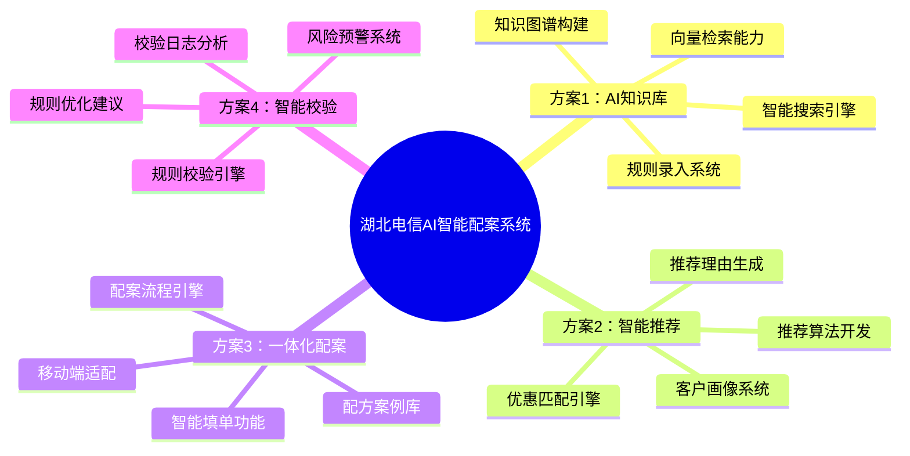

# 思维导图改进技能

## 问题诊断

| 问题 | 当前状态 | 改进方案 |
|------|---------|---------|
| 布局混乱 | markdown+graphviz | 使用HTML+CSS专业布局 |
| 节点重叠 | 层次过多 | 分层展开，控制密度 |
| 美观度差 | 无配色/样式 | 使用配色方案+渐变背景 |
| 无交互 | 静态图片 | HTML版本可折叠/展开 |

## 改进方案

### 方案1：使用infographic-creator

**模板选择**：

| 思维导图类型 | 推荐模板 | 说明 |
|-------------|---------|------|
| 树状结构 | hierarchy-mindmap-branch-gradient-capsule-item | 渐变胶囊节点 |
| 树状结构 | hierarchy-mindmap-level-gradient-compact-card | 紧凑卡片 |
| 树状结构 | hierarchy-tree-curved-line-rounded-rect-node | 曲线连接 |
| 技术风格 | hierarchy-tree-tech-style-badge-card | 科技风徽章 |
| 技术风格 | hierarchy-tree-tech-style-capsule-item | 科技风胶囊 |

**示例语法**：

```plain
infographic hierarchy-mindmap-branch-gradient-capsule-item
data
  title 湖北电信AI智能配案系统
  root
    label 解决方案
    children
      - label 方案1：AI知识库
        children
          - label 知识图谱构建
          - label 规则录入系统
          - label 智能搜索引擎
      - label 方案2：智能推荐
        children
          - label 客户画像系统
          - label 推荐算法开发
          - label 优惠匹配引擎
      - label 方案3：一体化配案
        children
          - label 配案流程引擎
          - label 智能填单功能
          - label 配方案例库
      - label 方案4：智能校验
        children
          - label 规则校验引擎
          - label 风险预警系统
          - label 校验日志分析
theme
  palette #C93832 #3B82F6 #10B981 #F59E0B
```

### 方案2：HTML+CSS专业布局

**特点**：
- 左右结构，清晰无重叠
- 配色方案可定制
- 支持折叠/展开
- 导出PNG/SVG

### 方案3：使用Mermaid（推荐）

**语法简单，渲染效果好**：



## 配色方案

### 中国电信配色

```css
/* 主色 */
--primary: #C93832;     /* 电信红 */
--secondary: #AC0000;   /* 深红 */
--accent: #ED7D31;      /* 橙色 */

/* 辅助色 */
--blue: #3B82F6;        /* 蓝色 */
--green: #10B981;       /* 绿色 */
--purple: #8B5CF6;      /* 紫色 */
--orange: #F59E0B;      /* 橙黄 */

/* 背景 */
--bg-light: #F5F7FA;    /* 浅灰 */
--bg-white: #FFFFFF;    /* 白色 */
```

### 渐变配色

```css
/* 红色渐变 */
background: linear-gradient(135deg, #C93832, #AC0000);

/* 蓝色渐变 */
background: linear-gradient(135deg, #3B82F6, #1E40AF);

/* 绿色渐变 */
background: linear-gradient(135deg, #10B981, #059669);
```

## 生成流程

```
1. 确定思维导图结构（树状/网状）
2. 选择模板（infographic/HTML/Mermaid）
3. 应用配色方案
4. 添加样式（渐变/阴影/圆角）
5. 导出PNG/SVG/HTML
```

## 质量检查

| 检查项 | 标准 | 分值 |
|--------|------|:----:|
| 层次清晰 | 节点无重叠，层次分明 | 25 |
| 配色美观 | 使用配色方案，渐变效果 | 25 |
| 布局合理 | 左右/上下结构，间距适中 | 20 |
| 内容完整 | 无遗漏关键信息 | 20 |
| 导出质量 | PNG清晰/SVG矢量/HTML可交互 | 10 |
| **总分** | **≥90分** | **100** |
