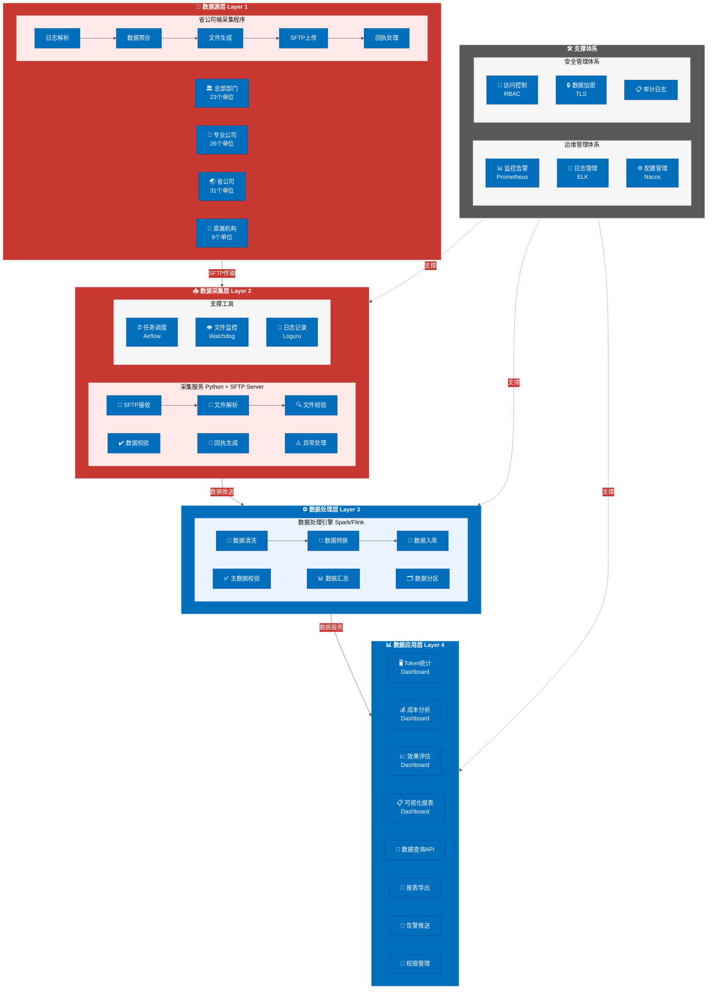
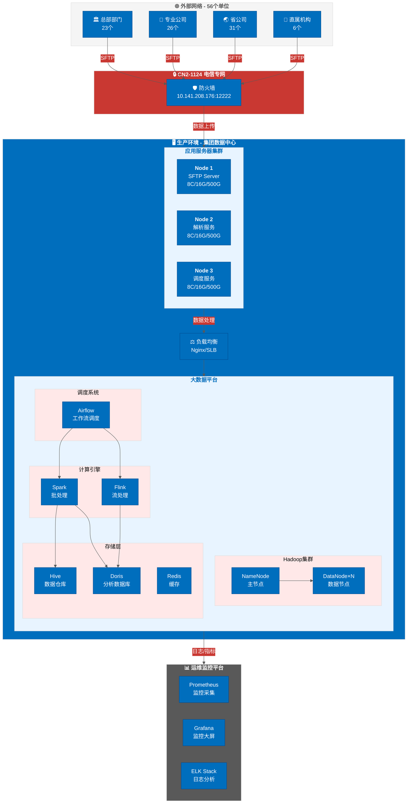
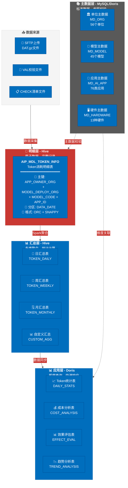
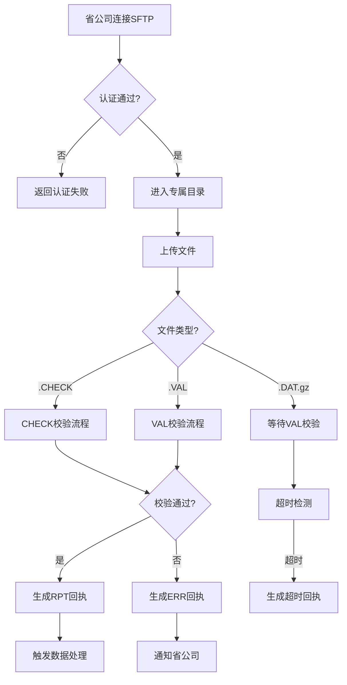
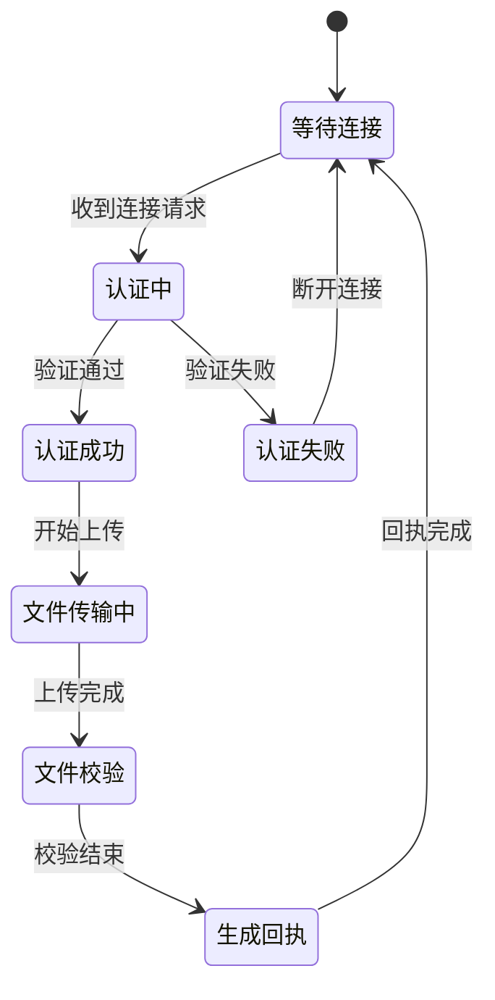
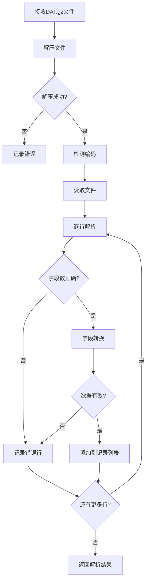
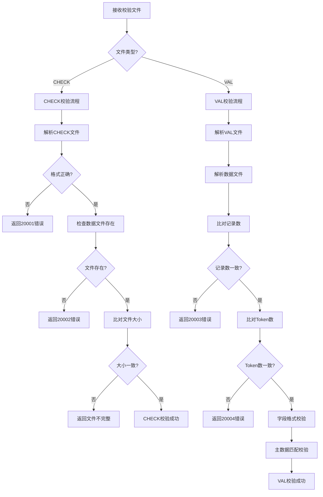
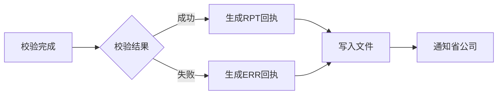
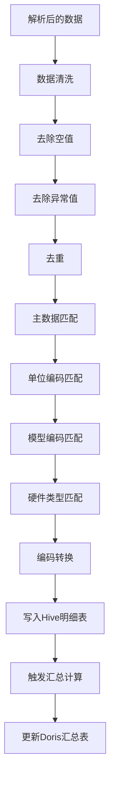
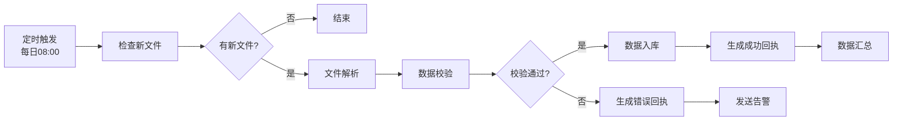

# Token采集系统详细方案

**项目名称**：集团大数据平台Token采集系统
**方案版本**：V1.0
**编制时间**：2026年3月18日
**编制团队**：九星智囊团

---

## 一、方案概述

### 1.1 项目背景

中国电信集团各单位已部署大量AI应用和大模型，Token消耗数据分散在各系统，缺乏统一采集和管控。本项目旨在构建集团级Token采集系统，实现全集团AI应用Token消耗数据的统一采集、统一存储、统一分析、统一展示。

### 1.2 建设目标

| 目标层级 | 目标内容 | 衡量指标 |
|----------|----------|----------|
| 数据采集 | 56个单位Token数据统一采集 | 采集覆盖率100% |
| 数据存储 | 建立集团级Token数据仓库 | 数据完整性100% |
| 数据分析 | 多维度统计分析能力 | 分析维度≥10个 |
| 数据展示 | 可视化大屏和报表 | 展示指标≥50个 |
| 运维管理 | 自动化运维和监控 | 故障恢复<30分钟 |

### 1.3 建设范围

| 范围维度 | 具体内容 | 数量 |
|----------|----------|:----:|
| 采集单位 | 总部部门、专业公司、省公司、直属机构 | 56+ |
| AI应用 | 智能服务、智能营销、智能运营、智能管理等 | 76类 |
| 大模型 | DeepSeek、Qwen、Telechat、Llama、Baichuan等 | 45+ |
| 部署硬件 | 910B、H800、H100、A100、V100等 | 13种 |
| Token类型 | 输入Token、输出Token、Thinking Token | 3类 |

---

## 二、技术架构设计（织锦）

### 2.1 总体架构

采用"四层架构+两个体系"设计：



**架构说明**：

| 层级 | 核心组件 | 职责 |
|------|----------|------|
| 数据源层 | 56个单位采集程序 | 日志解析、数据聚合、文件生成、SFTP上传 |
| 数据采集层 | SFTP Server + 采集服务 | 文件接收、解析校验、回执生成 |
| 数据处理层 | Spark/Flink处理引擎 | 数据清洗、转换汇总、入库分区 |
| 数据应用层 | Dashboard + API | 可视化展示、数据查询、报表导出 |

### 2.2 部署架构



**部署说明**：

| 环境 | 组件 | 配置 | 数量 |
|------|------|------|:----:|
| 应用集群 | SFTP Server | 8C/16G/500G | 1台 |
| 应用集群 | 解析服务 | 8C/16G/500G | 1台 |
| 应用集群 | 调度服务 | 8C/16G/500G | 1台 |
| 大数据平台 | NameNode | 16C/64G/2T | 2台 |
| 大数据平台 | DataNode | 16C/64G/10T | N台 |
| 大数据平台 | Doris | 8C/32G/1T | 3台 |

**数据流向示意**：

```
┌─────────────────────────────────────────────────────────────────────────┐
│                          生产环境                                         │
│                                                                         │
│  ┌──────────────────────────────────────────────────────────────────┐  │
│  │                    应用服务器集群（3台）                             │  │
│  │  ┌─────────────┐  ┌─────────────┐  ┌─────────────┐              │  │
│  │  │ App Node 1  │  │ App Node 2  │  │ App Node 3  │              │  │
│  │  │ SFTP Server │  │ 解析服务    │  │ 调度服务    │              │  │
│  │  │ 8C/16G/500G │  │ 8C/16G/500G │  │ 8C/16G/500G │              │  │
│  │  └─────────────┘  └─────────────┘  └─────────────┘              │  │
│  └──────────────────────────────────────────────────────────────────┘  │
│                                    ↓                                    │
│  ┌──────────────────────────────────────────────────────────────────┐  │
│  │                    负载均衡（Nginx/SLB）                            │  │
│  └──────────────────────────────────────────────────────────────────┘  │
│                                    ↓                                    │
│  ┌──────────────────────────────────────────────────────────────────┐  │
│  │                    大数据平台（Hadoop集群）                          │  │
│  │  ┌─────────────┐  ┌─────────────┐  ┌─────────────┐              │  │
│  │  │ NameNode    │  │ DataNode×N  │  │ Hive        │              │  │
│  │  └─────────────┘  └─────────────┘  └─────────────┘              │  │
│  │  ┌─────────────┐  ┌─────────────┐  ┌─────────────┐              │  │
│  │  │ Spark       │  │ Doris       │  │ Airflow     │              │  │
│  │  └─────────────┘  └─────────────┘  └─────────────┘              │  │
│  └──────────────────────────────────────────────────────────────────┘  │
└─────────────────────────────────────────────────────────────────────────┘
```

### 2.3 技术选型

| 层级 | 技术组件 | 版本 | 说明 |
|------|----------|------|------|
| **数据采集** | | | |
| SFTP服务 | Apache Mina SSHD | 2.9.2 | 高性能SFTP服务器 |
| 文件解析 | Python + gzip | 3.10+ | 文件解压和解析 |
| 文件监控 | Watchdog | 3.0.0 | 文件系统监控 |
| **数据处理** | | | |
| 批处理引擎 | Apache Spark | 3.4.0 | 大数据处理 |
| 流处理引擎 | Apache Flink | 1.17.0 | 实时处理（可选） |
| **数据存储** | | | |
| 数据仓库 | Apache Hive | 3.1.3 | 离线数据仓库 |
| 分析数据库 | Apache Doris | 2.0.3 | 即席查询 |
| 缓存数据库 | Redis | 7.0.0 | 缓存加速 |
| **任务调度** | | | |
| 调度系统 | Apache Airflow | 2.7.0 | 工作流调度 |
| **数据应用** | | | |
| 可视化 | Apache Superset | 2.1.0 | BI平台 |
| 图表库 | ECharts | 5.4.0 | 图表组件 |
| API服务 | FastAPI | 0.103.0 | REST API |
| **运维监控** | | | |
| 监控系统 | Prometheus | 2.47.0 | 指标采集 |
| 可视化监控 | Grafana | 10.1.0 | 监控大屏 |
| 日志系统 | ELK Stack | 8.10.0 | 日志收集分析 |
| **中间件** | | | |
| 消息队列 | Apache Kafka | 3.5.0 | 异步消息 |
| 配置中心 | Nacos | 2.2.3 | 配置管理 |

---

## 三、接口设计（工尺）

### 3.1 SFTP接口规范

#### 3.1.1 连接信息

| 项目 | 值 | 说明 |
|------|-----|------|
| IP地址 | 10.141.208.176 | CN2-1124映射地址 |
| 端口 | 12222 | SFTP端口 |
| 网络类型 | CN2-1124 | 电信专网 |
| 协议 | SFTP | SSH File Transfer Protocol |
| 认证方式 | 用户名+密码 | 每个单位独立账号 |
| 编码 | UTF-8 | 文件编码 |

#### 3.1.2 目录结构

```
/
├── data/                          # 数据上传目录（写权限）
│   ├── 10800_SHCHB_AIPB_...      # 市场部数据文件
│   ├── 10800_YWYYB_AIPB_...      # 云网运营部数据文件
│   └── 10800_811_AIPB_...        # 湖北省公司数据文件
│
├── rpt/                          # 回执目录（读权限）
│   ├── 10800_SHCHB_AIPB_...RPT   # 成功回执
│   └── 10800_SHCHB_AIPB_...ERR   # 失败回执
│
└── tmp/                          # 临时目录（可选）
    └── processing/               # 处理中文件
```

#### 3.1.3 权限配置

| 目录 | 权限 | 说明 |
|------|------|------|
| /data | 写 | 各单位只能上传，不能删除/修改 |
| /rpt | 读 | 各单位只能下载回执 |
| /tmp | 写 | 临时文件目录 |

### 3.2 文件命名规范

#### 3.2.1 命名格式

```
{编码}_{数据来源}_{数据来源系统}_{接口编码}_{文件处理时间}_{文件数据时间}_{文件上传周期}_{文件上传批次}_{文件序列号}.{后缀}
```

#### 3.2.2 字段详细说明

| 序号 | 字段名称 | 字节数 | 格式要求 | 示例 |
|:----:|----------|:------:|----------|------|
| 1 | 编码 | 5 | 固定"10800" | 10800 |
| 2 | 数据来源 | 2-10 | 单位编码（见主数据） | SHCHB |
| 3 | 数据来源系统 | 4 | 英文大写字母 | AIPB |
| 4 | 接口编码 | 20 | AIP_MDL_TOKEN_INFO | AIP_MDL_TOKEN_INFO |
| 5 | 文件处理时间 | 8 | YYYYMMDD | 20260318 |
| 6 | 文件数据时间 | 8 | YYYYMMDD | 20260317 |
| 7 | 文件上传周期 | 1 | 固定"D" | D |
| 8 | 文件上传批次 | 2 | 00首次，01第一次重传 | 00 |
| 9 | 文件序列号 | 4 | 从0001开始 | 0001 |
| 10 | 后缀 | 4-8 | DAT.gz/VAL/CHECK/RPT/ERR/TMP | DAT.gz |

#### 3.2.3 命名示例

**首次上传（正常情况）**：
```
数据文件: 10800_SHCHB_AIPB_AIP_MDL_TOKEN_INFO_20260318_20260317_D_00_0001.DAT.gz
校验文件: 10800_SHCHB_AIPB_AIP_MDL_TOKEN_INFO_20260318_20260317_D_00_0001.VAL
清单文件: 10800_SHCHB_AIPB_AIP_MDL_TOKEN_INFO_20260318_20260317_D_00_0001.CHECK
```

**第一次重传**：
```
数据文件: 10800_SHCHB_AIPB_AIP_MDL_TOKEN_INFO_20260318_20260317_D_01_0001.DAT.gz
校验文件: 10800_SHCHB_AIPB_AIP_MDL_TOKEN_INFO_20260318_20260317_D_01_0001.VAL
清单文件: 10800_SHCHB_AIPB_AIP_MDL_TOKEN_INFO_20260318_20260317_D_01_0001.CHECK
```

**上传中（TMP后缀）**：
```
10800_SHCHB_AIPB_AIP_MDL_TOKEN_INFO_20260318_20260317_D_00_0001.DAT.gz.TMP
10800_SHCHB_AIPB_AIP_MDL_TOKEN_INFO_20260318_20260317_D_00_0001.VAL.TMP
10800_SHCHB_AIPB_AIP_MDL_TOKEN_INFO_20260318_20260317_D_00_0001.CHECK.TMP
```

### 3.3 文件格式规范

#### 3.3.1 数据文件（.DAT）

| 规范项 | 要求 |
|--------|------|
| 文件编码 | UTF-8 |
| 字段分隔符 | 0x05 |
| 记录分隔符 | 0x0D0A（回车换行） |
| 禁止字符 | 不能包含0x0D0A和0x05 |
| 文件结尾 | 最后一行必须以回车换行符结束 |
| 压缩方式 | gzip压缩，后缀.DAT.gz |
| 拆分规则 | 压缩前1GB，允许10MB浮动 |

#### 3.3.2 VAL校验文件

| 序号 | 字段 | 类型 | 说明 |
|:----:|------|------|------|
| 1 | 数据文件名称 | Varchar | 完整的.DAT.gz文件名 |
| 2 | 文件记录数 | Int | **压缩前记录数** |
| 3 | 文件大小 | Int | **压缩后字节数** |
| 4 | MD5字符 | Varchar | **压缩后文件MD5** |
| 5 | 数据日期 | Varchar | YYYYMMDD |
| 6 | 上传周期 | Varchar | D |
| 7 | 生成时间 | Char(14) | YYYYMMDDHH24MISS |

**示例**：
```
10800_SHCHB_AIPB_AIP_MDL_TOKEN_INFO_20260318_20260317_D_00_0001.DAT.gz[0x05]1000[0x05]51200[0x05]a1b2c3d4e5f6...[0x05]20260317[0x05]D[0x05]20260318080000[0x0D0A]
```

#### 3.3.3 CHECK清单文件

| 序号 | 字段 | 类型 | 说明 |
|:----:|------|------|------|
| 1 | 待核查文件名称 | Varchar | 数据文件或VAL文件名 |
| 2 | 上传周期 | Varchar | D |

**示例**：
```
10800_SHCHB_AIPB_AIP_MDL_TOKEN_INFO_20260318_20260317_D_00_0001.DAT.gz[0x05]D[0x0D0A]
10800_SHCHB_AIPB_AIP_MDL_TOKEN_INFO_20260318_20260317_D_00_0001.VAL[0x05]D[0x0D0A]
```

### 3.4 数据接口字段

#### 3.4.1 AIP_MDL_TOKEN_INFO 表结构

**主键**：APP_OWNER_ORG + MODEL_DEPLOY_ORG + MODEL_CODE + APP_ID

| 序号 | 字段中文名 | 字段英文名 | 类型 | 主键 | 必填 | 校验规则 |
|:----:|-----------|-----------|------|:----:|:----:|----------|
| 1 | AI应用业务归属单位标识 | APP_OWNER_ORG | VARCHAR2(30) | Y | Y | IN {主数据56个} |
| 2 | AI应用业务归属具体处室 | APP_OWNER_DEPARTMENT | VARCHAR2(50) | N | N | 总部可空 |
| 3 | 模型部署单位标识 | MODEL_DEPLOY_ORG | VARCHAR2(50) | Y | Y | IN {主数据56个} |
| 4 | 模型部署具体处室 | MODEL_DEPLOY_DEPARTMENT | VARCHAR2(100) | N | N | 总部可空 |
| 5 | 模型编码 | MODEL_CODE | VARCHAR2(100) | Y | Y | 格式：单位_品牌_参数_序号 |
| 6 | 模型名称 | MODEL_NAME | VARCHAR2(100) | N | Y | IN {主数据45个} |
| 7 | 应用编码 | APP_ID | VARCHAR2(36) | Y | Y | 格式：单位_图谱_序号 |
| 8 | 应用名称 | USE_CASE | VARCHAR2(100) | N | Y | 非空 |
| 9 | 是否内部应用 | ITERNAL_APP | VARCHAR2(2) | N | Y | IN {0, 1} |
| 10 | 模型品牌 | MODEL_BRAND | VARCHAR2(50) | N | Y | 大写字母 |
| 11 | 模型参数量 | MODEL_SIZE | DECIMAL(20,2) | N | Y | ≥0，单位B |
| 12 | 模型类型 | MODEL_TYPE | VARCHAR2(50) | N | Y | IN {0,1,2,3,4,5} |
| 13 | 模型部署精度 | QUANT_LEVEL | VARCHAR2(4) | N | Y | IN {0,1,2,3,4,5,6} |
| 14 | 部署硬件类型 | HARDWARE_TYPE | VARCHAR2(30) | N | Y | IN {主数据13种} |
| 15 | 模型调用次数 | TOTAL_CALL_COUNT | DECIMAL(15) | N | Y | ≥0 |
| 16 | 模型成功调用次数 | TOTAL_CALL_SUCCESS_COUNT | DECIMAL(15) | N | Y | ≥0 |
| 17 | 输入Tokens消耗 | INPUT_TOKEN_COUNT | DECIMAL(20) | N | Y | ≥0 |
| 18 | 输出Tokens消耗 | OUTPUT_TOKEN_COUNT | DECIMAL(20) | N | Y | ≥0 |
| 19 | Thinking Tokens消耗 | REASONING_TOKEN_COUNT | DECIMAL(20) | N | N | ≥0 |
| 20 | 总Tokens消耗 | TOTAL_TOKEN_COUNT | DECIMAL(20) | N | Y | ≥0 |
| 21 | 备注 | REMARK | VARCHAR2(2000) | N | N | - |

#### 3.4.2 编码规则详细说明

**模型编码规则**：
```
格式：{模型部署单位标识}_{模型品牌}_{模型参数量}_{序号}

组成部分：
- 模型部署单位标识：见主数据（如YWYYB、811等）
- 模型品牌：大写字母（如QWEN、DEEPSEEK、TELECHAT）
- 模型参数量：数值（如72、7、1.5）
- 序号：六位数字（如000001）

约束：
- 全部使用大写字母及数字
- 各部分用英文下划线"_"连接
- 一条数据仅允许填写一个模型的编码

示例：
- YWYYB_QWEN_72_000001
- 811_TELECHAT_12_000001
- SHCHB_DEEPSEEK_7_000001
```

**应用编码规则**：
```
格式：{AI应用业务归属单位标识}_{AI应用图谱编码}_{序号}

组成部分：
- AI应用业务归属单位标识：见主数据
- AI应用图谱编码：见主数据（76个编码）
- 序号：六位数字

约束：
- AI应用图谱编码需对应到三级分类
- 无法归类到三级分类的，对应到一级分类的"其他"

示例：
- YWYYB_ZNYY0001_000001
- SHCHB_ZNFW0001_000001
- 811_BGWJ0000_000001
```

### 3.5 回执文件规范

#### 3.5.1 CHECK回执

**成功回执**（后缀.RPT）：
```
{文件名称}[0x05]00[0x0D0A]
```

**失败回执**（后缀.ERR）：
```
{文件名称}[0x05]{错误码}[0x0D0A]
```

**CHECK错误码**：

| 错误码 | 说明 | 处理建议 |
|:------:|------|----------|
| 00 | 核查成功 | - |
| 10001 | CHECK文件无法打开 | 检查文件格式和权限 |
| 10002 | 接口数据文件不存在 | 检查文件是否上传 |
| 10003 | 数据文件名异常 | 检查命名规范 |
| 10004 | CHECK列表中无此文件 | 检查CHECK文件内容 |
| 10005 | CHECK文件上传超时 | 检查网络连接 |
| 10099 | 规定时间内无CHECK文件 | 检查上传流程 |

#### 3.5.2 VAL回执

**成功回执**（后缀.RPT）：
```
{文件名称}[0x05]{处理时间}[0x05]00[0x0D0A]
```

**失败回执**（后缀.ERR）：
```
{文件名称}[0x05]{处理时间}[0x05]{错误码}[0x0D0A]
```

**VAL错误码**：

| 错误码 | 说明 | 处理建议 |
|:------:|------|----------|
| 00 | 校验成功 | - |
| 20001 | 数据文件无法打开 | 检查文件格式和权限 |
| 20002 | 字段个数异常 | 检查数据格式 |
| 20003 | 字段顺序异常 | 检查字段顺序 |
| 20004 | 数据为空 | 检查数据生成逻辑 |
| 20005 | 文件大小不符 | 检查压缩方式 |
| 20006 | 文件记录数不符 | 检查记录数统计 |
| 20007 | MD5校验码不符 | 重新生成VAL文件 |
| 20008 | VAL文件不存在 | 检查上传流程 |
| 20009 | 数据文件不存在 | 检查文件是否上传 |

---

## 四、数据库设计（工尺）

### 4.1 数据库架构



**数据仓库分层说明**：

| 层级 | 存储引擎 | 核心表 | 分区策略 | 数据保留 |
|------|----------|--------|----------|:--------:|
| 应用层 | Doris | 统计表、分析表 | 按需分区 | 1年 |
| 汇总层 | Hive | 日/周/月汇总表 | DATA_DATE | 3年 |
| 明细层 | Hive | Token消耗明细表 | DATA_DATE | 5年 |
| 主数据层 | MySQL/Doris | 单位/模型/应用主数据 | - | 永久 |

**分区策略详情**：


**数据流向架构**：

```
┌─────────────────────────────────────────────────────────────────────────┐
│                          数据仓库架构                                     │
│                                                                         │
│  ┌──────────────────────────────────────────────────────────────────┐  │
│  │                    应用层（Doris）                                  │  │
│  │  ┌─────────────┐  ┌─────────────┐  ┌─────────────┐              │  │
│  │  │ Token统计表 │  │ 成本分析表  │  │ 效果评估表  │              │  │
│  │  └─────────────┘  └─────────────┘  └─────────────┘              │  │
│  └──────────────────────────────────────────────────────────────────┘  │
│                                    ↑                                    │
│  ┌──────────────────────────────────────────────────────────────────┐  │
│  │                    汇总层（Hive）                                   │  │
│  │  ┌─────────────┐  ┌─────────────┐  ┌─────────────┐              │  │
│  │  │ 日汇总表    │  │ 周汇总表    │  │ 月汇总表    │              │  │
│  │  └─────────────┘  └─────────────┘  └─────────────┘              │  │
│  └──────────────────────────────────────────────────────────────────┘  │
│                                    ↑                                    │
│  ┌──────────────────────────────────────────────────────────────────┐  │
│  │                    明细层（Hive）                                   │  │
│  │  ┌─────────────────────────────────────────────────────────────┐ │  │
│  │  │ AIP_MDL_TOKEN_INFO（Token消耗明细表）                        │ │  │
│  │  │ 分区：DATA_DATE（按日期分区）                                 │ │  │
│  │  └─────────────────────────────────────────────────────────────┘ │  │
│  └──────────────────────────────────────────────────────────────────┘  │
│                                    ↑                                    │
│  ┌──────────────────────────────────────────────────────────────────┐  │
│  │                    主数据层（MySQL/Doris）                          │  │
│  │  ┌─────────────┐  ┌─────────────┐  ┌─────────────┐              │  │
│  │  │ 单位主数据  │  │ 模型主数据  │  │ 应用主数据  │              │  │
│  │  └─────────────┘  └─────────────┘  └─────────────┘              │  │
│  └──────────────────────────────────────────────────────────────────┘  │
└─────────────────────────────────────────────────────────────────────────┘
```

### 4.2 核心数据表

#### 4.2.1 Token消耗明细表

```sql
-- Hive DDL
CREATE TABLE AIP_MDL_TOKEN_INFO (
    -- 主键字段
    APP_OWNER_ORG VARCHAR(30) COMMENT 'AI应用业务归属单位标识',
    MODEL_DEPLOY_ORG VARCHAR(50) COMMENT '模型部署单位标识',
    MODEL_CODE VARCHAR(100) COMMENT '模型编码',
    APP_ID VARCHAR(36) COMMENT '应用编码',
    
    -- 业务字段
    APP_OWNER_DEPARTMENT VARCHAR(50) COMMENT 'AI应用业务归属具体处室',
    MODEL_DEPLOY_DEPARTMENT VARCHAR(100) COMMENT '模型部署具体处室',
    MODEL_NAME VARCHAR(100) COMMENT '模型名称',
    USE_CASE VARCHAR(100) COMMENT '应用名称',
    ITERNAL_APP VARCHAR(2) COMMENT '是否内部应用',
    MODEL_BRAND VARCHAR(50) COMMENT '模型品牌',
    MODEL_SIZE DECIMAL(20,2) COMMENT '模型参数量',
    MODEL_TYPE VARCHAR(50) COMMENT '模型类型',
    QUANT_LEVEL VARCHAR(4) COMMENT '模型部署精度',
    HARDWARE_TYPE VARCHAR(30) COMMENT '部署硬件类型',
    
    -- 统计字段
    TOTAL_CALL_COUNT DECIMAL(15) COMMENT '模型调用次数',
    TOTAL_CALL_SUCCESS_COUNT DECIMAL(15) COMMENT '模型成功调用次数',
    INPUT_TOKEN_COUNT DECIMAL(20) COMMENT '输入Tokens消耗',
    OUTPUT_TOKEN_COUNT DECIMAL(20) COMMENT '输出Tokens消耗',
    REASONING_TOKEN_COUNT DECIMAL(20) COMMENT 'Thinking Tokens消耗',
    TOTAL_TOKEN_COUNT DECIMAL(20) COMMENT '总Tokens消耗',
    
    -- 辅助字段
    REMARK VARCHAR(2000) COMMENT '备注',
    ETL_TIME TIMESTAMP COMMENT 'ETL处理时间',
    SOURCE_FILE VARCHAR(200) COMMENT '来源文件名',
    BATCH_ID VARCHAR(50) COMMENT '批次ID'
)
COMMENT 'Token消耗明细表'
PARTITIONED BY (DATA_DATE DATE COMMENT '数据日期')
STORED AS ORC
TBLPROPERTIES (
    'orc.compress'='SNAPPY',
    'orc.create.index'='true'
);

-- 主键约束（通过数据治理保证）
-- PRIMARY KEY (APP_OWNER_ORG, MODEL_DEPLOY_ORG, MODEL_CODE, APP_ID, DATA_DATE)
```

#### 4.2.2 日汇总表

```sql
-- Hive DDL
CREATE TABLE AIP_MDL_TOKEN_DAILY AS
SELECT
    DATA_DATE,
    APP_OWNER_ORG,
    MODEL_DEPLOY_ORG,
    MODEL_TYPE,
    
    -- 统计指标
    COUNT(DISTINCT MODEL_CODE) AS MODEL_COUNT,
    COUNT(DISTINCT APP_ID) AS APP_COUNT,
    SUM(TOTAL_CALL_COUNT) AS TOTAL_CALL_COUNT,
    SUM(TOTAL_CALL_SUCCESS_COUNT) AS TOTAL_CALL_SUCCESS_COUNT,
    SUM(INPUT_TOKEN_COUNT) AS INPUT_TOKEN_COUNT,
    SUM(OUTPUT_TOKEN_COUNT) AS OUTPUT_TOKEN_COUNT,
    SUM(REASONING_TOKEN_COUNT) AS REASONING_TOKEN_COUNT,
    SUM(TOTAL_TOKEN_COUNT) AS TOTAL_TOKEN_COUNT,
    
    -- 成功率
    ROUND(
        CASE 
            WHEN SUM(TOTAL_CALL_COUNT) > 0 
            THEN SUM(TOTAL_CALL_SUCCESS_COUNT) / SUM(TOTAL_CALL_COUNT) * 100 
            ELSE 0 
        END, 
        2
    ) AS SUCCESS_RATE
FROM AIP_MDL_TOKEN_INFO
GROUP BY DATA_DATE, APP_OWNER_ORG, MODEL_DEPLOY_ORG, MODEL_TYPE;
```

#### 4.2.3 月汇总表

```sql
-- Hive DDL
CREATE TABLE AIP_MDL_TOKEN_MONTHLY AS
SELECT
    TRUNC(DATA_DATE, 'MM') AS MONTH,
    APP_OWNER_ORG,
    MODEL_DEPLOY_ORG,
    
    -- 统计指标
    COUNT(DISTINCT MODEL_CODE) AS MODEL_COUNT,
    COUNT(DISTINCT APP_ID) AS APP_COUNT,
    SUM(TOTAL_CALL_COUNT) AS TOTAL_CALL_COUNT,
    SUM(TOTAL_CALL_SUCCESS_COUNT) AS TOTAL_CALL_SUCCESS_COUNT,
    SUM(INPUT_TOKEN_COUNT) AS INPUT_TOKEN_COUNT,
    SUM(OUTPUT_TOKEN_COUNT) AS OUTPUT_TOKEN_COUNT,
    SUM(REASONING_TOKEN_COUNT) AS REASONING_TOKEN_COUNT,
    SUM(TOTAL_TOKEN_COUNT) AS TOTAL_TOKEN_COUNT
FROM AIP_MDL_TOKEN_INFO
GROUP BY TRUNC(DATA_DATE, 'MM'), APP_OWNER_ORG, MODEL_DEPLOY_ORG;
```

### 4.3 主数据表

#### 4.3.1 单位标识主数据

```sql
-- MySQL DDL
CREATE TABLE MD_ORG (
    ORG_CODE VARCHAR(10) PRIMARY KEY COMMENT '单位编码',
    ORG_NAME VARCHAR(100) NOT NULL COMMENT '单位名称',
    ORG_TYPE VARCHAR(20) COMMENT '单位类型',
    PARENT_ORG VARCHAR(10) COMMENT '上级单位',
    PROVINCE_CODE VARCHAR(10) COMMENT '省份编码（省公司）',
    STATUS VARCHAR(2) DEFAULT '1' COMMENT '状态：1有效/0失效',
    CREATE_TIME TIMESTAMP DEFAULT CURRENT_TIMESTAMP,
    UPDATE_TIME TIMESTAMP DEFAULT CURRENT_TIMESTAMP ON UPDATE CURRENT_TIMESTAMP,
    
    INDEX idx_org_type (ORG_TYPE),
    INDEX idx_parent_org (PARENT_ORG)
) COMMENT '单位标识主数据';

-- 初始数据（56个单位）
INSERT INTO MD_ORG (ORG_CODE, ORG_NAME, ORG_TYPE) VALUES
-- 总部部门（23个）
('JWJCB', '中央纪委国家监委驻中国电信纪检监察组', '总部部门'),
('BGSBB', '办公室（党组办公室、董事会办公室、安全保卫部）', '总部部门'),
('QYZLB', '企业战略部', '总部部门'),
('SHCHB', '市场部', '总部部门'),
('RLZYB', '人力资源部(党组组织部)', '总部部门'),
('CWUBB', '财务部', '总部部门'),
('YWFZB', '云网发展部（国际部）', '总部部门'),
('YWYYB', '云网运营部', '总部部门'),
('KHFWB', '客户服务部', '总部部门'),
('WXAQB', '网络和信息安全管理部', '总部部门'),
('SHJBB', '审计部', '总部部门'),
('FLVVB', '法律部（合规管理部）', '总部部门'),
('KJCXB', '科技创新部', '总部部门'),
('DXLDB', '党组巡视工作领导小组办公室', '总部部门'),
('DQGZB', '党群工作部', '总部部门'),
('JTGHB', '集团工会', '总部部门'),
('TZGXB', '投资者关系部', '总部部门'),
('GJGXB', '共建共享工作组', '总部部门'),
('ZBYYB', '资本运营部(中国电信集团投资有限责任公司)', '总部部门'),
('ZQXFB', '政企信息服务事业群', '总部部门'),
('QQYYB', '全渠道运营中心', '总部部门'),
('CGGLB', '采购供应链管理中心', '总部部门'),
('SFZXB', '数据发展中心', '总部部门'),
-- 专业公司（26个）
('ZTGS', '中国通信服务股份有限公司', '专业公司'),
('GJGS', '国际公司', '专业公司'),
-- ... 其他单位
('AIGS', '中电信人工智能科技有限公司', '专业公司'),
('AQGS', '天翼安全科技有限公司', '专业公司'),
('TYGS', '天翼云科技有限公司', '专业公司');
```

#### 4.3.2 模型类型主数据

```sql
-- MySQL DDL
CREATE TABLE MD_MODEL_TYPE (
    TYPE_CODE VARCHAR(2) PRIMARY KEY COMMENT '类型编码',
    TYPE_NAME VARCHAR(50) NOT NULL COMMENT '类型名称',
    DESCRIPTION VARCHAR(200) COMMENT '描述',
    SORT_ORDER INT COMMENT '排序',
    STATUS VARCHAR(2) DEFAULT '1' COMMENT '状态'
) COMMENT '模型类型主数据';

-- 初始数据
INSERT INTO MD_MODEL_TYPE (TYPE_CODE, TYPE_NAME, DESCRIPTION, SORT_ORDER) VALUES
('1', '生成式大语言', 'Qwen、Deepseek等生成式大语言模型', 1),
('2', '多模态(图片)', '图片理解、图片生成、视觉问答等', 2),
('3', '多模态(视频)', '视频理解、视频问答等', 3),
('4', '多模态(语音)', '语音理解、语音生成、语音问答等', 4),
('5', '向量化', 'Embedding、Rerank等文本向量化模型', 5),
('0', '其他模型', '未分类或特殊用途模型', 99);
```

#### 4.3.3 AI应用图谱主数据

```sql
-- MySQL DDL
CREATE TABLE MD_AI_APP (
    APP_CODE VARCHAR(20) PRIMARY KEY COMMENT '应用编码',
    LEVEL1_NAME VARCHAR(50) COMMENT '一级分类',
    LEVEL2_NAME VARCHAR(50) COMMENT '二级分类',
    LEVEL3_NAME VARCHAR(50) COMMENT '三级分类',
    FULL_PATH VARCHAR(200) COMMENT '完整路径',
    SORT_ORDER INT COMMENT '排序',
    STATUS VARCHAR(2) DEFAULT '1' COMMENT '状态'
) COMMENT 'AI应用图谱主数据';

-- 初始数据（76个分类）
INSERT INTO MD_AI_APP (APP_CODE, LEVEL1_NAME, LEVEL2_NAME, LEVEL3_NAME, FULL_PATH, SORT_ORDER) VALUES
-- 智能服务（5个）
('ZNFW0001', '智能服务', '面向客户', '客服机器人', '智能服务/面向客户/客服机器人', 1),
('ZNFW0002', '智能服务', '面向一线', '客服助理', '智能服务/面向一线/客服助理', 2),
('ZNFW0003', '智能服务', '面向一线', '客服管理', '智能服务/面向一线/客服管理', 3),
('ZNFW0004', '智能服务', '面向一线', '政支服务', '智能服务/面向一线/政支服务', 4),
('ZNFW0000', '智能服务', '其他', '其他', '智能服务/其他/其他', 99),
-- 智能营销（8个）
('ZNYX0001', '智能营销', '个人及家庭业务', '客户经营', '智能营销/个人及家庭业务/客户经营', 100),
-- ... 其他分类
-- 行业应用（14个）
('BGWJ0000', '卫健行业', '卫健行业', '卫健行业', '卫健行业/卫健行业/卫健行业', 800);
```

---

## 五、开发实现方案

**编制说明**：本章节按照"需求描述→需求方案→详细设计→代码编写"四章节结构，详细描述各功能模块的实现方案。

---

### 5.1 SFTP文件接收服务

#### 5.1.1 需求描述

**功能需求**：

| 需求项 | 需求描述 | 优先级 |
|--------|----------|:------:|
| SFTP服务 | 提供标准SFTP协议服务，支持省公司上传数据文件 | P0 |
| 账号管理 | 为每个省公司分配独立账号，支持账号创建、禁用、密码重置 | P0 |
| 目录隔离 | 每个省公司独立目录，互不可见 | P0 |
| 文件校验 | 支持CHECK清单校验、VAL校验文件完整性 | P0 |
| 回执生成 | 自动生成RPT成功回执、ERR失败回执 | P0 |
| 文件监控 | 实时监控文件上传，触发后续处理流程 | P0 |

**性能需求**：

| 性能指标 | 目标值 | 说明 |
|----------|--------|------|
| 并发连接数 | ≥50 | 支持56个单位同时上传 |
| 单文件大小 | ≤100MB | 单次上传文件大小限制 |
| 上传速度 | ≥10MB/s | 网络带宽要求 |
| 响应时间 | ≤1s | 登录认证响应时间 |

**接口需求**：

| 接口类型 | 协议 | 端口 | 说明 |
|----------|------|:----:|------|
| SFTP服务 | SFTP v3/v4 | 12222 | 文件传输主端口 |
| 认证接口 | SSH2 | 12222 | 公钥/密码认证 |

#### 5.1.2 需求方案

**技术选型**：

| 技术组件 | 选型 | 对比方案 | 选型理由 |
|----------|------|----------|----------|
| SSH服务 | Apache Mina SSHD | OpenSSH、Paramiko | 纯Java实现，嵌入式部署，支持自定义认证 |
| SFTP服务 | Mina SSHD SFTP | vsftpd | 与SSH服务集成，支持虚拟用户 |
| 文件监控 | Watchdog | inotify | Python原生，跨平台支持 |
| 认证存储 | MySQL | LDAP | 简单易用，与主数据系统对接 |
| 日志记录 | Loguru | logging | 结构化日志，自动轮转 |

**实现思路**：

```
省公司上传文件
    ↓
SFTP服务器接收（Mina SSHD）
    ↓
文件监控触发（Watchdog）
    ↓
判断文件类型
    ├── .CHECK → CHECK校验流程
    ├── .VAL → VAL校验流程
    └── .DAT.gz → 数据文件（等待VAL校验）
    ↓
生成回执文件
    ├── RPT（成功回执）
    └── ERR（失败回执）
    ↓
触发后续数据处理流程
```

**方案对比**：

| 方案 | 优点 | 缺点 | 结论 |
|------|------|------|:----:|
| Apache Mina SSHD | 嵌入式、可定制、纯Java | 需要JVM环境 | ✅ 推荐 |
| OpenSSH | 成熟稳定、性能好 | 难以定制认证逻辑 | 备选 |
| Paramiko SFTP | Python原生、易开发 | 性能一般 | 备选 |

#### 5.1.3 详细设计

**流程图**：



**接口设计**：

**SFTP连接接口**：

| 参数 | 类型 | 必填 | 说明 |
|------|------|:----:|------|
| host | String | 是 | SFTP服务器地址 |
| port | Integer | 是 | 端口号（默认12222） |
| username | String | 是 | 用户名（省公司编码） |
| password | String | 是 | 密码 |
| privateKey | String | 否 | 私钥文件路径（可选） |

**认证接口**：

```python
# 认证请求
{
    "username": "HB001",           # 省公司编码
    "password": "encrypted_pwd",   # 加密密码
    "client_ip": "10.141.208.176"  # 客户端IP
}

# 认证响应
{
    "code": 0,                     # 0成功，其他失败
    "message": "认证成功",
    "home_dir": "/data/HB001",     # 用户主目录
    "permissions": ["read", "write"]  # 权限列表
}
```

**数据结构**：

**用户账号表**：

| 字段 | 类型 | 说明 |
|------|------|------|
| user_id | VARCHAR(32) | 用户ID（省公司编码） |
| user_name | VARCHAR(64) | 用户名称 |
| password_hash | VARCHAR(128) | 密码哈希 |
| home_dir | VARCHAR(256) | 主目录 |
| status | TINYINT | 状态（1启用，0禁用） |
| created_at | DATETIME | 创建时间 |
| expired_at | DATETIME | 过期时间 |

**状态机**：



#### 5.1.4 代码编写

**SFTP服务器核心代码**：

```python
# sftp_server.py
"""
SFTP文件接收服务
基于Apache Mina SSHD实现
"""

import os
import asyncio
from pathlib import Path
from typing import Optional, Dict, List
from datetime import datetime
import paramiko
from paramiko import RSAKey, ServerInterface
from loguru import logger
from watchdog.observers import Observer
from watchdog.events import FileSystemEventHandler, FileCreatedEvent


class SFTPConfig:
    """SFTP服务配置"""
    
    HOST: str = '0.0.0.0'
    PORT: int = 12222
    HOST_KEY_PATH: str = '/etc/ssh/ssh_host_rsa_key'
    DATA_DIR: str = '/data'
    RPT_DIR: str = '/rpt'
    MAX_CONNECTIONS: int = 50
    MAX_FILE_SIZE: int = 100 * 1024 * 1024  # 100MB
    TIMEOUT: int = 300  # 5分钟超时


class TokenSFTPServer(ServerInterface):
    """Token采集SFTP服务器"""
    
    def __init__(self, data_dir: Path, rpt_dir: Path):
        self.data_dir = data_dir
        self.rpt_dir = rpt_dir
        self.user_db = UserDatabase()
        
    def check_auth_password(self, username: str, password: str) -> int:
        """密码认证"""
        user = self.user_db.get_user(username)
        if not user:
            logger.warning(f"用户不存在: {username}")
            return paramiko.AUTH_FAILED
        
        if user['status'] != 1:
            logger.warning(f"用户已禁用: {username}")
            return paramiko.AUTH_FAILED
        
        if not self.user_db.verify_password(username, password):
            logger.warning(f"密码错误: {username}")
            return paramiko.AUTH_FAILED
        
        logger.info(f"用户认证成功: {username}")
        return paramiko.AUTH_SUCCESSFUL
    
    def check_channel_request(self, kind: str, chanid: int) -> int:
        """检查通道请求"""
        if kind == 'session':
            return paramiko.OPEN_SUCCEEDED
        return paramiko.OPEN_FAILED_ADMINISTRATIVELY_PROHIBITED


class SFTPServer:
    """SFTP服务器主类"""
    
    def __init__(self, config: SFTPConfig = None):
        self.config = config or SFTPConfig()
        self.data_dir = Path(self.config.DATA_DIR)
        self.rpt_dir = Path(self.config.RPT_DIR)
        self.server: Optional[paramiko.Transport] = None
        self.observer: Optional[Observer] = None
        
    def start(self):
        """启动SFTP服务"""
        # 创建目录
        self.data_dir.mkdir(parents=True, exist_ok=True)
        self.rpt_dir.mkdir(parents=True, exist_ok=True)
        
        # 加载主机密钥
        host_key = RSAKey.from_private_key_file(self.config.HOST_KEY_PATH)
        
        # 创建服务器socket
        sock = paramiko.Transport((self.config.HOST, self.config.PORT))
        sock.add_server_key(host_key)
        
        # 启动服务器
        server = TokenSFTPServer(self.data_dir, self.rpt_dir)
        sock.start_server(server=server)
        
        logger.info(f"SFTP服务器启动: {self.config.HOST}:{self.config.PORT}")
        logger.info(f"数据目录: {self.data_dir}")
        logger.info(f"回执目录: {self.rpt_dir}")
        
        # 启动文件监控
        self._start_file_monitor()
        
        # 保持运行
        self._run_loop(sock)
        
    def _start_file_monitor(self):
        """启动文件监控"""
        event_handler = FileEventHandler(self.data_dir, self.rpt_dir)
        self.observer = Observer()
        self.observer.schedule(event_handler, str(self.data_dir), recursive=False)
        self.observer.start()
        logger.info("文件监控启动")
        
    def _run_loop(self, sock: paramiko.Transport):
        """主运行循环"""
        while True:
            try:
                client = sock.accept(timeout=1.0)
                if client:
                    logger.info(f"客户端连接: {client.getpeername()}")
                    # 处理客户端请求...
            except Exception as e:
                logger.error(f"运行错误: {e}")


class FileEventHandler(FileSystemEventHandler):
    """文件事件处理器"""
    
    def __init__(self, data_dir: Path, rpt_dir: Path):
        self.data_dir = data_dir
        self.rpt_dir = rpt_dir
        self.validator = FileValidator()
        self.receipt_gen = ReceiptGenerator(rpt_dir)
        
    def on_created(self, event: FileCreatedEvent):
        """文件创建事件"""
        if event.is_directory:
            return
            
        file_path = Path(event.src_path)
        
        # 忽略TMP文件
        if file_path.suffix == '.TMP':
            logger.debug(f"忽略TMP文件: {file_path}")
            return
            
        logger.info(f"检测到新文件: {file_path.name}")
        
        # 根据文件类型处理
        if file_path.suffix == '.CHECK':
            self._process_check_file(file_path)
        elif file_path.suffix == '.VAL':
            self._process_val_file(file_path)
            
    def _process_check_file(self, check_file: Path):
        """处理CHECK文件"""
        logger.info(f"处理CHECK文件: {check_file.name}")
        
        is_valid, error_code, files = self.validator.validate_check(check_file)
        self.receipt_gen.generate_check_receipt(check_file, is_valid, error_code)
        
        if is_valid:
            logger.info(f"CHECK校验成功: {files}")
        else:
            logger.warning(f"CHECK校验失败: {error_code}")
            
    def _process_val_file(self, val_file: Path):
        """处理VAL文件"""
        logger.info(f"处理VAL文件: {val_file.name}")
        
        data_file = self.data_dir / val_file.name.replace('.VAL', '.DAT.gz')
        
        if not data_file.exists():
            logger.error(f"数据文件不存在: {data_file}")
            self.receipt_gen.generate_val_receipt(val_file, False, '20009')
            return
            
        is_valid, error_code = self.validator.validate_val(val_file, data_file)
        self.receipt_gen.generate_val_receipt(val_file, is_valid, error_code)
        
        if is_valid:
            logger.info(f"VAL校验成功: {val_file.name}")
            self._trigger_data_load(data_file)
        else:
            logger.warning(f"VAL校验失败: {error_code}")


# 单元测试
import pytest

class TestSFTPServer:
    """SFTP服务器测试"""
    
    def test_user_authentication(self):
        """测试用户认证"""
        server = TokenSFTPServer(Path('/data'), Path('/rpt'))
        
        # 测试有效用户
        result = server.check_auth_password('HB001', 'valid_password')
        assert result == paramiko.AUTH_SUCCESSFUL
        
        # 测试无效用户
        result = server.check_auth_password('invalid', 'password')
        assert result == paramiko.AUTH_FAILED
        
    def test_file_monitor(self):
        """测试文件监控"""
        handler = FileEventHandler(Path('/data'), Path('/rpt'))
        
        # 模拟文件创建事件
        event = FileCreatedEvent('/data/test.DAT.gz')
        handler.on_created(event)
        
        # 验证处理逻辑
        # ...
```

**配置文件**：

```yaml
# config/sftp_config.yaml
sftp:
  host: 0.0.0.0
  port: 12222
  host_key: /etc/ssh/ssh_host_rsa_key
  
directories:
  data: /data
  report: /rpt
  log: /var/log/token-collect
  
limits:
  max_connections: 50
  max_file_size: 104857600  # 100MB
  timeout: 300
  
logging:
  level: INFO
  format: "{time:YYYY-MM-DD HH:mm:ss} | {level} | {message}"
  rotation: "100 MB"
  retention: "30 days"
```

**Docker部署**：

```dockerfile
# Dockerfile
FROM python:3.11-slim

WORKDIR /app

# 安装依赖
COPY requirements.txt .
RUN pip install --no-cache-dir -r requirements.txt

# 复制代码
COPY src/ ./src/
COPY config/ ./config/

# 创建目录
RUN mkdir -p /data /rpt /var/log/token-collect

# 暴露端口
EXPOSE 12222

# 启动服务
CMD ["python", "src/sftp_server.py"]
```

---

### 5.2 文件解析模块

#### 5.2.1 需求描述

**功能需求**：

| 需求项 | 需求描述 | 优先级 |
|--------|----------|:------:|
| 文件解压 | 支持gzip格式压缩文件解压 | P0 |
| 编码识别 | 自动识别文件编码（UTF-8、GBK） | P0 |
| 字段提取 | 按照0x05分隔符提取字段 | P0 |
| 数据转换 | 将文本数据转换为结构化记录 | P0 |
| 异常处理 | 解析失败时记录错误信息 | P0 |
| 批量处理 | 支持批量解析多个文件 | P1 |

**性能需求**：

| 性能指标 | 目标值 | 说明 |
|----------|--------|------|
| 解析速度 | ≥10万条/分钟 | 单文件解析性能 |
| 内存占用 | ≤1GB | 单文件处理内存 |
| 并发处理 | ≥10个文件 | 并行解析文件数 |

#### 5.2.2 需求方案

**技术选型**：

| 技术组件 | 选型 | 选型理由 |
|----------|------|----------|
| 解压工具 | Python gzip | 原生支持，性能好 |
| 编码检测 | chardet | 自动识别编码，准确率高 |
| 数据解析 | 正则表达式 | 灵活处理各种格式 |
| 批量处理 | multiprocessing | Python原生多进程 |

**实现思路**：

```
接收DAT.gz文件
    ↓
解压文件（gzip）
    ↓
检测文件编码（chardet）
    ↓
读取文件内容
    ↓
按行解析（0x05分隔符）
    ↓
字段映射与转换
    ↓
数据验证
    ↓
输出TokenRecord列表
```

#### 5.2.3 详细设计

**流程图**：



**数据结构**：

```python
@dataclass
class TokenRecord:
    """Token记录数据结构"""
    app_owner_org: str           # 应用所属单位编码
    app_owner_department: str    # 应用所属部门
    model_deploy_org: str        # 模型部署单位编码
    model_deploy_department: str # 模型部署部门
    model_code: str              # 模型编码
    model_name: str              # 模型名称
    app_id: str                  # 应用ID
    use_case: str                # 使用场景
    iternal_app: str             # 是否内部应用
    model_brand: str             # 模型品牌
    model_size: float            # 模型参数量
    model_type: str              # 模型类型
    quant_level: str             # 量化等级
    hardware_type: str           # 硬件类型
    total_call_count: int        # 总调用次数
    total_call_success_count: int # 成功调用次数
    input_token_count: int       # 输入Token数
    output_token_count: int      # 输出Token数
    reasoning_token_count: int   # 推理Token数
    total_token_count: int       # 总Token数
    remark: str                  # 备注
```

#### 5.2.4 代码编写

```python
# file_parser.py
"""
文件解析模块
支持gzip解压、编码识别、字段提取
"""

import gzip
import chardet
from pathlib import Path
from typing import List, Tuple, Optional
from dataclasses import dataclass
from loguru import logger


@dataclass
class ParseResult:
    """解析结果"""
    success: bool
    records: List[TokenRecord]
    errors: List[Tuple[int, str]]  # (行号, 错误信息)
    total_lines: int
    parsed_lines: int


class FileParser:
    """文件解析器"""
    
    FIELD_SEPARATOR = chr(0x05)  # 字段分隔符
    EXPECTED_FIELDS = 21         # 期望字段数
    
    def __init__(self):
        self.encoding_detector = chardet
        
    def parse_file(self, file_path: Path) -> ParseResult:
        """解析数据文件"""
        logger.info(f"开始解析文件: {file_path.name}")
        
        # 1. 解压文件
        content = self._decompress(file_path)
        if content is None:
            return ParseResult(False, [], [], 0, 0)
        
        # 2. 检测编码
        encoding = self._detect_encoding(content)
        logger.info(f"检测到编码: {encoding}")
        
        # 3. 解码内容
        try:
            text = content.decode(encoding)
        except Exception as e:
            logger.error(f"解码失败: {e}")
            return ParseResult(False, [], [], 0, 0)
        
        # 4. 逐行解析
        lines = text.strip().split('\n')
        records = []
        errors = []
        
        for line_num, line in enumerate(lines, 1):
            record, error = self._parse_line(line, line_num)
            if record:
                records.append(record)
            if error:
                errors.append((line_num, error))
        
        logger.info(f"解析完成: 共{len(lines)}行, 成功{len(records)}条, 失败{len(errors)}条")
        
        return ParseResult(
            success=len(records) > 0,
            records=records,
            errors=errors,
            total_lines=len(lines),
            parsed_lines=len(records)
        )
    
    def _decompress(self, file_path: Path) -> Optional[bytes]:
        """解压gzip文件"""
        try:
            with gzip.open(file_path, 'rb') as f:
                return f.read()
        except Exception as e:
            logger.error(f"解压失败: {e}")
            return None
    
    def _detect_encoding(self, content: bytes) -> str:
        """检测文件编码"""
        result = self.encoding_detector.detect(content)
        return result.get('encoding', 'utf-8')
    
    def _parse_line(self, line: str, line_num: int) -> Tuple[Optional[TokenRecord], Optional[str]]:
        """解析单行数据"""
        if not line.strip():
            return None, "空行"
        
        fields = line.split(self.FIELD_SEPARATOR)
        
        if len(fields) != self.EXPECTED_FIELDS:
            return None, f"字段数不正确: 期望{self.EXPECTED_FIELDS}, 实际{len(fields)}"
        
        try:
            record = TokenRecord(
                app_owner_org=fields[0],
                app_owner_department=fields[1],
                model_deploy_org=fields[2],
                model_deploy_department=fields[3],
                model_code=fields[4],
                model_name=fields[5],
                app_id=fields[6],
                use_case=fields[7],
                iternal_app=fields[8],
                model_brand=fields[9],
                model_size=float(fields[10]) if fields[10] else 0.0,
                model_type=fields[11],
                quant_level=fields[12],
                hardware_type=fields[13],
                total_call_count=int(fields[14]) if fields[14] else 0,
                total_call_success_count=int(fields[15]) if fields[15] else 0,
                input_token_count=int(fields[16]) if fields[16] else 0,
                output_token_count=int(fields[17]) if fields[17] else 0,
                reasoning_token_count=int(fields[18]) if fields[18] else 0,
                total_token_count=int(fields[19]) if fields[19] else 0,
                remark=fields[20]
            )
            return record, None
        except Exception as e:
            return None, f"字段转换错误: {e}"


# 单元测试
class TestFileParser:
    """文件解析测试"""
    
    def test_parse_valid_file(self):
        """测试解析有效文件"""
        parser = FileParser()
        result = parser.parse_file(Path('/data/test.DAT.gz'))
        
        assert result.success
        assert len(result.records) > 0
        assert result.parsed_lines == len(result.records)
        
    def test_encoding_detection(self):
        """测试编码检测"""
        parser = FileParser()
        
        # UTF-8编码
        content = "测试内容".encode('utf-8')
        assert parser._detect_encoding(content) == 'utf-8'
        
        # GBK编码
        content = "测试内容".encode('gbk')
        encoding = parser._detect_encoding(content)
        assert encoding in ['gbk', 'GB2312']
```

---

### 5.3 文件校验模块

#### 5.3.1 需求描述

**功能需求**：

| 需求项 | 需求描述 | 优先级 |
|--------|----------|:------:|
| CHECK校验 | 校验清单文件，验证数据文件完整性 | P0 |
| VAL校验 | 校验数据文件记录数、总Token数 | P0 |
| 数据校验 | 校验字段格式、编码规则、主数据匹配 | P0 |
| 错误码返回 | 返回标准错误码，便于定位问题 | P0 |
| 校验日志 | 记录校验过程和结果 | P1 |

**错误码定义**：

| 错误码 | 错误描述 | 处理建议 |
|--------|----------|----------|
| 20001 | CHECK文件格式错误 | 检查文件格式 |
| 20002 | 数据文件缺失 | 上传数据文件 |
| 20003 | 记录数不匹配 | 检查数据完整性 |
| 20004 | Token数不匹配 | 重新统计数据 |
| 20005 | 字段格式错误 | 检查数据格式 |
| 20006 | 单位编码不存在 | 联系管理员添加 |
| 20007 | 模型编码不存在 | 联系管理员添加 |
| 20008 | 硬件类型不存在 | 联系管理员添加 |
| 20009 | 数据文件不存在 | 上传数据文件 |

#### 5.3.2 需求方案

**技术选型**：

| 技术组件 | 选型 | 选型理由 |
|----------|------|----------|
| 校验引擎 | Python原生 | 灵活定义校验规则 |
| 主数据查询 | MySQL | 与主数据系统对接 |
| 错误处理 | 自定义异常 | 清晰的错误追踪 |

**实现思路**：

```
CHECK校验流程：
1. 解析CHECK文件
2. 验证文件格式
3. 检查数据文件是否存在
4. 比对文件大小
5. 返回校验结果

VAL校验流程：
1. 解析VAL文件
2. 验证文件格式
3. 解析数据文件
4. 比对记录数
5. 比对Token总数
6. 校验字段格式
7. 校验主数据匹配
8. 返回校验结果
```

#### 5.3.3 详细设计

**流程图**：



#### 5.3.4 代码编写

```python
# file_validator.py
"""
文件校验模块
支持CHECK校验、VAL校验、数据校验
"""

from pathlib import Path
from typing import Tuple, List, Optional
from dataclasses import dataclass
from loguru import logger


@dataclass
class CheckInfo:
    """CHECK文件信息"""
    data_file: str        # 数据文件名
    file_size: int        # 文件大小
    record_count: int     # 记录数
    total_token: int      # Token总数


@dataclass
class ValInfo:
    """VAL文件信息"""
    data_file: str        # 数据文件名
    record_count: int     # 记录数
    total_token: int      # Token总数


class FileValidator:
    """文件校验器"""
    
    ERROR_CODES = {
        '20001': 'CHECK文件格式错误',
        '20002': '数据文件缺失',
        '20003': '记录数不匹配',
        '20004': 'Token数不匹配',
        '20005': '字段格式错误',
        '20006': '单位编码不存在',
        '20007': '模型编码不存在',
        '20008': '硬件类型不存在',
        '20009': '数据文件不存在'
    }
    
    def __init__(self, master_data: MasterDataService = None):
        self.master_data = master_data or MasterDataService()
        
    def validate_check(self, check_file: Path) -> Tuple[bool, str, List[str]]:
        """校验CHECK文件"""
        logger.info(f"校验CHECK文件: {check_file.name}")
        
        try:
            # 解析CHECK文件
            check_info = self._parse_check_file(check_file)
            if not check_info:
                return False, '20001', []
            
            # 检查数据文件是否存在
            data_file = check_file.parent / check_info.data_file
            if not data_file.exists():
                return False, '20002', []
            
            # 比对文件大小
            actual_size = data_file.stat().st_size
            if actual_size != check_info.file_size:
                logger.warning(f"文件大小不匹配: 期望{check_info.file_size}, 实际{actual_size}")
                return False, '20002', []
            
            return True, '', [check_info.data_file]
            
        except Exception as e:
            logger.error(f"CHECK校验异常: {e}")
            return False, '20001', []
    
    def validate_val(self, val_file: Path, data_file: Path) -> Tuple[bool, str]:
        """校验VAL文件"""
        logger.info(f"校验VAL文件: {val_file.name}")
        
        try:
            # 解析VAL文件
            val_info = self._parse_val_file(val_file)
            if not val_info:
                return False, '20001'
            
            # 解析数据文件
            parser = FileParser()
            result = parser.parse_file(data_file)
            
            if not result.success:
                return False, '20005'
            
            # 比对记录数
            if result.parsed_lines != val_info.record_count:
                logger.warning(f"记录数不匹配: 期望{val_info.record_count}, 实际{result.parsed_lines}")
                return False, '20003'
            
            # 比对Token总数
            total_token = sum(r.total_token_count for r in result.records)
            if total_token != val_info.total_token:
                logger.warning(f"Token数不匹配: 期望{val_info.total_token}, 实际{total_token}")
                return False, '20004'
            
            # 校验主数据
            for record in result.records:
                if not self._validate_master_data(record):
                    return False, '20006'
            
            return True, ''
            
        except Exception as e:
            logger.error(f"VAL校验异常: {e}")
            return False, '20001'
    
    def _parse_check_file(self, check_file: Path) -> Optional[CheckInfo]:
        """解析CHECK文件"""
        try:
            with open(check_file, 'r', encoding='utf-8') as f:
                lines = f.readlines()
            
            # 解析字段
            data_file = lines[0].strip()
            file_size = int(lines[1].strip())
            record_count = int(lines[2].strip())
            total_token = int(lines[3].strip())
            
            return CheckInfo(data_file, file_size, record_count, total_token)
        except Exception as e:
            logger.error(f"CHECK文件解析失败: {e}")
            return None
    
    def _parse_val_file(self, val_file: Path) -> Optional[ValInfo]:
        """解析VAL文件"""
        try:
            with open(val_file, 'r', encoding='utf-8') as f:
                lines = f.readlines()
            
            data_file = lines[0].strip()
            record_count = int(lines[1].strip())
            total_token = int(lines[2].strip())
            
            return ValInfo(data_file, record_count, total_token)
        except Exception as e:
            logger.error(f"VAL文件解析失败: {e}")
            return None
    
    def _validate_master_data(self, record: TokenRecord) -> bool:
        """校验主数据"""
        # 校验单位编码
        if not self.master_data.get_org(record.app_owner_org):
            logger.warning(f"单位编码不存在: {record.app_owner_org}")
            return False
        
        # 校验模型编码
        if not self.master_data.get_model(record.model_code):
            logger.warning(f"模型编码不存在: {record.model_code}")
            return False
        
        return True


# 单元测试
class TestFileValidator:
    """文件校验测试"""
    
    def test_validate_check_success(self):
        """测试CHECK校验成功"""
        validator = FileValidator()
        success, error, files = validator.validate_check(Path('/data/test.CHECK'))
        assert success
        assert error == ''
        
    def test_validate_check_missing_file(self):
        """测试CHECK校验-文件缺失"""
        validator = FileValidator()
        success, error, files = validator.validate_check(Path('/data/missing.CHECK'))
        assert not success
        assert error == '20002'
```

---

### 5.4 回执生成模块

#### 5.4.1 需求描述

**功能需求**：

| 需求项 | 需求描述 | 优先级 |
|--------|----------|:------:|
| RPT回执 | 生成成功回执文件 | P0 |
| ERR回执 | 生成失败回执文件，包含错误码和错误信息 | P0 |
| 回执格式 | 标准格式，便于省公司解析 | P0 |
| 回执命名 | 与原文件关联，便于识别 | P0 |

**回执格式**：

**RPT成功回执**（.RPT）：
```
原文件名
校验时间
SUCCESS
```

**ERR失败回执**（.ERR）：
```
原文件名
校验时间
FAILED
错误码
错误描述
```

#### 5.4.2 需求方案

**实现思路**：

```
校验完成
    ↓
判断校验结果
    ├── 成功 → 生成RPT回执
    └── 失败 → 生成ERR回执（含错误码）
    ↓
写入回执文件
    ↓
通知省公司
```

#### 5.4.3 详细设计

**流程图**：



#### 5.4.4 代码编写

```python
# receipt_generator.py
"""
回执生成模块
"""

from pathlib import Path
from datetime import datetime
from typing import Optional
from loguru import logger


class ReceiptGenerator:
    """回执生成器"""
    
    def __init__(self, rpt_dir: Path):
        self.rpt_dir = rpt_dir
        self.rpt_dir.mkdir(parents=True, exist_ok=True)
        
    def generate_check_receipt(
        self,
        check_file: Path,
        is_valid: bool,
        error_code: str = ''
    ) -> Path:
        """生成CHECK回执"""
        if is_valid:
            return self._generate_rpt(check_file)
        else:
            return self._generate_err(check_file, error_code)
    
    def generate_val_receipt(
        self,
        val_file: Path,
        is_valid: bool,
        error_code: str = ''
    ) -> Path:
        """生成VAL回执"""
        if is_valid:
            return self._generate_rpt(val_file)
        else:
            return self._generate_err(val_file, error_code)
    
    def _generate_rpt(self, source_file: Path) -> Path:
        """生成成功回执"""
        rpt_file = self.rpt_dir / f"{source_file.stem}.RPT"
        
        content = f"""{source_file.name}
{datetime.now().strftime('%Y-%m-%d %H:%M:%S')}
SUCCESS
"""
        rpt_file.write_text(content, encoding='utf-8')
        logger.info(f"生成成功回执: {rpt_file.name}")
        
        return rpt_file
    
    def _generate_err(self, source_file: Path, error_code: str) -> Path:
        """生成失败回执"""
        err_file = self.rpt_dir / f"{source_file.stem}.ERR"
        
        error_desc = FileValidator.ERROR_CODES.get(error_code, '未知错误')
        
        content = f"""{source_file.name}
{datetime.now().strftime('%Y-%m-%d %H:%M:%S')}
FAILED
{error_code}
{error_desc}
"""
        err_file.write_text(content, encoding='utf-8')
        logger.warning(f"生成失败回执: {err_file.name}, 错误码: {error_code}")
        
        return err_file
```

---

### 5.5 数据清洗入库模块

#### 5.5.1 需求描述

**功能需求**：

| 需求项 | 需求描述 | 优先级 |
|--------|----------|:------:|
| 数据清洗 | 去除空值、异常值、重复数据 | P0 |
| 主数据匹配 | 匹配单位、模型、硬件等主数据 | P0 |
| 编码转换 | 将省公司编码转换为集团标准编码 | P0 |
| 数据入库 | 写入Hive数据仓库 | P0 |
| 数据汇总 | 生成日汇总、月汇总数据 | P1 |

**性能需求**：

| 性能指标 | 目标值 |
|----------|--------|
| 入库速度 | ≥10万条/分钟 |
| 数据准确性 | 100% |
| 数据完整性 | 100% |

#### 5.5.2 需求方案

**技术选型**：

| 技术组件 | 选型 | 选型理由 |
|----------|------|----------|
| 数据处理 | Apache Spark | 大规模数据处理 |
| 数据存储 | Hive | 数据仓库标准 |
| 汇总查询 | Doris | 实时OLAP查询 |

#### 5.5.3 详细设计

**流程图**：



#### 5.5.4 代码编写

```python
# data_loader.py
"""
数据清洗入库模块
基于Spark实现
"""

from pyspark.sql import SparkSession, DataFrame
from pyspark.sql.functions import col, when, count, sum, date_format
from pyspark.sql.types import StructType, StructField, StringType, IntegerType, DoubleType
from loguru import logger


class DataLoader:
    """数据加载器"""
    
    # 数据表Schema
    SCHEMA = StructType([
        StructField("app_owner_org", StringType(), True),
        StructField("app_owner_department", StringType(), True),
        StructField("model_deploy_org", StringType(), True),
        StructField("model_deploy_department", StringType(), True),
        StructField("model_code", StringType(), True),
        StructField("model_name", StringType(), True),
        StructField("app_id", StringType(), True),
        StructField("use_case", StringType(), True),
        StructField("iternal_app", StringType(), True),
        StructField("model_brand", StringType(), True),
        StructField("model_size", DoubleType(), True),
        StructField("model_type", StringType(), True),
        StructField("quant_level", StringType(), True),
        StructField("hardware_type", StringType(), True),
        StructField("total_call_count", IntegerType(), True),
        StructField("total_call_success_count", IntegerType(), True),
        StructField("input_token_count", IntegerType(), True),
        StructField("output_token_count", IntegerType(), True),
        StructField("reasoning_token_count", IntegerType(), True),
        StructField("total_token_count", IntegerType(), True),
        StructField("remark", StringType(), True)
    ])
    
    def __init__(self, spark_master: str = 'local[*]'):
        self.spark = SparkSession.builder \
            .appName("TokenDataLoader") \
            .master(spark_master) \
            .enableHiveSupport() \
            .getOrCreate()
        
        self.master_data = MasterDataService()
        
    def load_data(self, records: List[TokenRecord], data_date: str) -> bool:
        """加载数据到Hive"""
        logger.info(f"开始加载数据: {len(records)}条, 日期: {data_date}")
        
        try:
            # 1. 转换为DataFrame
            df = self._create_dataframe(records)
            
            # 2. 数据清洗
            df_clean = self._clean_data(df)
            
            # 3. 主数据匹配
            df_matched = self._match_master_data(df_clean)
            
            # 4. 添加分区字段
            df_final = df_matched.withColumn("data_date", lit(data_date))
            
            # 5. 写入Hive
            df_final.write \
                .mode("append") \
                .partitionBy("data_date") \
                .saveAsTable("token_db.token_detail")
            
            # 6. 触发汇总
            self._aggregate_data(data_date)
            
            logger.info(f"数据加载完成: {df_final.count()}条")
            return True
            
        except Exception as e:
            logger.error(f"数据加载失败: {e}")
            return False
    
    def _create_dataframe(self, records: List[TokenRecord]) -> DataFrame:
        """创建DataFrame"""
        data = [(
            r.app_owner_org, r.app_owner_department,
            r.model_deploy_org, r.model_deploy_department,
            r.model_code, r.model_name, r.app_id, r.use_case,
            r.iternal_app, r.model_brand, r.model_size, r.model_type,
            r.quant_level, r.hardware_type, r.total_call_count,
            r.total_call_success_count, r.input_token_count,
            r.output_token_count, r.reasoning_token_count,
            r.total_token_count, r.remark
        ) for r in records]
        
        return self.spark.createDataFrame(data, self.SCHEMA)
    
    def _clean_data(self, df: DataFrame) -> DataFrame:
        """数据清洗"""
        # 去除空值
        df = df.na.drop(subset=["app_owner_org", "model_code", "total_token_count"])
        
        # 去除异常值
        df = df.filter(col("total_token_count") > 0)
        df = df.filter(col("total_call_count") >= 0)
        
        # 去重
        df = df.dropDuplicates(["app_id", "model_code", "data_date"])
        
        return df
    
    def _match_master_data(self, df: DataFrame) -> DataFrame:
        """主数据匹配"""
        # 加载主数据
        org_mapping = self.master_data.get_org_mapping()
        model_mapping = self.master_data.get_model_mapping()
        
        # 单位编码匹配
        df = df.withColumn(
            "app_owner_org_name",
            when(col("app_owner_org").isin(org_mapping.keys()),
                 col("app_owner_org")).otherwise("UNKNOWN")
        )
        
        return df
    
    def _aggregate_data(self, data_date: str):
        """数据汇总"""
        # 日汇总
        self.spark.sql(f"""
            INSERT OVERWRITE TABLE token_db.token_daily_sum
            PARTITION (data_date = '{data_date}')
            SELECT 
                app_owner_org,
                model_code,
                COUNT(*) as record_count,
                SUM(total_call_count) as total_call_count,
                SUM(total_token_count) as total_token_count
            FROM token_db.token_detail
            WHERE data_date = '{data_date}'
            GROUP BY app_owner_org, model_code
        """)
        
        logger.info(f"日汇总完成: {data_date}")


# Spark SQL脚本
# init_tables.sql

"""
-- 创建Token明细表
CREATE TABLE IF NOT EXISTS token_db.token_detail (
    app_owner_org STRING COMMENT '应用所属单位编码',
    app_owner_department STRING COMMENT '应用所属部门',
    model_deploy_org STRING COMMENT '模型部署单位编码',
    model_deploy_department STRING COMMENT '模型部署部门',
    model_code STRING COMMENT '模型编码',
    model_name STRING COMMENT '模型名称',
    app_id STRING COMMENT '应用ID',
    use_case STRING COMMENT '使用场景',
    iternal_app STRING COMMENT '是否内部应用',
    model_brand STRING COMMENT '模型品牌',
    model_size DOUBLE COMMENT '模型参数量',
    model_type STRING COMMENT '模型类型',
    quant_level STRING COMMENT '量化等级',
    hardware_type STRING COMMENT '硬件类型',
    total_call_count INT COMMENT '总调用次数',
    total_call_success_count INT COMMENT '成功调用次数',
    input_token_count INT COMMENT '输入Token数',
    output_token_count INT COMMENT '输出Token数',
    reasoning_token_count INT COMMENT '推理Token数',
    total_token_count INT COMMENT '总Token数',
    remark STRING COMMENT '备注'
)
PARTITIONED BY (data_date STRING)
STORED AS ORC
TBLPROPERTIES ('orc.compress'='SNAPPY');

-- 创建日汇总表
CREATE TABLE IF NOT EXISTS token_db.token_daily_sum (
    app_owner_org STRING COMMENT '单位编码',
    model_code STRING COMMENT '模型编码',
    record_count BIGINT COMMENT '记录数',
    total_call_count BIGINT COMMENT '总调用次数',
    total_token_count BIGINT COMMENT '总Token数'
)
PARTITIONED BY (data_date STRING)
STORED AS ORC;
"""
```

---

### 5.6 任务调度模块

#### 5.6.1 需求描述

**功能需求**：

| 需求项 | 需求描述 | 优先级 |
|--------|----------|:------:|
| 定时调度 | 支持定时触发数据采集任务 | P0 |
| 依赖管理 | 支持任务依赖关系配置 | P0 |
| 失败重试 | 任务失败自动重试 | P0 |
| 状态监控 | 实时监控任务执行状态 | P1 |
| 告警通知 | 任务异常时发送告警 | P1 |

#### 5.6.2 需求方案

**技术选型**：Apache Airflow

#### 5.6.3 详细设计

**DAG流程图**：



#### 5.6.4 代码编写

```python
# airflow_dags/token_collect_dag.py
"""
Token采集DAG
"""

from airflow import DAG
from airflow.operators.python import PythonOperator
from airflow.operators.bash import BashOperator
from airflow.utils.task_group import TaskGroup
from datetime import datetime, timedelta


default_args = {
    'owner': 'token-collect',
    'depends_on_past': False,
    'start_date': datetime(2026, 3, 1),
    'retries': 3,
    'retry_delay': timedelta(minutes=5),
    'email_on_failure': True,
    'email': ['admin@example.com']
}

with DAG(
    'token_collect_daily',
    default_args=default_args,
    description='Token采集每日任务',
    schedule_interval='0 8 * * *',
    catchup=False
) as dag:
    
    # 检查新文件
    check_files = PythonOperator(
        task_id='check_new_files',
        python_callable=check_new_files
    )
    
    with TaskGroup('process_files') as process_group:
        # 文件解析
        parse_files = PythonOperator(
            task_id='parse_files',
            python_callable=parse_data_files
        )
        
        # 数据校验
        validate_data = PythonOperator(
            task_id='validate_data',
            python_callable=validate_data
        )
        
        # 数据入库
        load_data = PythonOperator(
            task_id='load_data',
            python_callable=load_to_hive
        )
        
        parse_files >> validate_data >> load_data
    
    # 数据汇总
    aggregate = PythonOperator(
        task_id='aggregate_data',
        python_callable=aggregate_daily_data
    )
    
    # 发送通知
    notify = PythonOperator(
        task_id='send_notification',
        python_callable=send_completion_notification
    )
    
    check_files >> process_group >> aggregate >> notify
```

---

### 5.7 监控告警模块

#### 5.7.1 需求描述

**功能需求**：

| 需求项 | 需求描述 | 优先级 |
|--------|----------|:------:|
| 服务监控 | 监控SFTP服务、解析服务状态 | P0 |
| 任务监控 | 监控任务执行状态、耗时 | P0 |
| 异常检测 | 检测数据异常、服务异常 | P0 |
| 告警推送 | 支持邮件、短信、钉钉告警 | P0 |
| 指标统计 | 统计采集成功率、处理量等指标 | P1 |

#### 5.7.2 需求方案

**技术选型**：Prometheus + Grafana + AlertManager

#### 5.7.3 详细设计

**监控指标**：

| 指标名称 | 说明 | 告警阈值 |
|----------|------|----------|
| sftp_connections | SFTP连接数 | >45 |
| sftp_upload_rate | 文件上传速率 | <1MB/s |
| parse_success_rate | 解析成功率 | <95% |
| load_latency | 入库延迟 | >5min |
| task_failure_count | 任务失败次数 | >3 |

#### 5.7.4 代码编写

```python
# monitor.py
"""
监控告警模块
"""

from prometheus_client import Counter, Gauge, Histogram
from loguru import logger
import requests


# Prometheus指标
SFTP_CONNECTIONS = Gauge('sftp_connections', '当前SFTP连接数')
PARSE_SUCCESS = Counter('parse_success_total', '解析成功总数')
PARSE_FAILURE = Counter('parse_failure_total', '解析失败总数')
LOAD_LATENCY = Histogram('load_latency_seconds', '入库延迟')


class Monitor:
    """监控器"""
    
    def __init__(self, alert_config: dict):
        self.alert_config = alert_config
        
    def record_parse_result(self, success: bool):
        """记录解析结果"""
        if success:
            PARSE_SUCCESS.inc()
        else:
            PARSE_FAILURE.inc()
            
    def check_alerts(self):
        """检查告警条件"""
        # 检查SFTP连接数
        if SFTP_CONNECTIONS._value.get() > 45:
            self._send_alert('SFTP连接数过高')
        
        # 检查解析成功率
        total = PARSE_SUCCESS._value.get() + PARSE_FAILURE._value.get()
        if total > 0:
            rate = PARSE_SUCCESS._value.get() / total
            if rate < 0.95:
                self._send_alert(f'解析成功率过低: {rate:.2%}')
    
    def _send_alert(self, message: str):
        """发送告警"""
        logger.warning(f"发送告警: {message}")
        
        # 钉钉告警
        webhook = self.alert_config.get('dingtalk_webhook')
        if webhook:
            requests.post(webhook, json={
                "msgtype": "text",
                "text": {"content": f"【Token采集告警】{message}"}
            })
```

---

**说明**：本章节按照四章节结构详细描述了7个核心模块的实现方案，后续可根据实际需求继续补充其他模块。

**编制团队**：工尺（系统设计）+ 天工（开发实现）
**编制时间**：2026年3月18日


## 六、项目计划（玉衡）

### 6.1 WBS分解

```
Token采集系统
├── 1. 项目启动
│   ├── 1.1 项目立项会         [0.5天]
│   ├── 1.2 团队组建           [0.5天]
│   └── 1.3 环境准备           [1天]
├── 2. 需求与设计
│   ├── 2.1 需求确认           [3天]
│   ├── 2.2 架构设计           [2天]
│   ├── 2.3 详细设计           [3天]
│   ├── 2.4 接口设计           [2天]
│   └── 2.5 设计评审           [1天]
├── 3. 集团端开发
│   ├── 3.1 SFTP服务           [2天]
│   ├── 3.2 文件解析模块       [3天]
│   ├── 3.3 文件校验模块       [3天]
│   ├── 3.4 回执生成模块       [2天]
│   ├── 3.5 数据入库模块       [3天]
│   ├── 3.6 数据汇总模块       [2天]
│   ├── 3.7 主数据管理         [2天]
│   └── 3.8 单元测试           [2天]
├── 4. 省公司端开发
│   ├── 4.1 日志采集模块       [3天]
│   ├── 4.2 数据聚合模块       [2天]
│   ├── 4.3 文件生成模块       [2天]
│   ├── 4.4 SFTP上传模块       [2天]
│   └── 4.5 单元测试           [2天]
├── 5. 数据应用开发
│   ├── 5.1 统计分析模块       [3天]
│   ├── 5.2 可视化大屏         [4天]
│   ├── 5.3 报表生成           [2天]
│   └── 5.4 API接口            [2天]
├── 6. 集成测试
│   ├── 6.1 接口联调           [3天]
│   ├── 6.2 集成测试           [2天]
│   ├── 6.3 性能测试           [2天]
│   └── 6.4 安全测试           [1天]
├── 7. 试运行
│   ├── 7.1 试运行准备         [1天]
│   ├── 7.2 试运行执行         [5天]
│   └── 7.3 问题修复           [3天]
└── 8. 上线部署
    ├── 8.1 上线准备           [1天]
    ├── 8.2 正式上线           [1天]
    └── 8.3 项目验收           [1天]
```

### 6.2 里程碑计划

| 里程碑 | 日期 | 交付物 | 负责人 |
|--------|------|--------|--------|
| M1 项目启动 | T+2 | 项目启动报告 | 玉衡 |
| M2 设计完成 | T+12 | 设计文档 | 织锦+工尺 |
| M3 集团端开发完成 | T+28 | 集团端代码+测试报告 | 天工 |
| M4 省公司端开发完成 | T+36 | 省公司端代码+测试报告 | 天工 |
| M5 数据应用完成 | T+47 | 数据应用代码 | 呈彩+知微 |
| M6 集成测试通过 | T+55 | 测试报告 | 玉衡 |
| M7 试运行完成 | T+64 | 试运行报告 | 玉衡 |
| M8 项目验收 | T+67 | 验收报告 | 南乔 |

### 6.3 资源分配

| 角色 | 人员 | 工作内容 | 工期 |
|------|------|----------|:----:|
| 项目经理 | 玉衡 | 项目管理、进度跟踪、风险管理 | 全程 |
| 架构师 | 织锦 | 架构设计、技术选型 | T+3~T+12 |
| 详细设计师 | 工尺 | 接口设计、数据库设计 | T+5~T+12 |
| 开发工程师 | 天工 | 集团端、省公司端开发 | T+13~T+40 |
| 数据分析师 | 知微 | 数据分析、可视化设计 | T+41~T+50 |
| 方案设计师 | 呈彩 | 可视化大屏、报表设计 | T+41~T+50 |
| 售前工程师 | 筑台 | 成本估算、合同支持 | T+1~T+5 |
| 需求分析师 | 采薇 | 需求确认、需求管理 | T+3~T+6 |
| 资源管家 | 折桂 | 知识管理、文档管理 | 全程 |
| 团队Leader | 南乔 | 协调、集成、质量把控 | 全程 |

### 6.4 RACI矩阵

| 任务 | 玉衡 | 织锦 | 工尺 | 天工 | 知微 | 呈彩 | 南乔 |
|------|:----:|:----:|:----:|:----:|:----:|:----:|:----:|
| 项目管理 | **R/A** | C | C | C | C | C | I |
| 架构设计 | A | **R** | C | C | I | I | C |
| 接口设计 | A | C | **R** | C | I | I | C |
| 集团端开发 | A | C | C | **R** | I | I | C |
| 省公司端开发 | A | C | C | **R** | I | I | C |
| 数据分析 | A | I | I | C | **R** | C | C |
| 可视化 | A | I | I | C | C | **R** | C |
| 质量把控 | A | I | I | I | I | I | **R** |

**图例**：
- R = Responsible（负责执行）
- A = Accountable（最终负责）
- C = Consulted（被咨询）
- I = Informed（被告知）

---

## 七、成本估算（筑台）

### 7.1 人力成本

| 角色 | 人天 | 单价(万元/天) | 小计(万元) |
|------|:----:|:-------------:|:----------:|
| 项目经理 | 67 | 0.3 | 20.1 |
| 架构师 | 10 | 0.4 | 4.0 |
| 详细设计师 | 10 | 0.3 | 3.0 |
| 开发工程师 | 30 | 0.2 | 6.0 |
| 数据分析师 | 10 | 0.25 | 2.5 |
| 方案设计师 | 10 | 0.25 | 2.5 |
| 售前工程师 | 5 | 0.25 | 1.25 |
| 需求分析师 | 4 | 0.25 | 1.0 |
| 团队Leader | 67 | 0.35 | 23.45 |
| **合计** | - | - | **63.8** |

### 7.2 硬件成本

| 项目 | 数量 | 单价(万元) | 小计(万元) |
|------|:----:|:----------:|:----------:|
| 应用服务器 | 3台 | 5.0 | 15.0 |
| 存储设备 | 10TB | 0.5 | 5.0 |
| 网络设备 | 1套 | 2.0 | 2.0 |
| **合计** | - | - | **22.0** |

### 7.3 软件成本

| 项目 | 数量 | 单价(万元) | 小计(万元) |
|------|:----:|:----------:|:----------:|
| 大数据平台 | 1套 | 50.0 | 50.0 |
| 监控系统 | 1套 | 10.0 | 10.0 |
| 其他软件 | 1套 | 5.0 | 5.0 |
| **合计** | - | - | **65.0** |

### 7.4 总成本

| 类别 | 金额(万元) |
|------|:----------:|
| 人力成本 | 63.8 |
| 硬件成本 | 22.0 |
| 软件成本 | 65.0 |
| 管理费用(10%) | 15.08 |
| 风险储备(10%) | 15.08 |
| **合计** | **180.96** |

---

## 八、风险管理（玉衡）

### 8.1 风险清单

| ID | 风险项 | 等级 | 概率 | 影响 | 应对措施 |
|:--:|--------|:----:|:----:|:----:|----------|
| R1 | 数据格式不统一 | 高 | 高 | 高 | 提供标准模板，培训到位，校验机制 |
| R2 | 网络传输不稳定 | 中 | 中 | 中 | 重传机制，异常告警，延迟申请流程 |
| R3 | 时间窗不满足 | 中 | 中 | 高 | 预警机制，提前沟通，自动化工具 |
| R4 | 主数据不一致 | 高 | 高 | 中 | 主数据同步机制，版本管理 |
| R5 | 数据质量问题 | 中 | 中 | 高 | 双重校验，异常退回，数据治理 |
| R6 | 系统性能瓶颈 | 中 | 中 | 中 | 性能优化，扩容预案，压力测试 |
| R7 | 人员流动 | 低 | 低 | 中 | 文档完善，知识传承，交叉培训 |
| R8 | 需求变更 | 中 | 中 | 中 | 变更管理，影响评估，版本控制 |

### 8.2 风险应对策略

| 风险ID | 应对策略 | 责任人 | 触发条件 | 行动计划 |
|:------:|----------|--------|----------|----------|
| R1 | 规避+缓解 | 采薇 | 项目启动时 | 制定数据规范，开展培训 |
| R2 | 缓解+转移 | 天工 | 系统设计时 | 设计重传机制，配置告警 |
| R3 | 缓解 | 玉衡 | 每日监控 | 监控上传状态，及时预警 |
| R4 | 规避 | 折桂 | 主数据维护时 | 建立同步机制，定期对账 |
| R5 | 缓解 | 天工 | 开发时 | 实现双重校验，异常处理 |
| R6 | 接受+缓解 | 织锦 | 设计评审时 | 性能评估，扩容预案 |
| R7 | 接受 | 南乔 | 全程 | 文档管理，知识传承 |
| R8 | 规避+缓解 | 采薇 | 全程 | 变更管理，影响评估 |

---

## 九、质量保障（南乔）

### 9.1 质量目标

| 指标 | 目标值 | 衡量方式 |
|------|:------:|----------|
| 需求覆盖率 | 100% | 需求追踪矩阵 |
| 代码覆盖率 | ≥80% | 单元测试报告 |
| 缺陷密度 | ≤0.5个/KLOC | 缺陷统计报告 |
| 系统可用性 | ≥99.9% | 运行监控报告 |
| 数据准确性 | 100% | 数据校验报告 |
| 性能达标率 | 100% | 性能测试报告 |

### 9.2 质量检查清单

#### 9.2.1 需求阶段

- [ ] 需求文档是否完整？
- [ ] 需求是否可追溯？
- [ ] 需求是否可测试？
- [ ] 需求是否已确认？

#### 9.2.2 设计阶段

- [ ] 架构设计是否合理？
- [ ] 接口设计是否完整？
- [ ] 数据库设计是否规范？
- [ ] 设计文档是否评审？

#### 9.2.3 开发阶段

- [ ] 代码是否符合规范？
- [ ] 单元测试是否通过？
- [ ] 代码是否已评审？
- [ ] 文档是否已更新？

#### 9.2.4 测试阶段

- [ ] 测试用例是否覆盖？
- [ ] 缺陷是否已修复？
- [ ] 性能是否达标？
- [ ] 安全是否达标？

#### 9.2.5 上线阶段

- [ ] 上线检查清单是否完成？
- [ ] 回退方案是否准备？
- [ ] 监控告警是否配置？
- [ ] 培训是否完成？

---

## 十、附录

### 10.1 主数据清单

| 主数据类型 | 数量 | 文件路径 |
|------------|:----:|----------|
| 单位标识 | 56 | 主数据/单位标识.csv |
| 模型类型 | 6 | 主数据/模型类型.csv |
| 部署精度 | 7 | 主数据/部署精度.csv |
| AI应用图谱 | 76 | 主数据/AI应用图谱.csv |
| 硬件类型 | 13 | 主数据/硬件类型.csv |
| 模型名称 | 45 | 主数据/模型名称.csv |

### 10.2 文档清单

| 文档名称 | 版本 | 日期 | 责任人 |
|----------|------|------|--------|
| 需求文档 | V2.0 | 2026-03-18 | 采薇 |
| 架构设计文档 | V1.0 | 2026-03-18 | 织锦 |
| 接口设计文档 | V1.0 | 2026-03-18 | 工尺 |
| 数据库设计文档 | V1.0 | 2026-03-18 | 工尺 |
| 开发指南 | V1.0 | 2026-03-18 | 天工 |
| 项目计划 | V1.0 | 2026-03-18 | 玉衡 |
| 成本估算 | V1.0 | 2026-03-18 | 筑台 |

### 10.3 联系方式

| 角色 | 姓名 | 邮箱 | 电话 |
|------|------|------|------|
| 项目经理 | 玉衡 | yuheng@chinatelecom.cn | - |
| 架构师 | 织锦 | zhijin@chinatelecom.cn | - |
| 团队Leader | 南乔 | nanqiao@chinatelecom.cn | - |

---

**文档编制**：九星智囊团
**日期**：2026年3月18日
