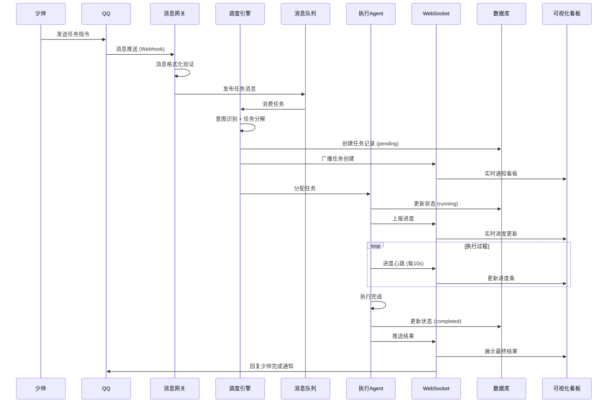

# QQ任务调度可视化 - 技术架构设计

> 设计师：织锦（🧵）  
> 日期：2026-03-19  
> 版本：v1.0

---

## 一、系统架构概览

### 1.1 整体架构图

```
┌─────────────────────────────────────────────────────────────────────────┐
│                          少帅（用户端）                                   │
│  ┌──────────────┐          ┌──────────────────────────────────────┐    │
│  │   QQ 客户端   │          │         Web 可视化看板               │    │
│  │  (发送任务)   │          │  ┌─────────┐ ┌─────────┐ ┌──────┐  │    │
│  └──────┬───────┘          │  │任务列表  │ │进度监控 │ │日志  │  │    │
│         │                  │  └─────────┘ └─────────┘ └──────┘  │    │
└─────────┼──────────────────└───────────────────┬───────────────┘    │
          │                                      │                     │
          ▼                                      │ WebSocket           │
┌─────────────────────────────────────────────────────────────────────┐
│                      消息接入层 (Message Gateway)                     │
│  ┌────────────────┐    ┌────────────────┐    ┌─────────────────┐   │
│  │  QQ Bot 监听   │───▶│  消息解析器     │───▶│  消息队列       │   │
│  │  (go-cqhttp)  │    │  (格式化/验证)  │    │  (Redis/Kafka)  │   │
│  └────────────────┘    └────────────────┘    └────────┬────────┘   │
└───────────────────────────────────────────────────────┼─────────────┘
                                                        │
          ┌─────────────────────────────────────────────┘
          ▼
┌─────────────────────────────────────────────────────────────────────┐
│                        调度引擎 (Orchestration Core)                  │
│  ┌─────────────┐   ┌─────────────┐   ┌──────────────┐              │
│  │ 意图识别    │──▶│ 任务分解    │──▶│ Agent 选择器 │              │
│  │ (NLU/LLM)  │   │ (DAG编排)   │   │ (能力匹配)   │              │
│  └─────────────┘   └─────────────┘   └──────┬───────┘              │
│                                              │                       │
│  ┌─────────────────────────────────────────┐│                       │
│  │         任务状态管理器 (State Manager)   │◀┘                       │
│  │  • pending → running → completed/failed │                       │
│  │  • WebSocket 通知                       │                       │
│  │  • 数据持久化 (PostgreSQL)              │                       │
│  └─────────────────────────────────────────┘                       │
└────────────────────────────────┬─────────────────────────────────────┘
                                 │ 任务分发
          ┌──────────────────────┼──────────────────────┐
          ▼                      ▼                      ▼
   ┌─────────────┐        ┌─────────────┐        ┌─────────────┐
   │   Agent A   │        │   Agent B   │        │   Agent N   │
   │  (数据处理) │        │  (内容创作) │        │  (其他能力) │
   └──────┬──────┘        └──────┬──────┘        └──────┬──────┘
          │                      │                      │
          ▼                      ▼                      ▼
┌─────────────────────────────────────────────────────────────────────┐
│                      执行反馈层 (Execution Feedback)                  │
│  ┌─────────────┐    ┌─────────────┐    ┌─────────────────────┐     │
│  │ 进度上报    │    │ 产出物存储  │    │ WebSocket 推送       │     │
│  │ (心跳机制)  │    │ (OSS/S3)   │    │ (实时状态广播)       │     │
│  └─────────────┘    └─────────────┘    └─────────────────────┘     │
└─────────────────────────────────────────────────────────────────────┘
```

---

## 二、数据流程图

### 2.1 完整任务生命周期



### 2.2 任务状态流转

```
┌─────────┐    分配成功    ┌─────────┐    开始执行    ┌─────────┐
│ pending │──────────────▶│ assigned│──────────────▶│ running │
└─────────┘               └─────────┘               └────┬────┘
     │                         │                        │
     │ 分配失败                 │ 超时                   │
     ▼                         ▼                        ▼
┌─────────┐               ┌─────────┐           ┌──────────────┐
│  failed │               │ timeout │          │ completed    │
└─────────┘               └─────────┘           └──────────────┘
                                                       │
                                                       │ 部分成功
                                                       ▼
                                                 ┌──────────────┐
                                                 │ partial_fail │
                                                 └──────────────┘
```

---

## 三、关键接口设计

### 3.1 消息接入层接口

#### 3.1.1 QQ消息接收接口

```yaml
# POST /api/v1/messages/qq
Request:
  post_type: "message"
  message_type: "private" | "group"
  user_id: "8236c3da..."          # QQ用户ID
  message: "帮我分析一下最近的销售数据"
  raw_message: "[CQ:at,qq=12345] 帮我分析..."
  time: 1710123456

Response:
  code: 200
  data:
    task_id: "task_20260319_001"
    status: "accepted"
    estimated_time: "2-5分钟"
```

#### 3.1.2 消息解析接口

```yaml
# POST /internal/parse
Request:
  raw_message: "帮我分析一下最近的销售数据，生成报告发给运营群"
  user_context:
    user_id: "shao_shuai_001"
    role: "admin"
    preferences: ["简洁", "数据驱动"]

Response:
  intent: "data_analysis"
  confidence: 0.95
  tasks:
    - type: "data_query"
      params: { target: "sales", range: "recent" }
    - type: "report_generation"
      params: { format: "standard" }
    - type: "notification"
      params: { target: "operation_group" }
```

---

### 3.2 调度引擎接口

#### 3.2.1 任务创建接口

```yaml
# POST /api/v1/tasks
Request:
  intent: "data_analysis"
  user_id: "shao_shuai_001"
  priority: "high" | "normal" | "low"
  tasks:
    - id: "task_1"
      type: "data_query"
      dependencies: []
      params: { target: "sales" }
    - id: "task_2"
      type: "report_generation"
      dependencies: ["task_1"]
      params: { format: "pdf" }

Response:
  workflow_id: "wf_20260319_001"
  tasks:
    - id: "task_1"
      status: "pending"
      assigned_agent: "data_agent_01"
    - id: "task_2"
      status: "pending"
      assigned_agent: null  # 等待依赖完成
```

#### 3.2.2 Agent 注册与发现

```yaml
# POST /api/v1/agents/register
Request:
  agent_id: "data_agent_01"
  name: "数据分析Agent"
  capabilities:
    - "data_query"
    - "data_analysis"
    - "report_generation"
  max_concurrent_tasks: 3
  endpoint: "http://data-agent:8080"

# GET /api/v1/agents/discover?capability=data_query
Response:
  agents:
    - agent_id: "data_agent_01"
      load: 0.3
      status: "available"
    - agent_id: "data_agent_02"
      load: 0.8
      status: "busy"
```

#### 3.2.3 任务分配接口

```yaml
# POST /api/v1/tasks/{task_id}/assign
Request:
  agent_id: "data_agent_01"
  estimated_duration: 120  # 秒

Response:
  status: "assigned"
  task_id: "task_1"
  agent_id: "data_agent_01"
```

---

### 3.3 执行反馈接口

#### 3.3.1 进度上报接口

```yaml
# POST /api/v1/tasks/{task_id}/progress
Request:
  agent_id: "data_agent_01"
  progress: 45  # 百分比
  status: "running"
  message: "正在查询销售数据..."
  details:
    records_processed: 1200
    total_records: 5000

Response:
  acknowledged: true
```

#### 3.3.2 任务完成接口

```yaml
# POST /api/v1/tasks/{task_id}/complete
Request:
  agent_id: "data_agent_01"
  status: "completed"
  result:
    type: "file"
    url: "https://storage.example.com/reports/sales_20260319.pdf"
    size: "2.3MB"
  summary: "销售数据分析报告已生成"
  metrics:
    records_analyzed: 5000
    insights_found: 12

Response:
  acknowledged: true
  notifications_sent: ["qq", "web"]
```

---

### 3.4 实时看板接口

#### 3.4.1 WebSocket 连接

```yaml
# WebSocket /ws/tasks?token={jwt_token}

# 客户端订阅
{
  "action": "subscribe",
  "channels": ["task_updates", "progress_updates", "agent_status"]
}

# 服务端推送 - 任务更新
{
  "event": "task_update",
  "data": {
    "task_id": "task_1",
    "workflow_id": "wf_20260319_001",
    "status": "running",
    "progress": 45,
    "message": "正在查询销售数据...",
    "timestamp": "2026-03-19T10:30:15Z"
  }
}

# 服务端推送 - Agent状态
{
  "event": "agent_status",
  "data": {
    "agent_id": "data_agent_01",
    "status": "busy",
    "current_tasks": 2,
    "load": 0.67
  }
}
```

#### 3.4.2 任务查询接口

```yaml
# GET /api/v1/tasks?user_id=shao_shuai_001&status=running
Response:
  tasks:
    - task_id: "task_1"
      workflow_id: "wf_20260319_001"
      type: "data_analysis"
      status: "running"
      progress: 45
      created_at: "2026-03-19T10:25:00Z"
      started_at: "2026-03-19T10:25:30Z"
      estimated_completion: "2026-03-19T10:28:00Z"
      agent:
        id: "data_agent_01"
        name: "数据分析Agent"
```

---

## 四、数据模型设计

### 4.1 核心表结构

```sql
-- 任务工作流表
CREATE TABLE workflows (
    workflow_id VARCHAR(64) PRIMARY KEY,
    user_id VARCHAR(64) NOT NULL,
    intent VARCHAR(128),
    priority VARCHAR(16) DEFAULT 'normal',
    status VARCHAR(32) DEFAULT 'pending',
    created_at TIMESTAMP DEFAULT NOW(),
    completed_at TIMESTAMP,
    INDEX idx_user_status (user_id, status),
    INDEX idx_created (created_at)
);

-- 任务表
CREATE TABLE tasks (
    task_id VARCHAR(64) PRIMARY KEY,
    workflow_id VARCHAR(64) REFERENCES workflows(workflow_id),
    task_type VARCHAR(64) NOT NULL,
    status VARCHAR(32) DEFAULT 'pending',
    progress INT DEFAULT 0,
    params JSONB,
    result JSONB,
    assigned_agent VARCHAR(64),
    dependencies TEXT[],
    created_at TIMESTAMP DEFAULT NOW(),
    started_at TIMESTAMP,
    completed_at TIMESTAMP,
    INDEX idx_workflow (workflow_id),
    INDEX idx_status (status),
    INDEX idx_agent (assigned_agent, status)
);

-- Agent注册表
CREATE TABLE agents (
    agent_id VARCHAR(64) PRIMARY KEY,
    name VARCHAR(128),
    capabilities TEXT[],
    status VARCHAR(32) DEFAULT 'offline',
    current_tasks INT DEFAULT 0,
    max_concurrent_tasks INT DEFAULT 3,
    endpoint VARCHAR(256),
    last_heartbeat TIMESTAMP,
    INDEX idx_capabilities USING GIN(capabilities),
    INDEX idx_status (status)
);

-- 任务执行日志
CREATE TABLE task_logs (
    log_id SERIAL PRIMARY KEY,
    task_id VARCHAR(64) REFERENCES tasks(task_id),
    agent_id VARCHAR(64),
    level VARCHAR(16),
    message TEXT,
    metadata JSONB,
    created_at TIMESTAMP DEFAULT NOW(),
    INDEX idx_task (task_id),
    INDEX idx_time (created_at)
);
```

---

## 五、技术选型建议

### 5.1 技术栈推荐

| 层级 | 组件 | 推荐方案 | 备选方案 | 理由 |
|------|------|----------|----------|------|
| **消息接入** | QQ Bot | go-cqhttp | NoneBot2 | 成熟稳定，社区活跃 |
| | 消息队列 | Redis Streams | Kafka/RabbitMQ | 轻量高效，支持持久化 |
| **调度引擎** | 编程语言 | Go / Python | Node.js | 高并发/生态丰富 |
| | 意图识别 | OpenAI API | 本地LLM | 准确率高 |
| | 任务编排 | Temporal | Celery | 可视化工作流 |
| **实时通信** | WebSocket | Socket.io | ws (原生) | 自动重连、房间管理 |
| | 消息推送 | Server-Sent Events | - | 单向推送场景 |
| **数据存储** | 主数据库 | PostgreSQL | MySQL | JSONB支持、扩展性 |
| | 缓存 | Redis | Memcached | 多数据结构 |
| | 对象存储 | MinIO | AWS S3 | 开源自建 |
| **前端看板** | 框架 | Vue 3 + Vite | React | 生态成熟 |
| | UI组件 | Element Plus | Ant Design | 中文友好 |
| | 可视化 | ECharts | D3.js | 图表丰富 |
| **监控运维** | 监控 | Prometheus + Grafana | ELK Stack | 指标可视化 |
| | 日志 | Loki | ELK | 轻量级 |

---

### 5.2 架构特点

#### ✅ 高可用设计
- 消息队列持久化，防止消息丢失
- Agent 心跳检测，自动故障转移
- 任务状态持久化，支持恢复重试

#### ✅ 实时性保障
- WebSocket 全双工通信
- 进度心跳机制（每10秒）
- 消息推送延迟 < 500ms

#### ✅ 可扩展性
- Agent 动态注册，水平扩展
- 任务类型插件化
- 微服务架构，独立部署

#### ✅ 可观测性
- 全链路日志追踪
- 任务执行状态监控
- Agent 负载实时展示

---

## 六、部署架构建议

### 6.1 生产环境拓扑

```
┌─────────────────────────────────────────────────────────────┐
│                       负载均衡 (Nginx)                       │
└─────────────────────┬───────────────────────────────────────┘
                      │
      ┌───────────────┼───────────────┐
      ▼               ▼               ▼
┌──────────┐    ┌──────────┐    ┌──────────┐
│ API网关   │    │ API网关   │    │ API网关   │
│ Node 1   │    │ Node 2   │    │ Node 3   │
└────┬─────┘    └────┬─────┘    └────┬─────┘
     │               │               │
     └───────────────┼───────────────┘
                     │
         ┌───────────┼───────────┐
         ▼           ▼           ▼
    ┌─────────┐ ┌─────────┐ ┌─────────┐
    │ Redis   │ │PostgreSQL│ │ MinIO   │
    │ Cluster │ │ Cluster  │ │ Storage │
    └─────────┘ └─────────┘ └─────────┘
```

### 6.2 Agent 集群

```
┌─────────────────────────────────────────┐
│            Agent 集群管理器              │
└─────────────────┬───────────────────────┘
                  │
    ┌─────────────┼─────────────┐
    ▼             ▼             ▼
┌────────┐   ┌────────┐   ┌────────┐
│Agent A │   │Agent B │   │Agent C │
│数据分析│   │内容创作│   │任务调度│
└────────┘   └────────┘   └────────┘
```

---

## 七、安全考虑

### 7.1 认证授权
- JWT Token 认证
- RBAC 权限模型
- 用户身份绑定 QQ ID

### 7.2 数据安全
- 敏感数据加密存储
- HTTPS 全链路加密
- 任务结果访问控制

### 7.3 防护措施
- 接口限流（防刷）
- 消息签名验证
- SQL 注入防护

---

## 八、实施路线图

### Phase 1：核心功能（2周）
- [ ] QQ Bot 消息接入
- [ ] 基础任务调度
- [ ] 简单看板展示

### Phase 2：实时反馈（1周）
- [ ] WebSocket 实时推送
- [ ] 进度上报机制
- [ ] Agent 注册管理

### Phase 3：高级特性（1周）
- [ ] 任务依赖编排
- [ ] 失败重试机制
- [ ] 监控告警

### Phase 4：优化完善（持续）
- [ ] 性能优化
- [ ] UI/UX 改进
- [ ] 功能扩展

---

## 九、风险与应对

| 风险 | 影响 | 应对措施 |
|------|------|----------|
| QQ API 限制 | 高 | 消息队列削峰，重试机制 |
| Agent 故障 | 中 | 心跳检测，自动转移 |
| 并发压力 | 中 | 限流保护，水平扩展 |
| 数据丢失 | 高 | 持久化存储，定期备份 |

---

> 🧵 **织锦出品** - 架构设计，织就未来  
> 如有疑问，欢迎讨论优化
