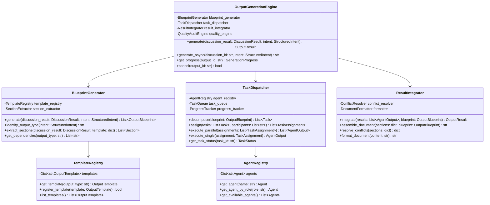
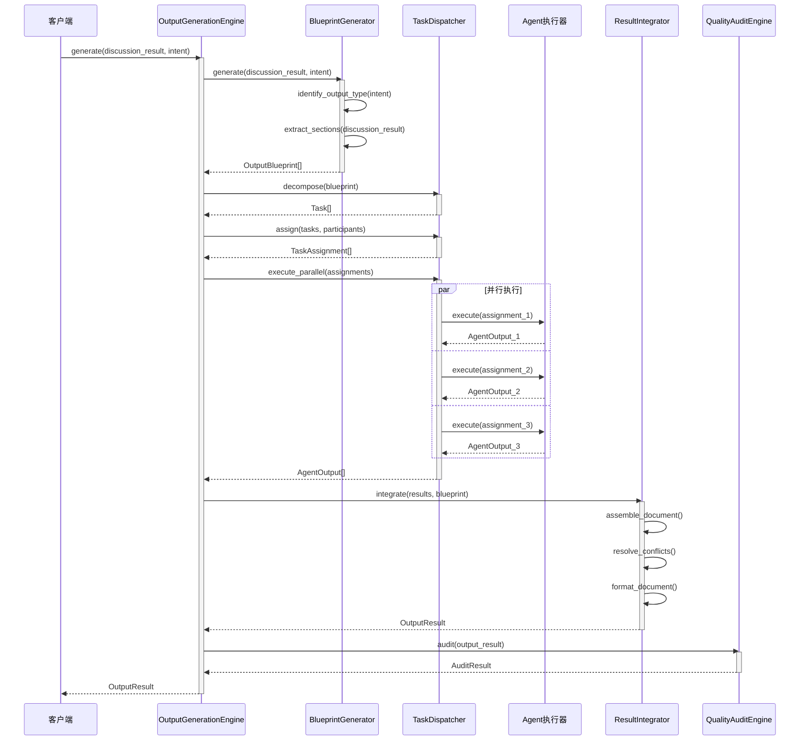
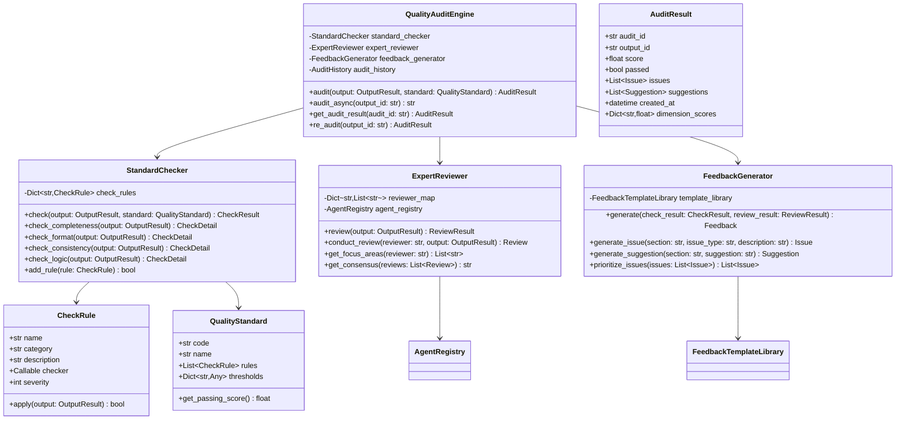
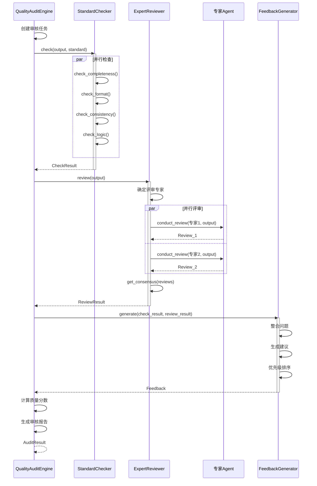
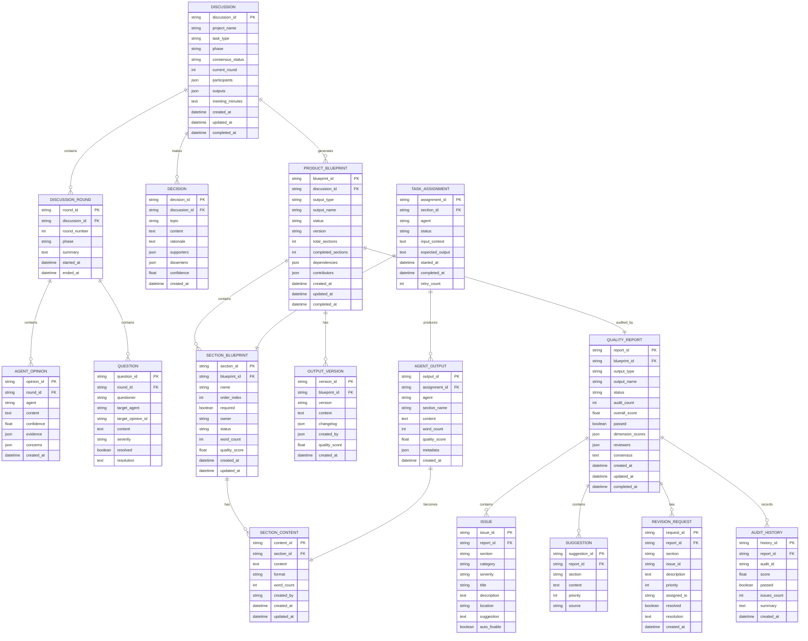
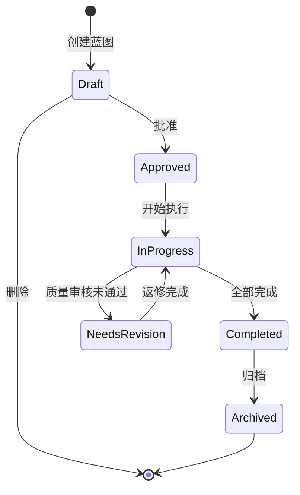

# V15.2 第二期详细架构设计

**架构设计师**：织锦（🧵）
**版本**：V1.0
**日期**：2026-03-19
**状态**：技术设计稿

---

## 目录

- [一、产物生成引擎架构](#一产物生成引擎架构)
- [二、质量审核引擎架构](#二质量审核引擎架构)
- [三、核心数据结构](#三核心数据结构)
- [四、数据库设计](#四数据库设计)
- [五、API设计](#五api设计)

---

## 一、产物生成引擎架构

### 1.1 模块设计

#### 1.1.1 类图



#### 1.1.2 序列图 - 产物生成流程



### 1.2 接口定义

```python
from typing import List, Dict, Optional, Any
from dataclasses import dataclass, field
from datetime import datetime
from enum import Enum
import asyncio
from abc import ABC, abstractmethod


# ==================== 枚举定义 ====================

class OutputType(Enum):
    """产物类型枚举"""
    SRS = "SRS"          # 需求规格说明书
    SAD = "SAD"          # 系统架构设计文档
    DDD = "DDD"          # 详细设计说明书
    PP = "PP"            # 项目计划书
    RR = "RR"            # 风险登记册
    TSP = "TSP"          # 技术方案
    SP = "SP"            # 售前方案
    IMP = "IMP"          # 实施方案


class TaskStatus(Enum):
    """任务状态枚举"""
    PENDING = "pending"
    RUNNING = "running"
    COMPLETED = "completed"
    FAILED = "failed"
    CANCELLED = "cancelled"


class GenerationPhase(Enum):
    """生成阶段枚举"""
    BLUEPRINT = "blueprint"
    DECOMPOSE = "decompose"
    ASSIGN = "assign"
    EXECUTE = "execute"
    INTEGRATE = "integrate"
    AUDIT = "audit"


# ==================== 数据类定义 ====================

@dataclass
class Section:
    """产物章节"""
    name: str
    order: int
    required: bool = True
    owner: Optional[str] = None
    description: str = ""
    content: Optional[str] = None
    word_count: int = 0


@dataclass
class OutputTemplate:
    """产物模板"""
    code: str
    name: str
    version: str
    sections: List[Section]
    quality_standards: Dict[str, Any] = field(default_factory=dict)
    metadata: Dict[str, Any] = field(default_factory=dict)


@dataclass
class OutputBlueprint:
    """产物蓝图"""
    output_id: str
    output_type: str
    output_name: str
    sections: List[Section]
    dependencies: List[str] = field(default_factory=list)
    template_name: str = ""
    created_at: datetime = field(default_factory=datetime.now)
    estimated_sections: int = 0
    priority: int = 0


@dataclass
class Task:
    """任务定义"""
    task_id: str
    section_name: str
    owner: str
    description: str
    input_context: str
    expected_output: str
    status: TaskStatus = TaskStatus.PENDING
    priority: int = 0
    dependencies: List[str] = field(default_factory=list)


@dataclass
class TaskAssignment:
    """任务分配"""
    assignment_id: str
    task_id: str
    agent: str
    sections: List[str]
    input_context: str
    expected_output: str
    status: TaskStatus = TaskStatus.PENDING
    started_at: Optional[datetime] = None
    completed_at: Optional[datetime] = None
    retry_count: int = 0
    max_retries: int = 3


@dataclass
class AgentOutput:
    """Agent产出"""
    output_id: str
    assignment_id: str
    agent: str
    section_name: str
    content: str
    word_count: int = 0
    quality_score: float = 0.0
    created_at: datetime = field(default_factory=datetime.now)
    metadata: Dict[str, Any] = field(default_factory=dict)


@dataclass
class OutputResult:
    """最终产物结果"""
    output_id: str
    output_type: str
    output_name: str
    content: str
    sections: Dict[str, str]
    contributors: List[str]
    quality_score: float = 0.0
    audit_result: Optional['AuditResult'] = None
    created_at: datetime = field(default_factory=datetime.now)
    version: str = "v1.0.0"


@dataclass
class GenerationProgress:
    """生成进度"""
    output_id: str
    phase: GenerationPhase
    total_tasks: int
    completed_tasks: int
    current_task: str
    started_at: datetime
    estimated_remaining_seconds: int
    tasks: List[Dict[str, Any]] = field(default_factory=list)


# ==================== 核心接口定义 ====================

class IBlueprintGenerator(ABC):
    """产物蓝图生成器接口"""
    
    @abstractmethod
    def generate(
        self, 
        discussion_result: 'DiscussionResult',
        intent: 'StructuredIntent'
    ) -> List[OutputBlueprint]:
        """生成产物蓝图"""
        pass
    
    @abstractmethod
    def identify_output_type(self, intent: 'StructuredIntent') -> str:
        """识别产物类型"""
        pass
    
    @abstractmethod
    def extract_sections(
        self,
        discussion_result: 'DiscussionResult',
        template: OutputTemplate
    ) -> List[Section]:
        """从讨论结果提取章节内容"""
        pass


class ITaskDispatcher(ABC):
    """任务调度器接口"""
    
    @abstractmethod
    def decompose(self, blueprint: OutputBlueprint) -> List[Task]:
        """任务分解"""
        pass
    
    @abstractmethod
    def assign(
        self,
        tasks: List[Task],
        participants: List[str]
    ) -> List[TaskAssignment]:
        """任务分配"""
        pass
    
    @abstractmethod
    async def execute_parallel(
        self,
        assignments: List[TaskAssignment]
    ) -> List[AgentOutput]:
        """并行执行"""
        pass
    
    @abstractmethod
    def get_task_status(self, task_id: str) -> TaskStatus:
        """获取任务状态"""
        pass


class IResultIntegrator(ABC):
    """结果整合器接口"""
    
    @abstractmethod
    def integrate(
        self,
        results: List[AgentOutput],
        blueprint: OutputBlueprint
    ) -> OutputResult:
        """整合结果"""
        pass
    
    @abstractmethod
    def resolve_conflicts(self, sections: Dict[str, str]) -> Dict[str, str]:
        """解决冲突"""
        pass


class IOutputGenerationEngine(ABC):
    """产物生成引擎接口"""
    
    @abstractmethod
    def generate(
        self,
        discussion_result: 'DiscussionResult',
        intent: 'StructuredIntent'
    ) -> OutputResult:
        """同步生成产物"""
        pass
    
    @abstractmethod
    async def generate_async(
        self,
        discussion_id: str,
        intent: 'StructuredIntent'
    ) -> str:
        """异步生成产物，返回output_id"""
        pass
    
    @abstractmethod
    def get_progress(self, output_id: str) -> GenerationProgress:
        """获取生成进度"""
        pass
    
    @abstractmethod
    def cancel(self, output_id: str) -> bool:
        """取消生成"""
        pass


# ==================== 实现类 ====================

class BlueprintGenerator(IBlueprintGenerator):
    """产物蓝图生成器实现"""
    
    # 产物类型与模板映射
    OUTPUT_TEMPLATES: Dict[str, OutputTemplate] = {
        'SRS': OutputTemplate(
            code='SRS',
            name='需求规格说明书',
            version='v1.0',
            sections=[
                Section(name='简介', order=1, required=True, owner='采薇'),
                Section(name='业务需求', order=2, required=True, owner='采薇'),
                Section(name='功能需求', order=3, required=True, owner='采薇'),
                Section(name='接口需求', order=4, required=False, owner='工尺'),
                Section(name='非功能需求', order=5, required=False, owner='织锦'),
                Section(name='约束条件', order=6, required=False, owner='玉衡'),
            ],
            quality_standards={
                'min_words_per_section': 100,
                'required_sections': ['简介', '业务需求', '功能需求']
            }
        ),
        'SAD': OutputTemplate(
            code='SAD',
            name='系统架构设计文档',
            version='v1.0',
            sections=[
                Section(name='架构概述', order=1, required=True, owner='织锦'),
                Section(name='技术架构', order=2, required=True, owner='织锦'),
                Section(name='数据架构', order=3, required=True, owner='工尺'),
                Section(name='接口设计', order=4, required=True, owner='工尺'),
                Section(name='部署架构', order=5, required=True, owner='织锦'),
                Section(name='安全架构', order=6, required=False, owner='织锦'),
            ],
            quality_standards={
                'min_words_per_section': 150,
                'required_sections': ['架构概述', '技术架构', '数据架构']
            }
        ),
        'DDD': OutputTemplate(
            code='DDD',
            name='详细设计说明书',
            version='v1.0',
            sections=[
                Section(name='模块设计', order=1, required=True, owner='工尺'),
                Section(name='接口设计', order=2, required=True, owner='工尺'),
                Section(name='数据库设计', order=3, required=True, owner='工尺'),
                Section(name='代码框架', order=4, required=False, owner='天工'),
            ],
            quality_standards={
                'min_words_per_section': 100,
                'required_sections': ['模块设计', '接口设计', '数据库设计']
            }
        ),
        'PP': OutputTemplate(
            code='PP',
            name='项目计划书',
            version='v1.0',
            sections=[
                Section(name='里程碑计划', order=1, required=True, owner='玉衡'),
                Section(name='资源计划', order=2, required=True, owner='玉衡'),
                Section(name='风险计划', order=3, required=True, owner='玉衡'),
                Section(name='成本估算', order=4, required=False, owner='筑台'),
            ],
            quality_standards={
                'min_words_per_section': 80,
                'required_sections': ['里程碑计划', '资源计划', '风险计划']
            }
        )
    }
    
    # 岗位与Agent映射
    AGENT_ROLE_MAP: Dict[str, str] = {
        '采薇': 'requirements',
        '织锦': 'architecture',
        '工尺': 'system',
        '天工': 'development',
        '玉衡': 'project',
        '筑台': 'presales',
        '呈彩': 'design',
        '折桂': 'resource',
        '扶摇': 'command',
        '知微': 'data'
    }
    
    def __init__(self, template_registry: 'TemplateRegistry' = None):
        self.template_registry = template_registry
        self.section_extractor = SectionExtractor()
    
    def generate(
        self,
        discussion_result: 'DiscussionResult',
        intent: 'StructuredIntent'
    ) -> List[OutputBlueprint]:
        """生成产物蓝图"""
        blueprints = []
        
        for output_spec in intent.outputs:
            output_type = output_spec.get('code', 'SRS')
            template = self.OUTPUT_TEMPLATES.get(output_type)
            
            if not template:
                raise ValueError(f"Unknown output type: {output_type}")
            
            # 提取章节内容
            sections = self.extract_sections(discussion_result, template)
            
            # 获取依赖
            dependencies = self._get_dependencies(output_type)
            
            blueprint = OutputBlueprint(
                output_id=self._generate_output_id(),
                output_type=output_type,
                output_name=output_spec.get('name', template.name),
                sections=sections,
                dependencies=dependencies,
                template_name=template.name,
                estimated_sections=len(sections)
            )
            blueprints.append(blueprint)
        
        return blueprints
    
    def identify_output_type(self, intent: 'StructuredIntent') -> str:
        """识别产物类型"""
        task_type = intent.task_type
        
        # 基于任务类型判断产物类型
        type_mapping = {
            'REQ-01': 'SRS',  # 需求分析
            'REQ-02': 'SRS',
            'DES-01': 'SAD',  # 架构设计
            'DES-02': 'DDD',  # 详细设计
            'PRJ-01': 'PP',   # 项目计划
        }
        
        return type_mapping.get(task_type, 'SRS')
    
    def extract_sections(
        self,
        discussion_result: 'DiscussionResult',
        template: OutputTemplate
    ) -> List[Section]:
        """从讨论结果提取章节"""
        sections = []
        
        for section_template in template.sections:
            # 从讨论结果中提取相关内容
            extracted_content = self.section_extractor.extract(
                discussion_result,
                section_template.name
            )
            
            section = Section(
                name=section_template.name,
                order=section_template.order,
                required=section_template.required,
                owner=section_template.owner,
                description=section_template.description,
                content=extracted_content
            )
            sections.append(section)
        
        return sections
    
    def _get_dependencies(self, output_type: str) -> List[str]:
        """获取产物依赖"""
        dependencies_map = {
            'SRS': [],
            'SAD': ['SRS'],
            'DDD': ['SRS', 'SAD'],
            'PP': ['SRS']
        }
        return dependencies_map.get(output_type, [])
    
    def _generate_output_id(self) -> str:
        """生成输出ID"""
        import uuid
        return f"out_{uuid.uuid4().hex[:12]}"


class TaskDispatcher(ITaskDispatcher):
    """任务调度器实现"""
    
    def __init__(
        self,
        agent_registry: 'AgentRegistry',
        task_queue: 'TaskQueue',
        progress_tracker: 'ProgressTracker'
    ):
        self.agent_registry = agent_registry
        self.task_queue = task_queue
        self.progress_tracker = progress_tracker
        self._running_tasks: Dict[str, asyncio.Task] = {}
    
    def decompose(self, blueprint: OutputBlueprint) -> List[Task]:
        """任务分解"""
        tasks = []
        
        for idx, section in enumerate(blueprint.sections):
            task = Task(
                task_id=f"task_{idx}_{section.name[:8]}",
                section_name=section.name,
                owner=section.owner or '采薇',
                description=f"生成{blueprint.output_name}的{section.name}章节",
                input_context=self._build_context(section, blueprint),
                expected_output=f"完整的{section.name}章节内容",
                status=TaskStatus.PENDING,
                priority=section.order
            )
            tasks.append(task)
        
        return tasks
    
    def assign(
        self,
        tasks: List[Task],
        participants: List[str]
    ) -> List[TaskAssignment]:
        """任务分配"""
        assignments = []
        
        for task in tasks:
            # 确定执行者（优先使用任务指定的owner）
            owner = task.owner
            if owner not in participants:
                # 如果owner不在参与者中，选择最接近的替代者
                owner = self._find_alternative_agent(owner, participants)
            
            assignment = TaskAssignment(
                assignment_id=f"assign_{task.task_id}",
                task_id=task.task_id,
                agent=owner,
                sections=[task.section_name],
                input_context=task.input_context,
                expected_output=task.expected_output,
                status=TaskStatus.PENDING
            )
            assignments.append(assignment)
        
        return assignments
    
    async def execute_parallel(
        self,
        assignments: List[TaskAssignment]
    ) -> List[AgentOutput]:
        """并行执行任务"""
        # 创建异步任务
        async_tasks = []
        for assignment in assignments:
            async_task = asyncio.create_task(
                self._execute_with_retry(assignment)
            )
            async_tasks.append(async_task)
            self._running_tasks[assignment.assignment_id] = async_task
        
        # 等待所有任务完成
        results = await asyncio.gather(*async_tasks, return_exceptions=True)
        
        # 处理结果
        outputs = []
        for idx, result in enumerate(results):
            if isinstance(result, Exception):
                # 任务失败，记录错误
                outputs.append(AgentOutput(
                    output_id=f"out_failed_{idx}",
                    assignment_id=assignments[idx].assignment_id,
                    agent=assignments[idx].agent,
                    section_name=assignments[idx].sections[0],
                    content="",
                    quality_score=0.0,
                    metadata={'error': str(result)}
                ))
            else:
                outputs.append(result)
        
        return outputs
    
    async def _execute_with_retry(
        self,
        assignment: TaskAssignment,
        max_retries: int = 3
    ) -> AgentOutput:
        """带重试的执行"""
        assignment.status = TaskStatus.RUNNING
        assignment.started_at = datetime.now()
        
        for attempt in range(max_retries):
            try:
                agent = self.agent_registry.get_agent(assignment.agent)
                output = await agent.execute(assignment)
                assignment.status = TaskStatus.COMPLETED
                assignment.completed_at = datetime.now()
                return output
            except Exception as e:
                assignment.retry_count = attempt + 1
                if attempt == max_retries - 1:
                    assignment.status = TaskStatus.FAILED
                    raise
                await asyncio.sleep(2 ** attempt)  # 指数退避
        
        raise RuntimeError("Unreachable")
    
    def get_task_status(self, task_id: str) -> TaskStatus:
        """获取任务状态"""
        return self.progress_tracker.get_status(task_id)
    
    def _build_context(self, section: Section, blueprint: OutputBlueprint) -> str:
        """构建上下文"""
        return f"""
产物: {blueprint.output_name}
章节: {section.name}
描述: {section.description}
已有内容: {section.content or '无'}
        """.strip()
    
    def _find_alternative_agent(
        self,
        preferred: str,
        available: List[str]
    ) -> str:
        """寻找替代Agent"""
        # 基于岗位相似度寻找替代
        role = self.AGENT_ROLE_MAP.get(preferred, 'general')
        
        for agent in available:
            agent_role = self.AGENT_ROLE_MAP.get(agent, '')
            if agent_role == role:
                return agent
        
        # 没有找到相似角色的，返回第一个可用的
        return available[0] if available else preferred


class ResultIntegrator(IResultIntegrator):
    """结果整合器实现"""
    
    def __init__(self, conflict_resolver: 'ConflictResolver' = None):
        self.conflict_resolver = conflict_resolver or ConflictResolver()
    
    def integrate(
        self,
        results: List[AgentOutput],
        blueprint: OutputBlueprint
    ) -> OutputResult:
        """整合结果"""
        # 1. 按章节收集内容
        sections_content: Dict[str, str] = {}
        contributors: List[str] = []
        
        for result in results:
            sections_content[result.section_name] = result.content
            if result.agent not in contributors:
                contributors.append(result.agent)
        
        # 2. 解决冲突（如果有多个Agent产出同一章节）
        sections_content = self.resolve_conflicts(sections_content)
        
        # 3. 组装完整文档
        full_content = self._assemble_document(sections_content, blueprint)
        
        # 4. 格式化
        formatted_content = self._format_document(full_content)
        
        # 5. 计算质量分数
        quality_score = self._calculate_quality(results)
        
        return OutputResult(
            output_id=blueprint.output_id,
            output_type=blueprint.output_type,
            output_name=blueprint.output_name,
            content=formatted_content,
            sections=sections_content,
            contributors=contributors,
            quality_score=quality_score
        )
    
    def resolve_conflicts(self, sections: Dict[str, str]) -> Dict[str, str]:
        """解决冲突"""
        # 目前简单处理，后续可以添加更复杂的冲突解决逻辑
        return sections
    
    def _assemble_document(
        self,
        sections: Dict[str, str],
        blueprint: OutputBlueprint
    ) -> str:
        """组装文档"""
        lines = [
            f"# {blueprint.output_name}",
            "",
            f"> 生成时间: {datetime.now().strftime('%Y-%m-%d %H:%M')}",
            f"> 产物类型: {blueprint.output_type}",
            "",
            "---",
            ""
        ]
        
        # 按顺序添加章节
        for section in sorted(blueprint.sections, key=lambda s: s.order):
            content = sections.get(section.name, '*[待补充]*')
            lines.extend([
                f"## {section.order}. {section.name}",
                "",
                content,
                ""
            ])
        
        return "\n".join(lines)
    
    def _format_document(self, content: str) -> str:
        """格式化文档"""
        # 简单的格式化处理
        return content
    
    def _calculate_quality(self, results: List[AgentOutput]) -> float:
        """计算质量分数"""
        if not results:
            return 0.0
        
        scores = [r.quality_score for r in results if r.quality_score > 0]
        return sum(scores) / len(scores) if scores else 75.0


class OutputGenerationEngine(IOutputGenerationEngine):
    """产物生成引擎主类"""
    
    def __init__(
        self,
        blueprint_generator: BlueprintGenerator = None,
        task_dispatcher: TaskDispatcher = None,
        result_integrator: ResultIntegrator = None,
        quality_engine: 'QualityAuditEngine' = None
    ):
        self.blueprint_generator = blueprint_generator or BlueprintGenerator()
        self.task_dispatcher = task_dispatcher
        self.result_integrator = result_integrator or ResultIntegrator()
        self.quality_engine = quality_engine
        
        self._progress_cache: Dict[str, GenerationProgress] = {}
    
    def generate(
        self,
        discussion_result: 'DiscussionResult',
        intent: 'StructuredIntent'
    ) -> OutputResult:
        """同步生成产物"""
        # 使用asyncio运行异步版本
        return asyncio.run(self._generate_async_internal(
            discussion_result,
            intent
        ))
    
    async def generate_async(
        self,
        discussion_id: str,
        intent: 'StructuredIntent'
    ) -> str:
        """异步生成产物"""
        # TODO: 从存储中加载discussion_result
        discussion_result = await self._load_discussion(discussion_id)
        
        # 在后台执行生成
        output_id = await self._generate_async_internal(
            discussion_result,
            intent
        )
        
        return output_id
    
    async def _generate_async_internal(
        self,
        discussion_result: 'DiscussionResult',
        intent: 'StructuredIntent'
    ) -> OutputResult:
        """内部异步生成逻辑"""
        output_id = self._generate_output_id()
        
        # 初始化进度
        self._init_progress(output_id)
        
        # 阶段1: 生成蓝图
        self._update_progress(output_id, GenerationPhase.BLUEPRINT, "生成产物蓝图")
        blueprints = self.blueprint_generator.generate(discussion_result, intent)
        
        if not blueprints:
            raise ValueError("No blueprints generated")
        
        blueprint = blueprints[0]  # 简化处理，取第一个
        
        # 阶段2: 任务分解
        self._update_progress(output_id, GenerationPhase.DECOMPOSE, "分解任务")
        tasks = self.task_dispatcher.decompose(blueprint)
        
        # 阶段3: 任务分配
        self._update_progress(output_id, GenerationPhase.ASSIGN, "分配任务")
        assignments = self.task_dispatcher.assign(tasks, intent.participants)
        
        # 阶段4: 并行执行
        self._update_progress(output_id, GenerationPhase.EXECUTE, "执行生成任务")
        results = await self.task_dispatcher.execute_parallel(assignments)
        
        # 阶段5: 结果整合
        self._update_progress(output_id, GenerationPhase.INTEGRATE, "整合结果")
        output_result = self.result_integrator.integrate(results, blueprint)
        
        # 阶段6: 质量审核
        if self.quality_engine:
            self._update_progress(output_id, GenerationPhase.AUDIT, "质量审核")
            audit_result = self.quality_engine.audit(output_result)
            output_result.audit_result = audit_result
            output_result.quality_score = audit_result.score
        
        return output_result
    
    def get_progress(self, output_id: str) -> GenerationProgress:
        """获取生成进度"""
        return self._progress_cache.get(output_id)
    
    def cancel(self, output_id: str) -> bool:
        """取消生成"""
        # TODO: 实现取消逻辑
        return False
    
    def _generate_output_id(self) -> str:
        import uuid
        return f"out_{uuid.uuid4().hex[:12]}"
    
    def _init_progress(self, output_id: str):
        """初始化进度"""
        self._progress_cache[output_id] = GenerationProgress(
            output_id=output_id,
            phase=GenerationPhase.BLUEPRINT,
            total_tasks=0,
            completed_tasks=0,
            current_task="初始化",
            started_at=datetime.now(),
            estimated_remaining_seconds=120
        )
    
    def _update_progress(
        self,
        output_id: str,
        phase: GenerationPhase,
        current_task: str
    ):
        """更新进度"""
        if output_id in self._progress_cache:
            progress = self._progress_cache[output_id]
            progress.phase = phase
            progress.current_task = current_task


# ==================== 辅助类 ====================

class SectionExtractor:
    """章节内容提取器"""
    
    def extract(
        self,
        discussion_result: 'DiscussionResult',
        section_name: str
    ) -> str:
        """从讨论结果中提取指定章节相关内容"""
        # TODO: 实现提取逻辑
        return ""


class ConflictResolver:
    """冲突解决器"""
    
    def resolve(self, sections: Dict[str, List[str]]) -> Dict[str, str]:
        """解决同一章节多个版本的冲突"""
        resolved = {}
        for section_name, contents in sections.items():
            if len(contents) == 1:
                resolved[section_name] = contents[0]
            else:
                # TODO: 实现更智能的合并策略
                resolved[section_name] = contents[0]
        return resolved


class TemplateRegistry:
    """模板注册中心"""
    
    def __init__(self):
        self._templates: Dict[str, OutputTemplate] = {}
    
    def register(self, template: OutputTemplate) -> bool:
        self._templates[template.code] = template
        return True
    
    def get(self, code: str) -> Optional[OutputTemplate]:
        return self._templates.get(code)
    
    def list_all(self) -> List[OutputTemplate]:
        return list(self._templates.values())


class AgentRegistry:
    """Agent注册中心"""
    
    def __init__(self):
        self._agents: Dict[str, Any] = {}
    
    def register(self, name: str, agent: Any) -> bool:
        self._agents[name] = agent
        return True
    
    def get(self, name: str) -> Optional[Any]:
        return self._agents.get(name)
    
    def get_by_role(self, role: str) -> List[Any]:
        return [
            agent for agent in self._agents.values()
            if getattr(agent, 'role', '') == role
        ]
```

---

## 二、质量审核引擎架构

### 2.1 模块设计

#### 2.1.1 类图



#### 2.1.2 序列图 - 质量审核流程



### 2.2 接口定义

```python
from typing import List, Dict, Optional, Callable, Any
from dataclasses import dataclass, field
from datetime import datetime
from enum import Enum
import re


# ==================== 枚举定义 ====================

class IssueSeverity(Enum):
    """问题严重程度"""
    CRITICAL = "critical"    # 严重问题，必须修复
    MAJOR = "major"          # 主要问题，建议修复
    MINOR = "minor"          # 次要问题，可选修复
    INFO = "info"            # 信息提示


class IssueCategory(Enum):
    """问题类别"""
    COMPLETENESS = "completeness"   # 完整性
    FORMAT = "format"               # 格式
    CONSISTENCY = "consistency"     # 一致性
    LOGIC = "logic"                 # 逻辑
    QUALITY = "quality"             # 质量
    STYLE = "style"                 # 风格


class CheckType(Enum):
    """检查类型"""
    COMPLETENESS = "completeness"
    FORMAT = "format"
    CONSISTENCY = "consistency"
    LOGIC = "logic"


# ==================== 数据类定义 ====================

@dataclass
class CheckRule:
    """检查规则"""
    name: str
    category: IssueCategory
    description: str
    severity: IssueSeverity
    checker: Callable[[Any], bool]
    enabled: bool = True
    
    def apply(self, output: 'OutputResult') -> bool:
        """应用检查规则"""
        if not self.enabled:
            return True
        return self.checker(output)


@dataclass
class CheckDetail:
    """检查详情"""
    check_type: CheckType
    passed: bool
    score: float
    issues: List['Issue'] = field(default_factory=list)
    details: str = ""


@dataclass
class CheckResult:
    """标准检查结果"""
    output_id: str
    passed: bool
    overall_score: float
    details: Dict[CheckType, CheckDetail] = field(default_factory=dict)
    checked_at: datetime = field(default_factory=datetime.now)


@dataclass
class Issue:
    """问题"""
    issue_id: str
    section: str
    category: IssueCategory
    severity: IssueSeverity
    title: str
    description: str
    location: str = ""
    suggestion: str = ""
    auto_fixable: bool = False


@dataclass
class Suggestion:
    """建议"""
    section: str
    content: str
    priority: int = 0
    source: str = ""  # 来源Agent


@dataclass
class Review:
    """专家评审"""
    reviewer: str
    review_id: str
    comments: List[str]
    rating: float
    focus_areas: List[str]
    issues_found: List[Issue]
    suggestions: List[Suggestion]
    created_at: datetime = field(default_factory=datetime.now)


@dataclass
class ReviewResult:
    """评审结果"""
    output_id: str
    reviews: List[Review]
    consensus: str
    overall_rating: float
    aggregated_issues: List[Issue]
    aggregated_suggestions: List[Suggestion]


@dataclass
class Feedback:
    """反馈"""
    feedback_id: str
    issues: List[Issue]
    suggestions: List[Suggestion]
    priority_order: List[str]  # 问题ID的优先级排序
    summary: str


@dataclass
class QualityStandard:
    """质量标准"""
    code: str
    name: str
    version: str
    rules: List[CheckRule]
    thresholds: Dict[str, float]
    required_sections: List[str]
    min_word_count: int = 100
    passing_score: float = 80.0
    
    def get_passing_score(self) -> float:
        return self.passing_score


@dataclass
class AuditResult:
    """审核结果"""
    audit_id: str
    output_id: str
    score: float
    passed: bool
    issues: List[Issue]
    suggestions: List[Suggestion]
    dimension_scores: Dict[str, float]
    check_result: Optional[CheckResult] = None
    review_result: Optional[ReviewResult] = None
    created_at: datetime = field(default_factory=datetime.now)


# ==================== 接口定义 ====================

class IStandardChecker(ABC):
    """标准检查器接口"""
    
    @abstractmethod
    def check(
        self,
        output: OutputResult,
        standard: QualityStandard
    ) -> CheckResult:
        """执行标准检查"""
        pass
    
    @abstractmethod
    def check_completeness(self, output: OutputResult) -> CheckDetail:
        """完整性检查"""
        pass
    
    @abstractmethod
    def check_format(self, output: OutputResult) -> CheckDetail:
        """格式检查"""
        pass
    
    @abstractmethod
    def check_consistency(self, output: OutputResult) -> CheckDetail:
        """一致性检查"""
        pass


class IExpertReviewer(ABC):
    """专家评审器接口"""
    
    @abstractmethod
    def review(self, output: OutputResult) -> ReviewResult:
        """执行专家评审"""
        pass
    
    @abstractmethod
    def conduct_review(
        self,
        reviewer: str,
        output: OutputResult
    ) -> Review:
        """单个专家评审"""
        pass


class IFeedbackGenerator(ABC):
    """反馈生成器接口"""
    
    @abstractmethod
    def generate(
        self,
        check_result: CheckResult,
        review_result: ReviewResult
    ) -> Feedback:
        """生成反馈"""
        pass


class IQualityAuditEngine(ABC):
    """质量审核引擎接口"""
    
    @abstractmethod
    def audit(
        self,
        output: OutputResult,
        standard: Optional[QualityStandard] = None
    ) -> AuditResult:
        """执行质量审核"""
        pass
    
    @abstractmethod
    def re_audit(self, output_id: str) -> AuditResult:
        """重新审核"""
        pass


# ==================== 实现类 ====================

class StandardChecker(IStandardChecker):
    """标准检查器实现"""
    
    # 默认检查规则
    DEFAULT_CHECK_RULES: Dict[CheckType, List[CheckRule]] = {
        CheckType.COMPLETENESS: [
            CheckRule(
                name="required_sections_exist",
                category=IssueCategory.COMPLETENESS,
                description="所有必填章节必须存在",
                severity=IssueSeverity.CRITICAL,
                checker=lambda o: all(
                    s.name in o.sections 
                    for s in o.sections.values()
                )
            ),
            CheckRule(
                name="min_word_count",
                category=IssueCategory.COMPLETENESS,
                description="章节内容不少于最小字数",
                severity=IssueSeverity.MAJOR,
                checker=lambda o: all(
                    len(content) >= 100 
                    for content in o.sections.values()
                )
            )
        ],
        CheckType.FORMAT: [
            CheckRule(
                name="heading_hierarchy",
                category=IssueCategory.FORMAT,
                description="标题层级正确",
                severity=IssueSeverity.MINOR,
                checker=lambda o: bool(
                    re.match(r'^#{1,4}\s', o.content, re.MULTILINE)
                )
            ),
            CheckRule(
                name="code_block_syntax",
                category=IssueCategory.FORMAT,
                description="代码块语法正确",
                severity=IssueSeverity.MINOR,
                checker=lambda o: True  # 简化实现
            )
        ],
        CheckType.CONSISTENCY: [
            CheckRule(
                name="terminology_consistent",
                category=IssueCategory.CONSISTENCY,
                description="术语使用一致",
                severity=IssueSeverity.MAJOR,
                checker=lambda o: True  # TODO: 实现术语一致性检查
            )
        ],
        CheckType.LOGIC: [
            CheckRule(
                name="section_order",
                category=IssueCategory.LOGIC,
                description="章节顺序合理",
                severity=IssueSeverity.MAJOR,
                checker=lambda o: True  # TODO: 实现顺序检查
            )
        ]
    }
    
    def __init__(self, custom_rules: Dict[CheckType, List[CheckRule]] = None):
        self.check_rules = custom_rules or self.DEFAULT_CHECK_RULES
    
    def check(
        self,
        output: OutputResult,
        standard: QualityStandard = None
    ) -> CheckResult:
        """执行标准检查"""
        details: Dict[CheckType, CheckDetail] = {}
        
        # 执行各类检查
        details[CheckType.COMPLETENESS] = self.check_completeness(output)
        details[CheckType.FORMAT] = self.check_format(output)
        details[CheckType.CONSISTENCY] = self.check_consistency(output)
        details[CheckType.LOGIC] = self.check_logic(output)
        
        # 计算总体分数
        scores = [d.score for d in details.values()]
        overall_score = sum(scores) / len(scores) if scores else 0
        
        # 判断是否通过
        passed = overall_score >= (standard.passing_score if standard else 80.0)
        
        return CheckResult(
            output_id=output.output_id,
            passed=passed,
            overall_score=overall_score,
            details=details
        )
    
    def check_completeness(self, output: OutputResult) -> CheckDetail:
        """完整性检查"""
        issues: List[Issue] = []
        
        # 检查必填章节是否存在
        rules = self.check_rules.get(CheckType.COMPLETENESS, [])
        
        for rule in rules:
            if not rule.apply(output):
                issues.append(Issue(
                    issue_id=f"issue_{rule.name}",
                    section="整体",
                    category=rule.category,
                    severity=rule.severity,
                    title=rule.name,
                    description=rule.description
                ))
        
        # 检查章节字数
        for section_name, content in output.sections.items():
            word_count = len(content)
            if word_count < 100:
                issues.append(Issue(
                    issue_id=f"issue_wordcount_{section_name}",
                    section=section_name,
                    category=IssueCategory.COMPLETENESS,
                    severity=IssueSeverity.MAJOR,
                    title="内容不足",
                    description=f"章节 '{section_name}' 内容仅 {word_count} 字，建议至少 100 字"
                ))
        
        # 计算分数
        score = 100.0
        for issue in issues:
            if issue.severity == IssueSeverity.CRITICAL:
                score -= 20
            elif issue.severity == IssueSeverity.MAJOR:
                score -= 10
            elif issue.severity == IssueSeverity.MINOR:
                score -= 5
        
        return CheckDetail(
            check_type=CheckType.COMPLETENESS,
            passed=len([i for i in issues if i.severity in 
                       [IssueSeverity.CRITICAL, IssueSeverity.MAJOR]]) == 0,
            score=max(0, score),
            issues=issues
        )
    
    def check_format(self, output: OutputResult) -> CheckDetail:
        """格式检查"""
        issues: List[Issue] = []
        
        # 检查标题层级
        heading_pattern = r'^(#{1,6})\s+.+$'
        lines = output.content.split('\n')
        prev_level = 0
        
        for idx, line in enumerate(lines):
            match = re.match(heading_pattern, line)
            if match:
                level = len(match.group(1))
                # 检查层级跳跃
                if level - prev_level > 1:
                    issues.append(Issue(
                        issue_id=f"issue_heading_{idx}",
                        section="格式",
                        category=IssueCategory.FORMAT,
                        severity=IssueSeverity.MINOR,
                        title="标题层级跳跃",
                        description=f"第 {idx + 1} 行标题层级从 {prev_level} 跳到 {level}",
                        location=f"行 {idx + 1}"
                    ))
                prev_level = level
        
        # 计算分数
        score = max(0, 100 - len(issues) * 5)
        
        return CheckDetail(
            check_type=CheckType.FORMAT,
            passed=len(issues) == 0,
            score=score,
            issues=issues
        )
    
    def check_consistency(self, output: OutputResult) -> CheckDetail:
        """一致性检查"""
        issues: List[Issue] = []
        
        # TODO: 实现术语一致性检查
        # TODO: 实现引用格式一致性检查
        
        return CheckDetail(
            check_type=CheckType.CONSISTENCY,
            passed=True,
            score=95.0,
            issues=issues
        )
    
    def check_logic(self, output: OutputResult) -> CheckDetail:
        """逻辑检查"""
        issues: List[Issue] = []
        
        # TODO: 实现逻辑一致性检查
        # TODO: 实现前后呼应检查
        
        return CheckDetail(
            check_type=CheckType.LOGIC,
            passed=True,
            score=90.0,
            issues=issues
        )
    
    def add_rule(self, rule: CheckRule, check_type: CheckType) -> bool:
        """添加检查规则"""
        if check_type not in self.check_rules:
            self.check_rules[check_type] = []
        self.check_rules[check_type].append(rule)
        return True


class ExpertReviewer(IExpertReviewer):
    """专家评审器实现"""
    
    # 评审专家映射（基于产物类型）
    REVIEWER_MAP: Dict[str, List[str]] = {
        'SRS': ['采薇', '玉衡'],     # 需求规格：采薇主导，玉衡确认
        'SAD': ['织锦', '工尺'],     # 架构设计：织锦主导，工尺确认
        'DDD': ['工尺', '天工'],     # 详细设计：工尺主导，天工确认
        'PP': ['玉衡', '筑台'],      # 项目计划：玉衡主导，筑台确认
        'TSP': ['织锦', '工尺'],     # 技术方案：织锦主导
        'SP': ['筑台', '呈彩'],      # 售前方案：筑台主导
    }
    
    # 评审关注点映射
    FOCUS_AREAS_MAP: Dict[str, List[str]] = {
        '采薇': ['需求完整性', '场景覆盖', '验收标准'],
        '织锦': ['架构合理性', '技术可行性', '扩展性'],
        '工尺': ['接口设计', '数据结构', '系统集成'],
        '天工': ['代码质量', '实现可行性', '测试覆盖'],
        '玉衡': ['计划可行性', '风险识别', '资源分配'],
        '筑台': ['成本合理性', '商业价值', '市场匹配'],
        '呈彩': ['用户体验', '视觉设计', '交互流程'],
    }
    
    def __init__(self, agent_registry: 'AgentRegistry' = None):
        self.agent_registry = agent_registry
    
    def review(self, output: OutputResult) -> ReviewResult:
        """执行专家评审"""
        # 确定评审专家
        reviewers = self._get_reviewers(output.output_type)
        
        # 并行执行评审
        reviews: List[Review] = []
        for reviewer in reviewers:
            review = self.conduct_review(reviewer, output)
            reviews.append(review)
        
        # 聚合结果
        aggregated_issues = self._aggregate_issues(reviews)
        aggregated_suggestions = self._aggregate_suggestions(reviews)
        
        # 计算总体评分
        overall_rating = sum(r.rating for r in reviews) / len(reviews) if reviews else 0
        
        return ReviewResult(
            output_id=output.output_id,
            reviews=reviews,
            consensus=self._get_consensus(reviews),
            overall_rating=overall_rating,
            aggregated_issues=aggregated_issues,
            aggregated_suggestions=aggregated_suggestions
        )
    
    def conduct_review(
        self,
        reviewer: str,
        output: OutputResult
    ) -> Review:
        """单个专家评审"""
        import uuid
        
        # 获取评审关注点
        focus_areas = self._get_focus_areas(reviewer)
        
        # TODO: 调用Agent执行评审
        # agent = self.agent_registry.get_agent(reviewer)
        # review_comments = agent.review_output(output, focus_areas)
        
        # 模拟评审结果
        review_comments = self._simulate_review(reviewer, output)
        
        # 计算评分
        rating = self._calculate_rating(review_comments)
        
        return Review(
            reviewer=reviewer,
            review_id=f"review_{uuid.uuid4().hex[:8]}",
            comments=review_comments['comments'],
            rating=rating,
            focus_areas=focus_areas,
            issues_found=review_comments['issues'],
            suggestions=review_comments['suggestions']
        )
    
    def _get_reviewers(self, output_type: str) -> List[str]:
        """获取评审专家列表"""
        return self.REVIEWER_MAP.get(output_type, ['南乔'])
    
    def _get_focus_areas(self, reviewer: str) -> List[str]:
        """获取评审关注点"""
        return self.FOCUS_AREAS_MAP.get(reviewer, ['整体质量'])
    
    def _get_consensus(self, reviews: List[Review]) -> str:
        """获取评审共识"""
        if not reviews:
            return "无评审意见"
        
        # 简单聚合：找出所有评审者共同认可的观点
        avg_rating = sum(r.rating for r in reviews) / len(reviews)
        
        if avg_rating >= 85:
            return "评审通过，产物质量优秀"
        elif avg_rating >= 70:
            return "评审通过，但有改进建议"
        else:
            return "评审未通过，需要返修"
    
    def _aggregate_issues(self, reviews: List[Review]) -> List[Issue]:
        """聚合问题"""
        all_issues: List[Issue] = []
        seen = set()
        
        for review in reviews:
            for issue in review.issues_found:
                key = (issue.section, issue.title)
                if key not in seen:
                    all_issues.append(issue)
                    seen.add(key)
        
        return all_issues
    
    def _aggregate_suggestions(self, reviews: List[Review]) -> List[Suggestion]:
        """聚合建议"""
        all_suggestions: List[Suggestion] = []
        seen = set()
        
        for review in reviews:
            for suggestion in review.suggestions:
                key = (suggestion.section, suggestion.content[:50])
                if key not in seen:
                    all_suggestions.append(suggestion)
                    seen.add(key)
        
        return all_suggestions
    
    def _simulate_review(
        self,
        reviewer: str,
        output: OutputResult
    ) -> Dict[str, Any]:
        """模拟评审（实际应调用Agent）"""
        # TODO: 替换为真实Agent调用
        return {
            'comments': [f"{reviewer}评审通过"],
            'issues': [],
            'suggestions': [
                Suggestion(
                    section="整体",
                    content="建议补充更多细节",
                    source=reviewer
                )
            ]
        }
    
    def _calculate_rating(self, review_result: Dict[str, Any]) -> float:
        """计算评分"""
        # 基于问题和建议数量计算评分
        issues = review_result.get('issues', [])
        critical_count = len([i for i in issues if i.severity == IssueSeverity.CRITICAL])
        major_count = len([i for i in issues if i.severity == IssueSeverity.MAJOR])
        
        score = 100.0 - (critical_count * 20 + major_count * 10)
        return max(0, min(100, score))


class FeedbackGenerator(IFeedbackGenerator):
    """反馈生成器实现"""
    
    def __init__(self, template_library: 'FeedbackTemplateLibrary' = None):
        self.template_library = template_library
    
    def generate(
        self,
        check_result: CheckResult,
        review_result: ReviewResult
    ) -> Feedback:
        """生成反馈"""
        import uuid
        
        # 整合问题
        issues = self._merge_issues(check_result, review_result)
        
        # 整合建议
        suggestions = self._merge_suggestions(check_result, review_result)
        
        # 优先级排序
        priority_order = self._prioritize_issues(issues)
        
        # 生成摘要
        summary = self._generate_summary(issues, suggestions)
        
        return Feedback(
            feedback_id=f"fb_{uuid.uuid4().hex[:8]}",
            issues=issues,
            suggestions=suggestions,
            priority_order=priority_order,
            summary=summary
        )
    
    def generate_issue(
        self,
        section: str,
        issue_type: str,
        description: str
    ) -> Issue:
        """生成问题"""
        import uuid
        
        return Issue(
            issue_id=f"issue_{uuid.uuid4().hex[:8]}",
            section=section,
            category=IssueCategory.QUALITY,
            severity=IssueSeverity.MAJOR,
            title=issue_type,
            description=description
        )
    
    def generate_suggestion(
        self,
        section: str,
        suggestion_text: str
    ) -> Suggestion:
        """生成建议"""
        return Suggestion(
            section=section,
            content=suggestion_text,
            priority=0
        )
    
    def _merge_issues(
        self,
        check_result: CheckResult,
        review_result: ReviewResult
    ) -> List[Issue]:
        """合并问题"""
        issues: List[Issue] = []
        seen = set()
        
        # 从检查结果中收集
        for detail in check_result.details.values():
            for issue in detail.issues:
                key = (issue.section, issue.title)
                if key not in seen:
                    issues.append(issue)
                    seen.add(key)
        
        # 从评审结果中收集
        for issue in review_result.aggregated_issues:
            key = (issue.section, issue.title)
            if key not in seen:
                issues.append(issue)
                seen.add(key)
        
        return issues
    
    def _merge_suggestions(
        self,
        check_result: CheckResult,
        review_result: ReviewResult
    ) -> List[Suggestion]:
        """合并建议"""
        return review_result.aggregated_suggestions
    
    def _prioritize_issues(self, issues: List[Issue]) -> List[str]:
        """问题优先级排序"""
        # 按严重程度排序
        severity_order = {
            IssueSeverity.CRITICAL: 0,
            IssueSeverity.MAJOR: 1,
            IssueSeverity.MINOR: 2,
            IssueSeverity.INFO: 3
        }
        
        sorted_issues = sorted(
            issues,
            key=lambda i: severity_order.get(i.severity, 4)
        )
        
        return [issue.issue_id for issue in sorted_issues]
    
    def _generate_summary(
        self,
        issues: List[Issue],
        suggestions: List[Suggestion]
    ) -> str:
        """生成摘要"""
        critical = len([i for i in issues if i.severity == IssueSeverity.CRITICAL])
        major = len([i for i in issues if i.severity == IssueSeverity.MAJOR])
        minor = len([i for i in issues if i.severity == IssueSeverity.MINOR])
        
        summary = f"发现 {len(issues)} 个问题"
        if critical > 0:
            summary += f"，其中 {critical} 个严重问题需要立即修复"
        if major > 0:
            summary += f"，{major} 个主要问题建议修复"
        if suggestions:
            summary += f"。共 {len(suggestions)} 条改进建议"
        
        return summary


class QualityAuditEngine(IQualityAuditEngine):
    """质量审核引擎实现"""
    
    def __init__(
        self,
        standard_checker: StandardChecker = None,
        expert_reviewer: ExpertReviewer = None,
        feedback_generator: FeedbackGenerator = None
    ):
        self.standard_checker = standard_checker or StandardChecker()
        self.expert_reviewer = expert_reviewer or ExpertReviewer()
        self.feedback_generator = feedback_generator or FeedbackGenerator()
        
        self._audit_cache: Dict[str, AuditResult] = {}
    
    def audit(
        self,
        output: OutputResult,
        standard: QualityStandard = None
    ) -> AuditResult:
        """执行质量审核"""
        import uuid
        
        audit_id = f"audit_{uuid.uuid4().hex[:8]}"
        
        # 阶段1: 标准检查
        check_result = self.standard_checker.check(output, standard)
        
        # 阶段2: 专家评审
        review_result = self.expert_reviewer.review(output)
        
        # 阶段3: 生成反馈
        feedback = self.feedback_generator.generate(check_result, review_result)
        
        # 计算综合分数
        score = self._calculate_score(check_result, review_result)
        
        # 判断是否通过
        passed = score >= 80.0 and not any(
            i.severity == IssueSeverity.CRITICAL 
            for i in feedback.issues
        )
        
        # 计算各维度分数
        dimension_scores = {
            'completeness': check_result.details.get(CheckType.COMPLETENESS, CheckDetail(CheckType.COMPLETENESS, True, 0)).score,
            'format': check_result.details.get(CheckType.FORMAT, CheckDetail(CheckType.FORMAT, True, 0)).score,
            'consistency': check_result.details.get(CheckType.CONSISTENCY, CheckDetail(CheckType.CONSISTENCY, True, 0)).score,
            'logic': check_result.details.get(CheckType.LOGIC, CheckDetail(CheckType.LOGIC, True, 0)).score,
            'expert_review': review_result.overall_rating
        }
        
        result = AuditResult(
            audit_id=audit_id,
            output_id=output.output_id,
            score=score,
            passed=passed,
            issues=feedback.issues,
            suggestions=feedback.suggestions,
            dimension_scores=dimension_scores,
            check_result=check_result,
            review_result=review_result
        )
        
        # 缓存结果
        self._audit_cache[audit_id] = result
        
        return result
    
    def re_audit(self, output_id: str) -> AuditResult:
        """重新审核"""
        # TODO: 从存储加载output，重新审核
        raise NotImplementedError("re_audit requires storage implementation")
    
    def _calculate_score(
        self,
        check_result: CheckResult,
        review_result: ReviewResult
    ) -> float:
        """计算综合分数"""
        # 标准检查权重: 60%
        check_score = check_result.overall_score * 0.6
        
        # 专家评审权重: 40%
        review_score = review_result.overall_rating * 0.4
        
        return check_score + review_score


# ==================== 辅助类 ====================

class FeedbackTemplateLibrary:
    """反馈模板库"""
    
    ISSUE_TEMPLATES: Dict[str, str] = {
        'missing_section': "缺少必填章节 '{section}'",
        'word_count_low': "章节 '{section}' 内容不足，当前 {current} 字，建议至少 {min} 字",
        'heading_error': "标题层级错误，位于 {location}",
        'terminology_inconsistent': "术语 '{term}' 使用不一致",
    }
    
    SUGGESTION_TEMPLATES: Dict[str, str] = {
        'add_section': "建议在 '{section}' 章节补充 {content}",
        'refine_content': "建议优化 '{section}' 的内容，{reason}",
        'add_example': "建议在 '{section}' 添加示例说明",
    }
```

---

## 三、核心数据结构

### 3.1 讨论状态 (DiscussionState)

```python
from typing import List, Dict, Optional
from dataclasses import dataclass, field
from datetime import datetime
from enum import Enum


class DiscussionPhase(Enum):
    """讨论阶段"""
    INIT = "init"                    # 初始化
    BRAINSTORM = "brainstorm"         # 头脑风暴
    DEBATE = "debate"                 # 观点碰撞
    CONSENSUS = "consensus"           # 共识达成
    SUMMARY = "summary"               # 总结收尾
    COMPLETED = "completed"           # 已完成


class ConsensusStatus(Enum):
    """共识状态"""
    PENDING = "pending"               # 待定
    PARTIAL = "partial"               # 部分共识
    REACHED = "reached"               # 已达成
    FAILED = "failed"                 # 未能达成


@dataclass
class AgentOpinion:
    """Agent观点"""
    agent: str                        # Agent名称
    opinion_id: str                   # 观点ID
    content: str                      # 观点内容
    confidence: float                 # 置信度 0-1
    evidence: List[str]               # 支撑论据
    concerns: List[str]               # 疑虑点
    round_number: int                 # 所属轮次
    created_at: datetime = field(default_factory=datetime.now)


@dataclass
class Question:
    """质疑问题"""
    question_id: str
    questioner: str                   # 提问Agent
    target_agent: str                 # 被质疑Agent
    target_opinion_id: str            # 被质疑的观点ID
    content: str                      # 质疑内容
    severity: str                     # 严重程度
    resolved: bool = False            # 是否已解决
    resolution: str = ""              # 解决方案


@dataclass
class DiscussionRound:
    """讨论轮次"""
    round_number: int
    phase: DiscussionPhase
    opinions: List[AgentOpinion]
    questions: List[Question]
    summary: str = ""
    started_at: datetime = field(default_factory=datetime.now)
    ended_at: Optional[datetime] = None


@dataclass
class Decision:
    """决策"""
    decision_id: str
    topic: str                        # 决策主题
    content: str                      # 决策内容
    rationale: str                    # 决策理由
    supporters: List[str]             # 支持者
    dissenters: List[str]             # 反对者
    confidence: float                 # 置信度
    created_at: datetime = field(default_factory=datetime.now)


@dataclass
class DiscussionState:
    """讨论状态 - 核心数据结构"""
    
    # 基本信息
    discussion_id: str                # 讨论ID
    project_name: str                 # 项目名称
    task_type: str                    # 任务类型
    
    # 状态信息
    phase: DiscussionPhase = DiscussionPhase.INIT
    consensus_status: ConsensusStatus = ConsensusStatus.PENDING
    current_round: int = 0
    
    # 讨论内容
    rounds: List[DiscussionRound] = field(default_factory=list)
    decisions: List[Decision] = field(default_factory=list)
    
    # 参与者
    participants: List[str] = field(default_factory=list)
    active_agents: List[str] = field(default_factory=list)
    
    # 产物信息
    outputs: List[Dict[str, str]] = field(default_factory=list)
    meeting_minutes: str = ""
    
    # 元数据
    created_at: datetime = field(default_factory=datetime.now)
    updated_at: datetime = field(default_factory=datetime.now)
    completed_at: Optional[datetime] = None
    
    # 扩展字段
    metadata: Dict[str, any] = field(default_factory=dict)
    
    def add_opinion(self, opinion: AgentOpinion) -> None:
        """添加观点"""
        if self.rounds:
            self.rounds[-1].opinions.append(opinion)
        self.updated_at = datetime.now()
    
    def add_question(self, question: Question) -> None:
        """添加质疑"""
        if self.rounds:
            self.rounds[-1].questions.append(question)
        self.updated_at = datetime.now()
    
    def add_decision(self, decision: Decision) -> None:
        """添加决策"""
        self.decisions.append(decision)
        self.updated_at = datetime.now()
    
    def start_new_round(self) -> DiscussionRound:
        """开始新轮次"""
        self.current_round += 1
        round_obj = DiscussionRound(
            round_number=self.current_round,
            phase=self.phase
        )
        self.rounds.append(round_obj)
        self.updated_at = datetime.now()
        return round_obj
    
    def end_current_round(self, summary: str = "") -> None:
        """结束当前轮次"""
        if self.rounds:
            self.rounds[-1].ended_at = datetime.now()
            self.rounds[-1].summary = summary
        self.updated_at = datetime.now()
    
    def reach_consensus(self) -> None:
        """达成共识"""
        self.consensus_status = ConsensusStatus.REACHED
        self.phase = DiscussionPhase.CONSENSUS
        self.updated_at = datetime.now()
    
    def complete(self, meeting_minutes: str) -> None:
        """完成讨论"""
        self.phase = DiscussionPhase.COMPLETED
        self.meeting_minutes = meeting_minutes
        self.completed_at = datetime.now()
        self.updated_at = datetime.now()
    
    def get_opinions_by_agent(self, agent: str) -> List[AgentOpinion]:
        """获取指定Agent的所有观点"""
        opinions = []
        for round_obj in self.rounds:
            for opinion in round_obj.opinions:
                if opinion.agent == agent:
                    opinions.append(opinion)
        return opinions
    
    def get_unresolved_questions(self) -> List[Question]:
        """获取未解决的质疑"""
        questions = []
        for round_obj in self.rounds:
            for question in round_obj.questions:
                if not question.resolved:
                    questions.append(question)
        return questions
    
    def to_dict(self) -> Dict:
        """转换为字典"""
        return {
            'discussion_id': self.discussion_id,
            'project_name': self.project_name,
            'task_type': self.task_type,
            'phase': self.phase.value,
            'consensus_status': self.consensus_status.value,
            'current_round': self.current_round,
            'rounds': [
                {
                    'round_number': r.round_number,
                    'phase': r.phase.value,
                    'opinions_count': len(r.opinions),
                    'questions_count': len(r.questions),
                    'summary': r.summary
                }
                for r in self.rounds
            ],
            'decisions_count': len(self.decisions),
            'participants': self.participants,
            'outputs': self.outputs,
            'created_at': self.created_at.isoformat(),
            'updated_at': self.updated_at.isoformat(),
            'completed_at': self.completed_at.isoformat() if self.completed_at else None
        }
```

### 3.2 产物蓝图 (ProductBlueprint)

```python
from typing import List, Dict, Optional, Any
from dataclasses import dataclass, field
from datetime import datetime
from enum import Enum


class BlueprintStatus(Enum):
    """蓝图状态"""
    DRAFT = "draft"                   # 草稿
    APPROVED = "approved"             # 已批准
    IN_PROGRESS = "in_progress"       # 执行中
    COMPLETED = "completed"           # 已完成
    ARCHIVED = "archived"             # 已归档


class SectionStatus(Enum):
    """章节状态"""
    PENDING = "pending"               # 待处理
    ASSIGNED = "assigned"             # 已分配
    IN_PROGRESS = "in_progress"       # 处理中
    COMPLETED = "completed"           # 已完成
    NEEDS_REVISION = "needs_revision" # 需要修订


@dataclass
class SectionBlueprint:
    """章节蓝图"""
    section_id: str
    name: str
    order: int
    required: bool = True
    
    # 分配信息
    owner: Optional[str] = None       # 负责Agent
    backup_owner: Optional[str] = None # 备选Agent
    
    # 内容信息
    description: str = ""
    template: str = ""                # 章节模板
    min_words: int = 100
    max_words: int = 10000
    
    # 依赖关系
    dependencies: List[str] = field(default_factory=list)
    
    # 状态
    status: SectionStatus = SectionStatus.PENDING
    content: Optional[str] = None
    word_count: int = 0
    
    # 质量信息
    quality_score: float = 0.0
    issues: List[str] = field(default_factory=list)
    
    # 元数据
    created_at: datetime = field(default_factory=datetime.now)
    updated_at: datetime = field(default_factory=datetime.now)
    completed_at: Optional[datetime] = None
    
    def assign_to(self, agent: str) -> None:
        """分配给Agent"""
        self.owner = agent
        self.status = SectionStatus.ASSIGNED
        self.updated_at = datetime.now()
    
    def start_processing(self) -> None:
        """开始处理"""
        self.status = SectionStatus.IN_PROGRESS
        self.updated_at = datetime.now()
    
    def complete(self, content: str, quality_score: float = 0.0) -> None:
        """完成章节"""
        self.content = content
        self.word_count = len(content)
        self.quality_score = quality_score
        self.status = SectionStatus.COMPLETED
        self.completed_at = datetime.now()
        self.updated_at = datetime.now()
    
    def request_revision(self, issues: List[str]) -> None:
        """请求修订"""
        self.issues = issues
        self.status = SectionStatus.NEEDS_REVISION
        self.updated_at = datetime.now()


@dataclass
class OutputSpec:
    """产出物规格"""
    code: str                         # 产物代码 (SRS/SAD等)
    name: str                         # 产物名称
    format: str = "markdown"          # 输出格式
    priority: int = 0                 # 优先级


@dataclass
class ProductBlueprint:
    """产物蓝图 - 核心数据结构"""
    
    # 基本信息
    blueprint_id: str
    discussion_id: str                # 关联的讨论ID
    output_type: str                  # 产物类型
    output_name: str                  # 产物名称
    
    # 状态
    status: BlueprintStatus = BlueprintStatus.DRAFT
    version: str = "v1.0.0"
    
    # 章节规划
    sections: List[SectionBlueprint] = field(default_factory=list)
    
    # 依赖关系
    dependencies: List[str] = field(default_factory=list)  # 依赖的其他产物ID
    
    # 模板信息
    template_name: str = ""
    template_version: str = "v1.0"
    
    # 质量标准
    quality_standard: str = "professional"  # 质量标准代码
    min_quality_score: float = 80.0
    
    # 执行信息
    total_sections: int = 0
    completed_sections: int = 0
    estimated_time_seconds: int = 300
    
    # 参与者
    contributors: List[str] = field(default_factory=list)
    
    # 元数据
    created_at: datetime = field(default_factory=datetime.now)
    updated_at: datetime = field(default_factory=datetime.now)
    completed_at: Optional[datetime] = None
    
    # 扩展字段
    metadata: Dict[str, Any] = field(default_factory=dict)
    
    def add_section(self, section: SectionBlueprint) -> None:
        """添加章节"""
        self.sections.append(section)
        self.total_sections = len(self.sections)
        self.updated_at = datetime.now()
    
    def get_section(self, section_id: str) -> Optional[SectionBlueprint]:
        """获取章节"""
        for section in self.sections:
            if section.section_id == section_id:
                return section
        return None
    
    def get_sections_by_owner(self, owner: str) -> List[SectionBlueprint]:
        """获取指定Agent负责的章节"""
        return [s for s in self.sections if s.owner == owner]
    
    def get_pending_sections(self) -> List[SectionBlueprint]:
        """获取待处理章节"""
        return [s for s in self.sections if s.status == SectionStatus.PENDING]
    
    def get_in_progress_sections(self) -> List[SectionBlueprint]:
        """获取处理中章节"""
        return [s for s in self.sections if s.status == SectionStatus.IN_PROGRESS]
    
    def update_progress(self) -> None:
        """更新进度"""
        self.completed_sections = len([
            s for s in self.sections 
            if s.status == SectionStatus.COMPLETED
        ])
        self.updated_at = datetime.now()
    
    def get_progress_percentage(self) -> float:
        """获取进度百分比"""
        if self.total_sections == 0:
            return 0.0
        return (self.completed_sections / self.total_sections) * 100
    
    def approve(self) -> None:
        """批准蓝图"""
        self.status = BlueprintStatus.APPROVED
        self.updated_at = datetime.now()
    
    def start_execution(self) -> None:
        """开始执行"""
        self.status = BlueprintStatus.IN_PROGRESS
        self.updated_at = datetime.now()
    
    def complete(self) -> None:
        """完成蓝图"""
        self.status = BlueprintStatus.COMPLETED
        self.completed_at = datetime.now()
        self.updated_at = datetime.now()
    
    def is_ready_for_execution(self) -> bool:
        """检查是否可以开始执行"""
        # 检查依赖是否满足
        # 检查所有必填章节是否已分配
        required_sections = [s for s in self.sections if s.required]
        all_assigned = all(s.owner for s in required_sections)
        return self.status == BlueprintStatus.APPROVED and all_assigned
    
    def get_assignments(self) -> Dict[str, List[str]]:
        """获取Agent分配情况"""
        assignments: Dict[str, List[str]] = {}
        for section in self.sections:
            if section.owner:
                if section.owner not in assignments:
                    assignments[section.owner] = []
                assignments[section.owner].append(section.name)
        return assignments
    
    def to_dict(self) -> Dict:
        """转换为字典"""
        return {
            'blueprint_id': self.blueprint_id,
            'discussion_id': self.discussion_id,
            'output_type': self.output_type,
            'output_name': self.output_name,
            'status': self.status.value,
            'version': self.version,
            'total_sections': self.total_sections,
            'completed_sections': self.completed_sections,
            'progress_percentage': self.get_progress_percentage(),
            'sections': [
                {
                    'section_id': s.section_id,
                    'name': s.name,
                    'order': s.order,
                    'owner': s.owner,
                    'status': s.status.value,
                    'word_count': s.word_count,
                    'quality_score': s.quality_score
                }
                for s in self.sections
            ],
            'dependencies': self.dependencies,
            'contributors': self.contributors,
            'created_at': self.created_at.isoformat(),
            'updated_at': self.updated_at.isoformat()
        }
```

### 3.3 质量报告 (QualityReport)

```python
from typing import List, Dict, Optional
from dataclasses import dataclass, field
from datetime import datetime
from enum import Enum


class AuditStatus(Enum):
    """审核状态"""
    PENDING = "pending"               # 待审核
    IN_PROGRESS = "in_progress"       # 审核中
    COMPLETED = "completed"           # 已完成
    NEEDS_REVISION = "needs_revision" # 需要修订
    APPROVED = "approved"             # 已通过


@dataclass
class DimensionScore:
    """维度评分"""
    dimension: str                    # 维度名称
    score: float                      # 分数 0-100
    weight: float                     # 权重
    comments: str = ""                # 评语
    details: List[str] = field(default_factory=list)


@dataclass
class RevisionRequest:
    """返修请求"""
    request_id: str
    section: str                      # 章节
    issue_id: str                     # 问题ID
    description: str                  # 返修描述
    priority: int                     # 优先级
    assigned_to: str                  # 分配给
    created_at: datetime = field(default_factory=datetime.now)
    resolved: bool = False
    resolution: str = ""


@dataclass
class AuditHistory:
    """审核历史"""
    audit_id: str
    score: float
    passed: bool
    issues_count: int
    created_at: datetime
    summary: str


@dataclass
class QualityReport:
    """质量报告 - 核心数据结构"""
    
    # 基本信息
    report_id: str
    output_id: str                    # 关联产物ID
    output_type: str                  # 产物类型
    output_name: str                  # 产物名称
    
    # 审核状态
    status: AuditStatus = AuditStatus.PENDING
    audit_count: int = 0              # 审核次数
    
    # 评分信息
    overall_score: float = 0.0
    passed: bool = False
    passing_threshold: float = 80.0
    
    # 维度评分
    dimension_scores: Dict[str, DimensionScore] = field(default_factory=dict)
    
    # 问题信息
    critical_issues: List['Issue'] = field(default_factory=list)
    major_issues: List['Issue'] = field(default_factory=list)
    minor_issues: List['Issue'] = field(default_factory=list)
    
    # 建议
    suggestions: List['Suggestion'] = field(default_factory=list)
    
    # 返修信息
    revision_requests: List[RevisionRequest] = field(default_factory=list)
    pending_revisions: int = 0
    
    # 审核历史
    audit_history: List[AuditHistory] = field(default_factory=list)
    
    # 评审信息
    reviewers: List[str] = field(default_factory=list)
    review_comments: List[str] = field(default_factory=list)
    consensus: str = ""
    
    # 元数据
    created_at: datetime = field(default_factory=datetime.now)
    updated_at: datetime = field(default_factory=datetime.now)
    completed_at: Optional[datetime] = None
    
    # 扩展字段
    metadata: Dict[str, Any] = field(default_factory=dict)
    
    def add_issue(self, issue: 'Issue') -> None:
        """添加问题"""
        from .quality_audit_engine import IssueSeverity
        
        if issue.severity == IssueSeverity.CRITICAL:
            self.critical_issues.append(issue)
        elif issue.severity == IssueSeverity.MAJOR:
            self.major_issues.append(issue)
        else:
            self.minor_issues.append(issue)
        self.updated_at = datetime.now()
    
    def add_suggestion(self, suggestion: 'Suggestion') -> None:
        """添加建议"""
        self.suggestions.append(suggestion)
        self.updated_at = datetime.now()
    
    def set_dimension_score(self, dimension: str, score: DimensionScore) -> None:
        """设置维度评分"""
        self.dimension_scores[dimension] = score
        self._recalculate_overall_score()
        self.updated_at = datetime.now()
    
    def _recalculate_overall_score(self) -> None:
        """重新计算总分"""
        if not self.dimension_scores:
            return
        
        total_weight = sum(ds.weight for ds in self.dimension_scores.values())
        weighted_sum = sum(
            ds.score * ds.weight 
            for ds in self.dimension_scores.values()
        )
        
        self.overall_score = weighted_sum / total_weight if total_weight > 0 else 0
        self.passed = (
            self.overall_score >= self.passing_threshold and 
            len(self.critical_issues) == 0
        )
    
    def create_revision_request(
        self,
        issue: 'Issue',
        assigned_to: str
    ) -> RevisionRequest:
        """创建返修请求"""
        import uuid
        
        request = RevisionRequest(
            request_id=f"rev_{uuid.uuid4().hex[:8]}",
            section=issue.section,
            issue_id=issue.issue_id,
            description=issue.description,
            priority=1 if issue.severity.value == 'critical' else 2,
            assigned_to=assigned_to
        )
        
        self.revision_requests.append(request)
        self.pending_revisions += 1
        self.status = AuditStatus.NEEDS_REVISION
        self.updated_at = datetime.now()
        
        return request
    
    def resolve_revision(self, request_id: str, resolution: str) -> None:
        """解决返修"""
        for request in self.revision_requests:
            if request.request_id == request_id:
                request.resolved = True
                request.resolution = resolution
                self.pending_revisions -= 1
                break
        
        if self.pending_revisions == 0:
            self.status = AuditStatus.COMPLETED
        
        self.updated_at = datetime.now()
    
    def add_audit_history(
        self,
        audit_id: str,
        score: float,
        passed: bool,
        summary: str
    ) -> None:
        """添加审核历史"""
        history = AuditHistory(
            audit_id=audit_id,
            score=score,
            passed=passed,
            issues_count=len(self.critical_issues) + len(self.major_issues),
            created_at=datetime.now(),
            summary=summary
        )
        self.audit_history.append(history)
        self.audit_count += 1
        self.updated_at = datetime.now()
    
    def complete(self) -> None:
        """完成审核"""
        if self.passed:
            self.status = AuditStatus.APPROVED
        else:
            self.status = AuditStatus.NEEDS_REVISION
        
        self.completed_at = datetime.now()
        self.updated_at = datetime.now()
    
    def get_issues_summary(self) -> Dict[str, int]:
        """获取问题摘要"""
        return {
            'critical': len(self.critical_issues),
            'major': len(self.major_issues),
            'minor': len(self.minor_issues),
            'total': len(self.critical_issues) + len(self.major_issues) + len(self.minor_issues)
        }
    
    def get_quality_grade(self) -> str:
        """获取质量等级"""
        if self.overall_score >= 90:
            return 'A'
        elif self.overall_score >= 80:
            return 'B'
        elif self.overall_score >= 70:
            return 'C'
        elif self.overall_score >= 60:
            return 'D'
        else:
            return 'F'
    
    def to_dict(self) -> Dict:
        """转换为字典"""
        return {
            'report_id': self.report_id,
            'output_id': self.output_id,
            'output_type': self.output_type,
            'output_name': self.output_name,
            'status': self.status.value,
            'audit_count': self.audit_count,
            'overall_score': self.overall_score,
            'grade': self.get_quality_grade(),
            'passed': self.passed,
            'dimension_scores': {
                k: {
                    'score': v.score,
                    'weight': v.weight,
                    'comments': v.comments
                }
                for k, v in self.dimension_scores.items()
            },
            'issues': self.get_issues_summary(),
            'suggestions_count': len(self.suggestions),
            'pending_revisions': self.pending_revisions,
            'reviewers': self.reviewers,
            'consensus': self.consensus,
            'created_at': self.created_at.isoformat(),
            'updated_at': self.updated_at.isoformat(),
            'completed_at': self.completed_at.isoformat() if self.completed_at else None
        }
```

---

## 四、数据库设计

### 4.1 ER图



### 4.2 表结构定义

#### 4.2.1 讨论相关表

```sql
-- 讨论主表
CREATE TABLE discussion (
    discussion_id VARCHAR(64) PRIMARY KEY,
    project_name VARCHAR(255) NOT NULL,
    task_type VARCHAR(32) NOT NULL,
    phase ENUM('init', 'brainstorm', 'debate', 'consensus', 'summary', 'completed') DEFAULT 'init',
    consensus_status ENUM('pending', 'partial', 'reached', 'failed') DEFAULT 'pending',
    current_round INT DEFAULT 0,
    participants JSON,
    outputs JSON,
    meeting_minutes TEXT,
    created_at TIMESTAMP DEFAULT CURRENT_TIMESTAMP,
    updated_at TIMESTAMP DEFAULT CURRENT_TIMESTAMP ON UPDATE CURRENT_TIMESTAMP,
    completed_at TIMESTAMP NULL,
    
    INDEX idx_project_name (project_name),
    INDEX idx_task_type (task_type),
    INDEX idx_phase (phase),
    INDEX idx_created_at (created_at)
) ENGINE=InnoDB DEFAULT CHARSET=utf8mb4 COLLATE=utf8mb4_unicode_ci;

-- 讨论轮次表
CREATE TABLE discussion_round (
    round_id VARCHAR(64) PRIMARY KEY,
    discussion_id VARCHAR(64) NOT NULL,
    round_number INT NOT NULL,
    phase ENUM('init', 'brainstorm', 'debate', 'consensus', 'summary') NOT NULL,
    summary TEXT,
    started_at TIMESTAMP DEFAULT CURRENT_TIMESTAMP,
    ended_at TIMESTAMP NULL,
    
    FOREIGN KEY (discussion_id) REFERENCES discussion(discussion_id) ON DELETE CASCADE,
    INDEX idx_discussion_id (discussion_id),
    UNIQUE KEY uk_discussion_round (discussion_id, round_number)
) ENGINE=InnoDB DEFAULT CHARSET=utf8mb4 COLLATE=utf8mb4_unicode_ci;

-- Agent观点表
CREATE TABLE agent_opinion (
    opinion_id VARCHAR(64) PRIMARY KEY,
    round_id VARCHAR(64) NOT NULL,
    agent VARCHAR(32) NOT NULL,
    content TEXT NOT NULL,
    confidence DECIMAL(3,2) DEFAULT 0.80,
    evidence JSON,
    concerns JSON,
    created_at TIMESTAMP DEFAULT CURRENT_TIMESTAMP,
    
    FOREIGN KEY (round_id) REFERENCES discussion_round(round_id) ON DELETE CASCADE,
    INDEX idx_round_id (round_id),
    INDEX idx_agent (agent)
) ENGINE=InnoDB DEFAULT CHARSET=utf8mb4 COLLATE=utf8mb4_unicode_ci;

-- 质疑问题表
CREATE TABLE question (
    question_id VARCHAR(64) PRIMARY KEY,
    round_id VARCHAR(64) NOT NULL,
    questioner VARCHAR(32) NOT NULL,
    target_agent VARCHAR(32),
    target_opinion_id VARCHAR(64),
    content TEXT NOT NULL,
    severity ENUM('low', 'medium', 'high') DEFAULT 'medium',
    resolved BOOLEAN DEFAULT FALSE,
    resolution TEXT,
    created_at TIMESTAMP DEFAULT CURRENT_TIMESTAMP,
    
    FOREIGN KEY (round_id) REFERENCES discussion_round(round_id) ON DELETE CASCADE,
    INDEX idx_round_id (round_id),
    INDEX idx_resolved (resolved)
) ENGINE=InnoDB DEFAULT CHARSET=utf8mb4 COLLATE=utf8mb4_unicode_ci;

-- 决策表
CREATE TABLE decision (
    decision_id VARCHAR(64) PRIMARY KEY,
    discussion_id VARCHAR(64) NOT NULL,
    topic VARCHAR(255) NOT NULL,
    content TEXT NOT NULL,
    rationale TEXT,
    supporters JSON,
    dissenters JSON,
    confidence DECIMAL(3,2) DEFAULT 0.80,
    created_at TIMESTAMP DEFAULT CURRENT_TIMESTAMP,
    
    FOREIGN KEY (discussion_id) REFERENCES discussion(discussion_id) ON DELETE CASCADE,
    INDEX idx_discussion_id (discussion_id)
) ENGINE=InnoDB DEFAULT CHARSET=utf8mb4 COLLATE=utf8mb4_unicode_ci;
```

#### 4.2.2 产物相关表

```sql
-- 产物蓝图主表
CREATE TABLE product_blueprint (
    blueprint_id VARCHAR(64) PRIMARY KEY,
    discussion_id VARCHAR(64) NOT NULL,
    output_type VARCHAR(32) NOT NULL,
    output_name VARCHAR(255) NOT NULL,
    status ENUM('draft', 'approved', 'in_progress', 'completed', 'archived') DEFAULT 'draft',
    version VARCHAR(16) DEFAULT 'v1.0.0',
    total_sections INT DEFAULT 0,
    completed_sections INT DEFAULT 0,
    dependencies JSON,
    contributors JSON,
    metadata JSON,
    created_at TIMESTAMP DEFAULT CURRENT_TIMESTAMP,
    updated_at TIMESTAMP DEFAULT CURRENT_TIMESTAMP ON UPDATE CURRENT_TIMESTAMP,
    completed_at TIMESTAMP NULL,
    
    FOREIGN KEY (discussion_id) REFERENCES discussion(discussion_id) ON DELETE CASCADE,
    INDEX idx_discussion_id (discussion_id),
    INDEX idx_output_type (output_type),
    INDEX idx_status (status)
) ENGINE=InnoDB DEFAULT CHARSET=utf8mb4 COLLATE=utf8mb4_unicode_ci;

-- 章节蓝图表
CREATE TABLE section_blueprint (
    section_id VARCHAR(64) PRIMARY KEY,
    blueprint_id VARCHAR(64) NOT NULL,
    name VARCHAR(255) NOT NULL,
    order_index INT NOT NULL,
    required BOOLEAN DEFAULT TRUE,
    owner VARCHAR(32),
    backup_owner VARCHAR(32),
    description TEXT,
    template TEXT,
    min_words INT DEFAULT 100,
    max_words INT DEFAULT 10000,
    dependencies JSON,
    status ENUM('pending', 'assigned', 'in_progress', 'completed', 'needs_revision') DEFAULT 'pending',
    word_count INT DEFAULT 0,
    quality_score DECIMAL(5,2) DEFAULT 0.00,
    issues JSON,
    created_at TIMESTAMP DEFAULT CURRENT_TIMESTAMP,
    updated_at TIMESTAMP DEFAULT CURRENT_TIMESTAMP ON UPDATE CURRENT_TIMESTAMP,
    completed_at TIMESTAMP NULL,
    
    FOREIGN KEY (blueprint_id) REFERENCES product_blueprint(blueprint_id) ON DELETE CASCADE,
    INDEX idx_blueprint_id (blueprint_id),
    INDEX idx_owner (owner),
    INDEX idx_status (status),
    UNIQUE KEY uk_blueprint_section (blueprint_id, order_index)
) ENGINE=InnoDB DEFAULT CHARSET=utf8mb4 COLLATE=utf8mb4_unicode_ci;

-- 章节内容表
CREATE TABLE section_content (
    content_id VARCHAR(64) PRIMARY KEY,
    section_id VARCHAR(64) NOT NULL,
    content LONGTEXT NOT NULL,
    format VARCHAR(32) DEFAULT 'markdown',
    word_count INT DEFAULT 0,
    created_by VARCHAR(32),
    created_at TIMESTAMP DEFAULT CURRENT_TIMESTAMP,
    updated_at TIMESTAMP DEFAULT CURRENT_TIMESTAMP ON UPDATE CURRENT_TIMESTAMP,
    
    FOREIGN KEY (section_id) REFERENCES section_blueprint(section_id) ON DELETE CASCADE,
    INDEX idx_section_id (section_id)
) ENGINE=InnoDB DEFAULT CHARSET=utf8mb4 COLLATE=utf8mb4_unicode_ci;

-- 产物版本表
CREATE TABLE output_version (
    version_id VARCHAR(64) PRIMARY KEY,
    blueprint_id VARCHAR(64) NOT NULL,
    version VARCHAR(16) NOT NULL,
    content LONGTEXT NOT NULL,
    changelog JSON,
    created_by JSON,
    quality_score DECIMAL(5,2) DEFAULT 0.00,
    created_at TIMESTAMP DEFAULT CURRENT_TIMESTAMP,
    
    FOREIGN KEY (blueprint_id) REFERENCES product_blueprint(blueprint_id) ON DELETE CASCADE,
    INDEX idx_blueprint_id (blueprint_id),
    UNIQUE KEY uk_blueprint_version (blueprint_id, version)
) ENGINE=InnoDB DEFAULT CHARSET=utf8mb4 COLLATE=utf8mb4_unicode_ci;

-- 任务分配表
CREATE TABLE task_assignment (
    assignment_id VARCHAR(64) PRIMARY KEY,
    section_id VARCHAR(64) NOT NULL,
    agent VARCHAR(32) NOT NULL,
    status ENUM('pending', 'running', 'completed', 'failed', 'cancelled') DEFAULT 'pending',
    input_context TEXT,
    expected_output TEXT,
    started_at TIMESTAMP NULL,
    completed_at TIMESTAMP NULL,
    retry_count INT DEFAULT 0,
    max_retries INT DEFAULT 3,
    error_message TEXT,
    created_at TIMESTAMP DEFAULT CURRENT_TIMESTAMP,
    
    FOREIGN KEY (section_id) REFERENCES section_blueprint(section_id) ON DELETE CASCADE,
    INDEX idx_section_id (section_id),
    INDEX idx_agent (agent),
    INDEX idx_status (status)
) ENGINE=InnoDB DEFAULT CHARSET=utf8mb4 COLLATE=utf8mb4_unicode_ci;

-- Agent产出表
CREATE TABLE agent_output (
    output_id VARCHAR(64) PRIMARY KEY,
    assignment_id VARCHAR(64) NOT NULL,
    agent VARCHAR(32) NOT NULL,
    section_name VARCHAR(255) NOT NULL,
    content LONGTEXT NOT NULL,
    word_count INT DEFAULT 0,
    quality_score DECIMAL(5,2) DEFAULT 0.00,
    metadata JSON,
    created_at TIMESTAMP DEFAULT CURRENT_TIMESTAMP,
    
    FOREIGN KEY (assignment_id) REFERENCES task_assignment(assignment_id) ON DELETE CASCADE,
    INDEX idx_assignment_id (assignment_id),
    INDEX idx_agent (agent)
) ENGINE=InnoDB DEFAULT CHARSET=utf8mb4 COLLATE=utf8mb4_unicode_ci;
```

#### 4.2.3 质量相关表

```sql
-- 质量报告主表
CREATE TABLE quality_report (
    report_id VARCHAR(64) PRIMARY KEY,
    blueprint_id VARCHAR(64) NOT NULL,
    output_type VARCHAR(32) NOT NULL,
    output_name VARCHAR(255) NOT NULL,
    status ENUM('pending', 'in_progress', 'completed', 'needs_revision', 'approved') DEFAULT 'pending',
    audit_count INT DEFAULT 0,
    overall_score DECIMAL(5,2) DEFAULT 0.00,
    passed BOOLEAN DEFAULT FALSE,
    passing_threshold DECIMAL(5,2) DEFAULT 80.00,
    dimension_scores JSON,
    reviewers JSON,
    review_comments JSON,
    consensus TEXT,
    pending_revisions INT DEFAULT 0,
    metadata JSON,
    created_at TIMESTAMP DEFAULT CURRENT_TIMESTAMP,
    updated_at TIMESTAMP DEFAULT CURRENT_TIMESTAMP ON UPDATE CURRENT_TIMESTAMP,
    completed_at TIMESTAMP NULL,
    
    FOREIGN KEY (blueprint_id) REFERENCES product_blueprint(blueprint_id) ON DELETE CASCADE,
    INDEX idx_blueprint_id (blueprint_id),
    INDEX idx_status (status),
    INDEX idx_passed (passed)
) ENGINE=InnoDB DEFAULT CHARSET=utf8mb4 COLLATE=utf8mb4_unicode_ci;

-- 问题表
CREATE TABLE issue (
    issue_id VARCHAR(64) PRIMARY KEY,
    report_id VARCHAR(64) NOT NULL,
    section VARCHAR(255),
    category ENUM('completeness', 'format', 'consistency', 'logic', 'quality', 'style') NOT NULL,
    severity ENUM('critical', 'major', 'minor', 'info') NOT NULL,
    title VARCHAR(255) NOT NULL,
    description TEXT NOT NULL,
    location VARCHAR(255),
    suggestion TEXT,
    auto_fixable BOOLEAN DEFAULT FALSE,
    created_at TIMESTAMP DEFAULT CURRENT_TIMESTAMP,
    
    FOREIGN KEY (report_id) REFERENCES quality_report(report_id) ON DELETE CASCADE,
    INDEX idx_report_id (report_id),
    INDEX idx_severity (severity),
    INDEX idx_category (category)
) ENGINE=InnoDB DEFAULT CHARSET=utf8mb4 COLLATE=utf8mb4_unicode_ci;

-- 建议表
CREATE TABLE suggestion (
    suggestion_id VARCHAR(64) PRIMARY KEY,
    report_id VARCHAR(64) NOT NULL,
    section VARCHAR(255),
    content TEXT NOT NULL,
    priority INT DEFAULT 0,
    source VARCHAR(32),
    created_at TIMESTAMP DEFAULT CURRENT_TIMESTAMP,
    
    FOREIGN KEY (report_id) REFERENCES quality_report(report_id) ON DELETE CASCADE,
    INDEX idx_report_id (report_id)
) ENGINE=InnoDB DEFAULT CHARSET=utf8mb4 COLLATE=utf8mb4_unicode_ci;

-- 返修请求表
CREATE TABLE revision_request (
    request_id VARCHAR(64) PRIMARY KEY,
    report_id VARCHAR(64) NOT NULL,
    section VARCHAR(255) NOT NULL,
    issue_id VARCHAR(64),
    description TEXT NOT NULL,
    priority INT DEFAULT 1,
    assigned_to VARCHAR(32) NOT NULL,
    resolved BOOLEAN DEFAULT FALSE,
    resolution TEXT,
    created_at TIMESTAMP DEFAULT CURRENT_TIMESTAMP,
    resolved_at TIMESTAMP NULL,
    
    FOREIGN KEY (report_id) REFERENCES quality_report(report_id) ON DELETE CASCADE,
    FOREIGN KEY (issue_id) REFERENCES issue(issue_id) ON DELETE SET NULL,
    INDEX idx_report_id (report_id),
    INDEX idx_assigned_to (assigned_to),
    INDEX idx_resolved (resolved)
) ENGINE=InnoDB DEFAULT CHARSET=utf8mb4 COLLATE=utf8mb4_unicode_ci;

-- 审核历史表
CREATE TABLE audit_history (
    history_id VARCHAR(64) PRIMARY KEY,
    report_id VARCHAR(64) NOT NULL,
    audit_id VARCHAR(64) NOT NULL,
    score DECIMAL(5,2) NOT NULL,
    passed BOOLEAN NOT NULL,
    issues_count INT DEFAULT 0,
    summary TEXT,
    created_at TIMESTAMP DEFAULT CURRENT_TIMESTAMP,
    
    FOREIGN KEY (report_id) REFERENCES quality_report(report_id) ON DELETE CASCADE,
    INDEX idx_report_id (report_id)
) ENGINE=InnoDB DEFAULT CHARSET=utf8mb4 COLLATE=utf8mb4_unicode_ci;
```

---

## 五、API设计

### 5.1 API概览

| 模块 | 端点 | 方法 | 描述 |
|------|------|:----:|------|
| **产物生成** | `/api/v2/output/generate` | POST | 生成产物 |
| | `/api/v2/output/{output_id}` | GET | 获取产物详情 |
| | `/api/v2/output/{output_id}/progress` | GET | 获取生成进度 |
| | `/api/v2/output/{output_id}/cancel` | POST | 取消生成 |
| | `/api/v2/output/{output_id}/versions` | GET | 获取版本列表 |
| | `/api/v2/output/{output_id}/rollback` | POST | 版本回滚 |
| **质量审核** | `/api/v2/audit` | POST | 创建审核 |
| | `/api/v2/audit/{audit_id}` | GET | 获取审核结果 |
| | `/api/v2/audit/{audit_id}/report` | GET | 获取质量报告 |
| | `/api/v2/audit/{audit_id}/revisions` | GET | 获取返修列表 |
| | `/api/v2/audit/{audit_id}/resolve` | POST | 解决返修 |
| **蓝图管理** | `/api/v2/blueprint` | POST | 创建蓝图 |
| | `/api/v2/blueprint/{blueprint_id}` | GET | 获取蓝图详情 |
| | `/api/v2/blueprint/{blueprint_id}/approve` | POST | 批准蓝图 |
| | `/api/v2/blueprint/{blueprint_id}/sections` | GET | 获取章节列表 |
| **任务管理** | `/api/v2/task` | GET | 获取任务列表 |
| | `/api/v2/task/{task_id}` | GET | 获取任务详情 |
| | `/api/v2/task/{task_id}/status` | PUT | 更新任务状态 |

### 5.2 产物生成API

#### 5.2.1 创建产物生成任务

```http
POST /api/v2/output/generate
Content-Type: application/json

{
    "discussion_id": "disc_20260319_abc123",
    "output_type": "SRS",
    "options": {
        "template": "standard",
        "quality_check": true,
        "async": true,
        "participants": ["采薇", "织锦", "工尺"]
    }
}
```

**响应 202 Accepted**:

```json
{
    "code": 202,
    "message": "产物生成任务已创建",
    "data": {
        "output_id": "out_20260319_xyz789",
        "blueprint_id": "bp_20260319_def456",
        "status": "pending",
        "estimated_time_seconds": 180,
        "progress_url": "/api/v2/output/out_20260319_xyz789/progress"
    }
}
```

#### 5.2.2 获取产物详情

```http
GET /api/v2/output/{output_id}
```

**响应 200 OK**:

```json
{
    "code": 200,
    "data": {
        "output_id": "out_20260319_xyz789",
        "blueprint_id": "bp_20260319_def456",
        "output_type": "SRS",
        "output_name": "需求规格说明书",
        "status": "completed",
        "version": "v1.0.0",
        "content": "# 需求规格说明书\n\n...",
        "sections": {
            "简介": "...",
            "业务需求": "...",
            "功能需求": "..."
        },
        "contributors": ["采薇", "织锦", "工尺"],
        "quality_score": 85.5,
        "audit_result": {
            "audit_id": "audit_20260319_ghi012",
            "passed": true,
            "score": 85.5
        },
        "created_at": "2026-03-19T10:00:00Z",
        "completed_at": "2026-03-19T10:05:30Z",
        "download_url": "/api/v2/output/out_20260319_xyz789/download"
    }
}
```

#### 5.2.3 获取生成进度

```http
GET /api/v2/output/{output_id}/progress
```

**响应 200 OK**:

```json
{
    "code": 200,
    "data": {
        "output_id": "out_20260319_xyz789",
        "phase": "execute",
        "status": "running",
        "progress": {
            "total": 6,
            "completed": 3,
            "percentage": 50.0
        },
        "current_task": {
            "section": "功能需求",
            "agent": "采薇",
            "status": "running",
            "started_at": "2026-03-19T10:02:00Z"
        },
        "tasks": [
            {
                "section": "简介",
                "agent": "采薇",
                "status": "completed",
                "word_count": 350
            },
            {
                "section": "业务需求",
                "agent": "采薇",
                "status": "completed",
                "word_count": 520
            },
            {
                "section": "功能需求",
                "agent": "采薇",
                "status": "running",
                "word_count": 0
            },
            {
                "section": "接口需求",
                "agent": "工尺",
                "status": "pending",
                "word_count": 0
            },
            {
                "section": "非功能需求",
                "agent": "织锦",
                "status": "pending",
                "word_count": 0
            },
            {
                "section": "约束条件",
                "agent": "织锦",
                "status": "pending",
                "word_count": 0
            }
        ],
        "estimated_remaining_seconds": 90,
        "started_at": "2026-03-19T10:00:00Z"
    }
}
```

#### 5.2.4 取消生成

```http
POST /api/v2/output/{output_id}/cancel
```

**响应 200 OK**:

```json
{
    "code": 200,
    "message": "生成任务已取消",
    "data": {
        "output_id": "out_20260319_xyz789",
        "status": "cancelled",
        "completed_tasks": 3,
        "total_tasks": 6
    }
}
```

#### 5.2.5 获取版本列表

```http
GET /api/v2/output/{output_id}/versions
```

**响应 200 OK**:

```json
{
    "code": 200,
    "data": {
        "output_id": "out_20260319_xyz789",
        "current_version": "v1.1.0",
        "versions": [
            {
                "version": "v1.0.0",
                "message": "初始版本",
                "created_at": "2026-03-19T10:00:00Z",
                "created_by": ["采薇", "织锦", "工尺"],
                "quality_score": 82.0
            },
            {
                "version": "v1.1.0",
                "message": "补充非功能需求章节",
                "created_at": "2026-03-19T14:00:00Z",
                "created_by": ["织锦"],
                "quality_score": 85.5
            }
        ]
    }
}
```

#### 5.2.6 版本回滚

```http
POST /api/v2/output/{output_id}/rollback
Content-Type: application/json

{
    "target_version": "v1.0.0",
    "reason": "v1.1.0存在问题需要修复"
}
```

**响应 200 OK**:

```json
{
    "code": 200,
    "message": "版本已回滚",
    "data": {
        "output_id": "out_20260319_xyz789",
        "previous_version": "v1.1.0",
        "current_version": "v1.0.0",
        "rolled_back_at": "2026-03-19T15:00:00Z"
    }
}
```

### 5.3 质量审核API

#### 5.3.1 创建质量审核

```http
POST /api/v2/audit
Content-Type: application/json

{
    "output_id": "out_20260319_xyz789",
    "standard": "professional",
    "reviewers": ["采薇", "玉衡"],
    "options": {
        "auto_revision": true,
        "max_revisions": 3
    }
}
```

**响应 202 Accepted**:

```json
{
    "code": 202,
    "message": "质量审核任务已创建",
    "data": {
        "audit_id": "audit_20260319_ghi012",
        "report_id": "qr_20260319_jkl345",
        "status": "in_progress",
        "estimated_time_seconds": 60
    }
}
```

#### 5.3.2 获取审核结果

```http
GET /api/v2/audit/{audit_id}
```

**响应 200 OK**:

```json
{
    "code": 200,
    "data": {
        "audit_id": "audit_20260319_ghi012",
        "output_id": "out_20260319_xyz789",
        "status": "completed",
        "score": 85.5,
        "passed": true,
        "grade": "B",
        "dimension_scores": {
            "completeness": 90.0,
            "format": 85.0,
            "consistency": 80.0,
            "logic": 85.0,
            "expert_review": 88.0
        },
        "issues_summary": {
            "critical": 0,
            "major": 2,
            "minor": 3,
            "total": 5
        },
        "reviewers": ["采薇", "玉衡"],
        "consensus": "评审通过，但有改进建议",
        "created_at": "2026-03-19T10:05:00Z",
        "completed_at": "2026-03-19T10:06:30Z"
    }
}
```

#### 5.3.3 获取质量报告

```http
GET /api/v2/audit/{audit_id}/report
```

**响应 200 OK**:

```json
{
    "code": 200,
    "data": {
        "report_id": "qr_20260319_jkl345",
        "audit_id": "audit_20260319_ghi012",
        "output_type": "SRS",
        "output_name": "需求规格说明书",
        "status": "approved",
        "overall_score": 85.5,
        "grade": "B",
        "passed": true,
        "dimension_scores": {
            "completeness": {
                "score": 90.0,
                "weight": 0.25,
                "comments": "内容完整，各章节齐全"
            },
            "format": {
                "score": 85.0,
                "weight": 0.15,
                "comments": "格式规范，结构清晰"
            },
            "consistency": {
                "score": 80.0,
                "weight": 0.20,
                "comments": "术语使用基本一致"
            },
            "logic": {
                "score": 85.0,
                "weight": 0.20,
                "comments": "逻辑清晰，论述合理"
            },
            "expert_review": {
                "score": 88.0,
                "weight": 0.20,
                "comments": "专家评审通过"
            }
        },
        "issues": [
            {
                "issue_id": "issue_001",
                "section": "功能需求",
                "category": "completeness",
                "severity": "major",
                "title": "缺少异常处理场景描述",
                "description": "功能需求章节未描述异常处理和错误场景",
                "suggestion": "建议补充异常处理场景和错误码定义"
            },
            {
                "issue_id": "issue_002",
                "section": "非功能需求",
                "category": "quality",
                "severity": "major",
                "title": "性能指标缺少具体数值",
                "description": "性能需求描述过于笼统，缺少可量化的指标",
                "suggestion": "建议补充具体的响应时间、吞吐量等指标"
            }
        ],
        "suggestions": [
            {
                "section": "功能需求",
                "content": "建议补充用户权限管理相关需求",
                "priority": 1,
                "source": "采薇"
            },
            {
                "section": "非功能需求",
                "content": "建议补充数据安全相关需求",
                "priority": 2,
                "source": "玉衡"
            }
        ],
        "audit_history": [
            {
                "audit_id": "audit_20260319_ghi012",
                "score": 85.5,
                "passed": true,
                "issues_count": 5,
                "summary": "首次审核通过，质量良好",
                "created_at": "2026-03-19T10:06:30Z"
            }
        ],
        "created_at": "2026-03-19T10:05:00Z",
        "updated_at": "2026-03-19T10:06:30Z"
    }
}
```

#### 5.3.4 获取返修列表

```http
GET /api/v2/audit/{audit_id}/revisions
```

**响应 200 OK**:

```json
{
    "code": 200,
    "data": {
        "audit_id": "audit_20260319_ghi012",
        "pending_count": 2,
        "revisions": [
            {
                "request_id": "rev_001",
                "section": "功能需求",
                "issue_id": "issue_001",
                "description": "缺少异常处理场景描述",
                "priority": 1,
                "assigned_to": "采薇",
                "resolved": false,
                "created_at": "2026-03-19T10:07:00Z"
            },
            {
                "request_id": "rev_002",
                "section": "非功能需求",
                "issue_id": "issue_002",
                "description": "性能指标缺少具体数值",
                "priority": 2,
                "assigned_to": "织锦",
                "resolved": false,
                "created_at": "2026-03-19T10:07:00Z"
            }
        ]
    }
}
```

#### 5.3.5 解决返修

```http
POST /api/v2/audit/{audit_id}/resolve
Content-Type: application/json

{
    "request_id": "rev_001",
    "resolution": "已补充异常处理场景描述，包括参数校验、业务异常、系统异常三类",
    "updated_content": "..."
}
```

**响应 200 OK**:

```json
{
    "code": 200,
    "message": "返修已解决",
    "data": {
        "request_id": "rev_001",
        "resolved": true,
        "resolved_at": "2026-03-19T10:15:00Z",
        "pending_count": 1
    }
}
```

### 5.4 蓝图管理API

#### 5.4.1 创建产物蓝图

```http
POST /api/v2/blueprint
Content-Type: application/json

{
    "discussion_id": "disc_20260319_abc123",
    "output_type": "SRS",
    "output_name": "需求规格说明书",
    "sections": [
        {
            "name": "简介",
            "required": true,
            "owner": "采薇"
        },
        {
            "name": "业务需求",
            "required": true,
            "owner": "采薇"
        }
    ]
}
```

**响应 201 Created**:

```json
{
    "code": 201,
    "message": "蓝图创建成功",
    "data": {
        "blueprint_id": "bp_20260319_def456",
        "discussion_id": "disc_20260319_abc123",
        "output_type": "SRS",
        "output_name": "需求规格说明书",
        "status": "draft",
        "total_sections": 2,
        "created_at": "2026-03-19T10:00:00Z"
    }
}
```

#### 5.4.2 获取蓝图详情

```http
GET /api/v2/blueprint/{blueprint_id}
```

**响应 200 OK**:

```json
{
    "code": 200,
    "data": {
        "blueprint_id": "bp_20260319_def456",
        "discussion_id": "disc_20260319_abc123",
        "output_type": "SRS",
        "output_name": "需求规格说明书",
        "status": "approved",
        "version": "v1.0.0",
        "total_sections": 6,
        "completed_sections": 0,
        "progress_percentage": 0.0,
        "sections": [
            {
                "section_id": "sec_001",
                "name": "简介",
                "order": 1,
                "required": true,
                "owner": "采薇",
                "status": "pending",
                "word_count": 0
            }
        ],
        "dependencies": [],
        "contributors": ["采薇", "织锦", "工尺"],
        "created_at": "2026-03-19T10:00:00Z"
    }
}
```

#### 5.4.3 批准蓝图

```http
POST /api/v2/blueprint/{blueprint_id}/approve
```

**响应 200 OK**:

```json
{
    "code": 200,
    "message": "蓝图已批准",
    "data": {
        "blueprint_id": "bp_20260319_def456",
        "status": "approved",
        "approved_at": "2026-03-19T10:00:30Z"
    }
}
```

### 5.5 任务管理API

#### 5.5.1 获取任务列表

```http
GET /api/v2/task?agent=采薇&status=running
```

**响应 200 OK**:

```json
{
    "code": 200,
    "data": {
        "total": 2,
        "tasks": [
            {
                "task_id": "task_001",
                "section_name": "功能需求",
                "agent": "采薇",
                "status": "running",
                "blueprint_id": "bp_20260319_def456",
                "started_at": "2026-03-19T10:02:00Z"
            },
            {
                "task_id": "task_002",
                "section_name": "业务需求",
                "agent": "采薇",
                "status": "running",
                "blueprint_id": "bp_20260319_def456",
                "started_at": "2026-03-19T10:01:00Z"
            }
        ]
    }
}
```

#### 5.5.2 获取任务详情

```http
GET /api/v2/task/{task_id}
```

**响应 200 OK**:

```json
{
    "code": 200,
    "data": {
        "task_id": "task_001",
        "assignment_id": "assign_001",
        "section_id": "sec_003",
        "section_name": "功能需求",
        "blueprint_id": "bp_20260319_def456",
        "agent": "采薇",
        "status": "running",
        "input_context": "产物: 需求规格说明书\n章节: 功能需求\n...",
        "expected_output": "完整的功能需求章节内容",
        "started_at": "2026-03-19T10:02:00Z",
        "retry_count": 0,
        "progress": 60
    }
}
```

#### 5.5.3 更新任务状态

```http
PUT /api/v2/task/{task_id}/status
Content-Type: application/json

{
    "status": "completed",
    "output": {
        "content": "...",
        "word_count": 520
    }
}
```

**响应 200 OK**:

```json
{
    "code": 200,
    "message": "任务状态已更新",
    "data": {
        "task_id": "task_001",
        "status": "completed",
        "completed_at": "2026-03-19T10:04:00Z",
        "output_id": "out_section_003"
    }
}
```

---

## 附录

### A. 错误码定义

| 错误码 | 说明 |
|:------:|------|
| 400 | 请求参数错误 |
| 401 | 未授权 |
| 403 | 无权限 |
| 404 | 资源不存在 |
| 409 | 资源冲突 |
| 422 | 业务逻辑错误 |
| 500 | 服务器内部错误 |
| 503 | 服务不可用 |

### B. 状态流转图



### C. 部署架构

```
┌─────────────────────────────────────────────────────────────────────┐
│                           Nginx (负载均衡)                           │
└─────────────────────────────────────────────────────────────────────┘
                                 │
        ┌────────────────────────┼────────────────────────┐
        ↓                        ↓                        ↓
┌───────────────┐       ┌───────────────┐       ┌───────────────┐
│  API Gateway  │       │  API Gateway  │       │  API Gateway  │
│  (FastAPI)    │       │  (FastAPI)    │       │  (FastAPI)    │
└───────────────┘       └───────────────┘       └───────────────┘
        │                        │                        │
        └────────────────────────┼────────────────────────┘
                                 ↓
┌─────────────────────────────────────────────────────────────────────┐
│                        Redis (消息队列/缓存)                         │
└─────────────────────────────────────────────────────────────────────┘
                                 │
        ┌────────────────────────┼────────────────────────┐
        ↓                        ↓                        ↓
┌───────────────┐       ┌───────────────┐       ┌───────────────┐
│ Celery Worker │       │ Celery Worker │       │ Celery Worker │
│   (任务执行)   │       │   (任务执行)   │       │   (任务执行)   │
└───────────────┘       └───────────────┘       └───────────────┘
                                 │
                                 ↓
┌─────────────────────────────────────────────────────────────────────┐
│                       MySQL (数据持久化)                            │
└─────────────────────────────────────────────────────────────────────┘
```

---

**织锦（🧵） | 架构设计师**
**2026-03-19**

---

*织锦成章，架构有方。详细设计，即刻编码。*
